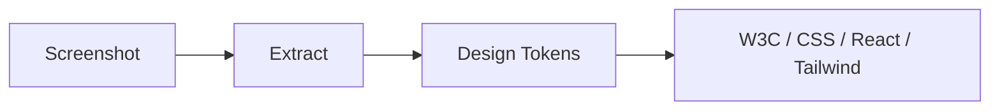

# Copy That

**Screenshot → design tokens → export.**

Upload a UI screenshot, extract colors, spacing, typography, and shadows (plus shape/opacity), then download **W3C Design Tokens**, **CSS**, **React**, or **Tailwind**.

**Live site (hiring showcase):** [joshband.github.io/copy-that](https://joshband.github.io/copy-that/) · [Engineering](https://joshband.github.io/copy-that/engineering.html)  
Static pages under [`site/`](./site/) deploy via GitHub Actions (`pages.yml`) — not branch `/docs` (that tree is engineering docs).

[](https://github.com/joshband/copy-that/actions/workflows/ci.yml)
[](https://www.python.org/downloads/)
[](./LICENSE)

---

## What it does

| Included | Parked (flag-off / not the default path) |
|----------|------------------------------------------|
| Colors, spacing, typography, shadows | Mood board, lighting, geometry |
| Shape (border/radius) + opacity | Sessions, batch jobs, multimodal inputs |
| W3C JSON, CSS, React theme, Tailwind theme | Flutter / Figma as product surfaces |
| Overview narrative + Export tab | Default-on GPU / deep-model pipelines |


```mermaid
flowchart LR
    A[Screenshot] --> B[Extract]
    B --> C[Design Tokens]
    C --> D[W3C / CSS / React / Tailwind]
```

---

## Quick start

```bash
git clone https://github.com/joshband/copy-that.git
cd copy-that

python -m venv .venv && source .venv/bin/activate
make install
pnpm install
cp .env.example .env   # SECRET_KEY, DATABASE_URL, ANTHROPIC_API_KEY

make db-bootstrap      # Docker Postgres + Alembic
# or: make db-bootstrap-sqlite

# Terminal 1 — API
python -m uvicorn src.copy_that.interfaces.api.main:app --reload --port 8000

# Terminal 2 — UI
pnpm dev               # http://localhost:5173
```

Use the UI: **upload → review tabs → Export**.  
OpenAPI: http://localhost:8000/docs · Health: `GET /health`

API-first curls: [docs/examples/api_curl.md](docs/examples/api_curl.md) · fuller setup: [docs/setup/start_here.md](docs/setup/start_here.md)

---

## Validate

```bash
make check          # mypy + ruff + pnpm type-check
make test-quick     # backend smoke
pnpm test           # Vitest
pnpm test:e2e:mvp   # Playwright MVP pack
```

---

## Stack

| Layer | Choice |
|-------|--------|
| API | FastAPI, Pydantic v2, SQLAlchemy + Alembic |
| Extract | Claude + ColorAide (color); CV/OCR (spacing, typography, shadows) |
| UI | React 18 + TypeScript + Vite (`frontend/`) |
| Jobs | Redis + Celery (optional; mood board / async) |
| Deploy | Docker Compose locally; GCP Cloud Run optional (manual — not Actions) |

```
copy-that/
├── src/copy_that/   # API, extractors, exporters
├── frontend/        # Vite React app
├── alembic/         # migrations
├── tests/           # pytest
└── docs/            # see DOCUMENTATION_INDEX.md
```

---

## API (happy path)

| Area | Routes |
|------|--------|
| Extract | `POST /api/v1/colors/extract`, `…/spacing/extract`, `…/typography/extract`, `…/shadows/extract` |
| Export | `GET /api/v1/design-tokens/export/w3c`, `…/css`, `…/react`, `…/tailwind` |
| Projects | `POST/GET /api/v1/projects` |
| Health | `GET /health` · docs `GET /docs` |

Mood board, lighting, and geometry routers may be mounted but stay off the default UI (`featureFlags`).

---

## Docs

| Need | Doc |
|------|-----|
| Nav | [DOCUMENTATION_INDEX.md](DOCUMENTATION_INDEX.md) |
| Setup | [docs/setup/start_here.md](docs/setup/start_here.md) |
| Roadmap | [docs/planning/MVP_EXPANSION_ROADMAP.md](docs/planning/MVP_EXPANSION_ROADMAP.md) |
| Architecture | [docs/architecture/CURRENT_ARCHITECTURE_STATE.md](docs/architecture/CURRENT_ARCHITECTURE_STATE.md) |
| W3C / DTCG | [docs/domain/W3C_CONFORMANCE.md](docs/domain/W3C_CONFORMANCE.md) |
| Mood board (parked) | [docs/features/MOOD_BOARD_SPECIFICATION.md](docs/features/MOOD_BOARD_SPECIFICATION.md) |
| Env | [.env.example](.env.example) · [ENVIRONMENT_VARIABLES.md](docs/configuration/ENVIRONMENT_VARIABLES.md) |
| Testing | [docs/testing/TESTING_GUIDE.md](docs/testing/TESTING_GUIDE.md) |

---

## Contributing

1. Branch → change → `make check` + relevant tests  
2. PRs must pass mypy, ruff, `pnpm type-check`, and CI  
3. Never commit secrets — copy from `.env.example` only  

Agent workflow notes: [docs/guides/AGENTS.md](docs/guides/AGENTS.md)

MIT License · [Issues](https://github.com/joshband/copy-that/issues) · v1.0.2
