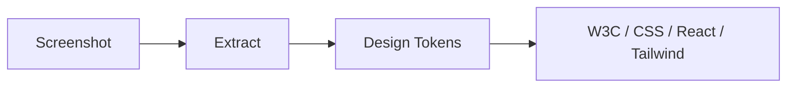

# Copy That

**Screenshot → design tokens → export.**

Upload a UI screenshot, extract colors, spacing, typography, and shadows (plus shape/opacity), then download **W3C Design Tokens**, **CSS**, **React**, **Tailwind**, or a **Design Guide Pack**.

**Live site (hiring showcase):** [joshband.github.io/copy-that](https://joshband.github.io/copy-that/) · [Engineering](https://joshband.github.io/copy-that/engineering.html)
Static pages under [`site/`](./site/) deploy via GitHub Actions (`pages.yml`) — not branch `/docs` (that tree is engineering docs).

[](https://github.com/joshband/copy-that/actions/workflows/ci.yml)
[](https://www.python.org/downloads/)
[](./LICENSE)

---

## What it does

| Included | Opt-in tabs (never run during extract) | Parked (API-only / flag-off) |
|----------|----------------------------------------|------------------------------|
| Colors, spacing, typography, shadows | Mood board (Mood tab), lighting (Lighting tab, on-demand geometry) | Geometry as a standalone surface |
| Shape (border/radius) + opacity | | Sessions, batch jobs, multimodal inputs |
| W3C JSON, CSS, React theme, Tailwind theme | | Flutter / Figma as product surfaces |
| Overview narrative + Export tab | | Default-on GPU / deep-model pipelines |


```mermaid
flowchart LR
    A[Screenshot] --> B[Extract]
    B --> C[Design Tokens]
    C --> D[W3C / CSS / React / Tailwind]
```

---

## Quick start

Requires Python 3.12+, uv, and Node 22.12+ with the pinned pnpm version.

```bash
git clone https://github.com/joshband/copy-that.git
cd copy-that

make install           # uv sync (creates .venv) + pnpm install, both from lockfiles; git hooks
cp .env.example .env   # SECRET_KEY, DATABASE_URL, ANTHROPIC_API_KEY

make db-bootstrap      # Docker Postgres + Alembic
# or: make db-bootstrap-sqlite

# Terminal 1 — API
PYTHONPATH=src .venv/bin/python -m uvicorn copy_that.interfaces.api.main:app --reload --port 8000

# Terminal 2 — UI
pnpm dev               # http://localhost:5173
```

Use the UI: **upload → review tabs → Export**.
OpenAPI: http://localhost:8000/docs · Health: `GET /health`

API-first curls: [docs/examples/api_curl.md](docs/examples/api_curl.md) · fuller setup: [docs/setup/start_here.md](docs/setup/start_here.md)

---

## Validate

```bash
make check          # mypy + ruff + format + tsc + eslint (~1 min)
make verify         # check + full Vitest + pytest unit/integration = everything CI gates
make test-quick     # backend smoke
pnpm test:e2e:mvp   # Playwright MVP pack (mocked)
```

---

## Stack

| Layer | Choice |
|-------|--------|
| API | FastAPI, Pydantic v2, SQLAlchemy + Alembic |
| Extract | Claude + ColorAide (color); CV/OCR (spacing, typography, shadows) |
| UI | React 19 + TypeScript + Vite 8 (`frontend/`) |
| Jobs | Redis + Celery (optional; mood board / async) |
| Deploy | Docker Compose locally; GCP Cloud Run optional (manual — not Actions) |

```
copy-that/
├── src/copy_that/   # API, extractors, exporters
├── frontend/        # Vite React app
├── alembic/         # migrations
├── tests/           # pytest (CI runs tests/unit + tests/integration)
└── docs/            # see DOCUMENTATION_INDEX.md
```

---

## API (happy path)

| Area | Routes |
|------|--------|
| Extract | `POST /api/v1/colors/extract`, `…/spacing/extract`, `…/typography/extract`, `…/shadows/extract` |
| Export | `GET /api/v1/design-tokens/export/w3c`, `…/css`, `…/react`, `…/tailwind`, `…/guide-pack`, `…/guide-html` |
| Projects | `POST/GET /api/v1/projects` |
| Health | `GET /health` · docs `GET /docs` |

Mood board and lighting have their own tabs and only run when you use them; geometry is API-only. Current tab state lives in [`frontend/src/config/featureFlags.ts`](frontend/src/config/featureFlags.ts) — that file, not this README, is the source of truth.

Local Mood generation works without sign-in. Hosted Mood generation requires a
bearer access token and applies a per-user rate limit; the Mood tab provides sign-in and sign-out. Tokens stay in memory, and signing
in does not start generation. Sessions, batch, and multi-extract APIs are
configurable independently of UI tabs; see [runtime access controls](docs/configuration/ENVIRONMENT_VARIABLES.md#api--runtime).

---

## Docs

| Need | Doc |
|------|-----|
| Nav | [DOCUMENTATION_INDEX.md](DOCUMENTATION_INDEX.md) |
| Setup | [docs/setup/start_here.md](docs/setup/start_here.md) |
| Hosted demo plan | [HOSTED_DEMO_PLAN.md](docs/planning/HOSTED_DEMO_PLAN.md) |
| Roadmap | [docs/planning/MVP_EXPANSION_ROADMAP.md](docs/planning/MVP_EXPANSION_ROADMAP.md) |
| Architecture | [docs/architecture/CURRENT_ARCHITECTURE_STATE.md](docs/architecture/CURRENT_ARCHITECTURE_STATE.md) |
| W3C / DTCG | [docs/domain/W3C_CONFORMANCE.md](docs/domain/W3C_CONFORMANCE.md) |
| Mood board | [docs/features/MOOD_BOARD_SPECIFICATION.md](docs/features/MOOD_BOARD_SPECIFICATION.md) |
| Env | [.env.example](.env.example) · [ENVIRONMENT_VARIABLES.md](docs/configuration/ENVIRONMENT_VARIABLES.md) |
| Testing | [docs/testing/TESTING_GUIDE.md](docs/testing/TESTING_GUIDE.md) |

---

## Contributing

1. Branch → change → `make verify` (the same gates CI runs)
2. PRs must pass CI: ruff, format, mypy, `pnpm type-check`, eslint, Vitest, pytest, Playwright MVP pack
3. Never commit secrets — copy from `.env.example` only

Agent rules: [AGENTS.md](AGENTS.md) · workflow: [docs/guides/AGENT_WORKFLOW.md](docs/guides/AGENT_WORKFLOW.md)

MIT License · [Issues](https://github.com/joshband/copy-that/issues) · v1.0.2
