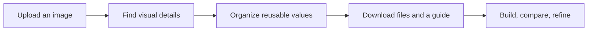

# Copy That

**A visual language anyone can build with.**

A visual language is the colors, text styles, spacing, and other choices that make a design feel consistent. Copy That analyzes an image and organizes what it finds into reusable style values, called **design tokens**. Those values can become styling files for websites and apps, or a shareable guide for people and AI agents.

The goal is to make design accessible to anyone: explore inspiration, try a direction, compare the results, and refine it. Shared values reduce repeated styling work and help people and agents carry the same decisions into each iteration.

Inspiration can come from a screenshot, a photograph, an existing website captured as an image, or another visual. **The current application focuses on interface images—screens from websites and apps.** Broader image sources need their own accuracy checks. The application accepts uploaded images; the website workflow starts with a captured image. Reusable exports support building and styling interfaces; generating a complete interface automatically remains outside the current workflow.

[Project showcase](https://joshband.github.io/copy-that/) · [How it works](https://joshband.github.io/copy-that/engineering.html) · [Setup guide](docs/setup/start_here.md)

The showcase is a static website, with labelled concept studies and example files. To use the application today, run it on your own computer using the instructions below. The pages in [`site/`](site/README.md) publish through GitHub Actions; hosted application access has a separate [invited-demo plan](docs/planning/HOSTED_DEMO_PLAN.md).

[](https://github.com/joshband/copy-that/actions/workflows/ci.yml)
[](https://www.python.org/downloads/)
[](LICENSE)

## How it works

1. **Upload an image.** Start with a screen whose style you want to understand.
2. **Review the details.** Inspect the colors, text styles, spacing, and shadows the tool finds.
3. **Reuse the choices.** Download named style values and a guide for your website, app, or development workflow.
4. **Try and refine.** Apply the choices, compare the result, and repeat as the design develops.


```mermaid
flowchart LR
    A[Upload an image] --> B[Find visual details]
    B --> C[Organize reusable values]
    C --> D[Download files and a guide]
    D --> E[Build, compare, refine]
```

### What is available today

| Area | What you can use |
|------|------------------|
| Visual details | Colors, spacing, text styles, shadows, borders, rounded corners, and transparency |
| Review | A results summary and separate views for the main families of style values |
| Downloads | Shared design-token files, website/app styling formats, and a Design Guide Pack |
| Optional tools | Mood (inspiration boards), lighting analysis, and on-demand layout measurements |
| Separate or deferred scope | Session history, bulk processing, mixed-media inputs, Flutter/Figma product surfaces, and automatic use of heavier image-analysis models |

A result can contain values measured from the image, values calculated from other findings, and defaults. These have different kinds of evidence; a reusable file is not proof that every value was directly observed. The [format and conformance guide](docs/domain/W3C_CONFORMANCE.md) documents those distinctions.

Optional tools run when requested and stay separate from the core upload analysis. Layout measurements use the geometry API, including requests from the Lighting tab; there is no standalone geometry interface. Current navigation is defined in [`featureFlags.ts`](frontend/src/config/featureFlags.ts). Server configuration is independent of those UI choices.

### What the downloads mean

| Format | Purpose |
|--------|---------|
| W3C design-token JSON | A shared file format for named style values. JSON is structured text that software can read. W3C, a web standards organization, hosts the Design Tokens Community Group that publishes this format. |
| CSS | Named values for styling a website—such as colors that can be reused across many elements |
| React theme | Styling values for an application built with the React interface library |
| Tailwind configuration | Styling values for projects using Tailwind, a website styling tool |
| Design Guide Pack | A shareable package that explains and carries the style; an HTML guide is also available |

People can use the guide to understand the choices. Developers and AI agents can use the structured files to apply them consistently. An agent still needs the target application's requirements and context.

## Run it locally

Requires **Python 3.12+**, **uv** (the Python dependency manager), **Node 22.12+**, and the pnpm version pinned in [`package.json`](package.json). Docker is needed for the PostgreSQL setup below; SQLite is available for a local smoke setup.

Actual text recognition also needs the external **Tesseract** program. On macOS, install it with `brew install tesseract`; see the [setup guide](docs/setup/start_here.md) for dependency details. Installing the Python wrapper alone does not install this program.

```bash
git clone https://github.com/joshband/copy-that.git
cd copy-that

make install           # Locked Python/JS development dependencies and Git hooks
cp .env.example .env   # Configure your private settings; never commit .env

make db-bootstrap      # Docker PostgreSQL database and migrations
# Alternative local smoke setup: make db-bootstrap-sqlite

# Terminal 1 — application server
PYTHONPATH=src .venv/bin/python -m uvicorn copy_that.interfaces.api.main:app --reload --port 8000

# Terminal 2 — browser interface
pnpm dev               # http://localhost:5173
```

Before starting the server, configure `SECRET_KEY`, `DATABASE_URL`, and any provider credentials you intend to use, following the [environment-variable guide](docs/configuration/ENVIRONMENT_VARIABLES.md). Keep credentials in local settings. AI-assisted features need the selected provider's configuration; a successful startup alone does not verify live AI extraction.

Open **http://localhost:5173**, upload an image, review the results, and use **Export**. The server's interactive API reference is at **http://localhost:8000/docs**, and `GET /health` checks whether the server is running.

For more detail: [setup](docs/setup/start_here.md) · [API request examples](docs/examples/api_curl.md).

## Check the work

```bash
make check          # Python/TypeScript types, lint, and formatting
make verify         # make check + full frontend and backend unit/integration tests
make test-quick     # Focused backend smoke tests
pnpm test:e2e:mvp   # Key browser workflows with simulated responses
```

`make verify` is the main local code-quality and test gate. [GitHub CI](.github/workflows/ci.yml) additionally checks dependencies and security, startup without optional cloud/deep-image packages, database migrations, and the mocked browser workflow. CI means these checks run automatically for pull requests and changes to `main`.

Simulated browser tests check interaction behavior. They do not establish how accurately the application reads a real image. Real-image evaluation, actual downloaded-file checks, and physical-device testing are separate evidence.

## Technical reference

### Application structure

| Layer | Choice |
|-------|--------|
| Server | FastAPI (Python web framework), Pydantic v2 (data validation), SQLAlchemy + Alembic (database access and migrations) |
| Image analysis | Claude (AI interpretation), ColorAide (color calculations), computer vision (automatic image analysis), and OCR (recognizing text in images) |
| Browser interface | React 19 + TypeScript + Vite 8 in `frontend/` |
| Background jobs | Redis + Celery, optional for Mood and asynchronous work |
| Deployment | Local Docker Compose; optional GCP Cloud Run deployment is manual. GitHub Actions publishes the separate static showcase. |

Canonical image-analysis code lives under `src/copy_that/extractors/`. Larger depth/layout models load only for their separate, on-demand workflows and never during upload analysis. Model identifiers are centralized in [`ai_models.py`](src/copy_that/infrastructure/ai_models.py).

```text
copy-that/
├── src/copy_that/   # Server, image analyzers, and exporters
├── frontend/        # Browser application
├── alembic/         # Database migrations
├── tests/           # Python tests; CI runs unit + integration suites
├── site/            # Static project showcase
└── docs/            # Setup, architecture, formats, and plans
```

### Core API routes

An API is the interface software uses to request work from the server. These routes support the main image-analysis and download workflow:

| Area | Routes |
|------|--------|
| Analyze | `POST /api/v1/colors/extract`, `…/spacing/extract`, `…/typography/extract`, `…/shadows/extract` |
| Download | `GET /api/v1/design-tokens/export/w3c`, `…/css`, `…/react`, `…/tailwind`, `…/guide-pack`, `…/guide-html` |
| Projects | `POST/GET /api/v1/projects` |
| Server status/reference | `GET /health`, `GET /docs` |

Local Mood generation works without sign-in. Hosted Mood generation requires a user's access token and applies a per-user rate limit. The Mood tab provides sign-in and sign-out; tokens stay in memory, and signing in does not start generation. Session, bulk-processing, and multi-extract APIs are configured independently of UI tabs; see [runtime access controls](docs/configuration/ENVIRONMENT_VARIABLES.md#api--runtime).

## Documentation

| Need | Start here |
|------|------------|
| Documentation map | [DOCUMENTATION_INDEX.md](DOCUMENTATION_INDEX.md) |
| Setup | [start_here.md](docs/setup/start_here.md) |
| Hosted demo plan | [HOSTED_DEMO_PLAN.md](docs/planning/HOSTED_DEMO_PLAN.md) |
| Plans and priorities | [MVP_EXPANSION_ROADMAP.md](docs/planning/MVP_EXPANSION_ROADMAP.md) |
| What exists in the code | [CURRENT_ARCHITECTURE_STATE.md](docs/architecture/CURRENT_ARCHITECTURE_STATE.md) |
| Shared format and differences | [W3C_CONFORMANCE.md](docs/domain/W3C_CONFORMANCE.md) |
| Inspiration-board feature | [MOOD_BOARD_SPECIFICATION.md](docs/features/MOOD_BOARD_SPECIFICATION.md) |
| Configuration | [.env.example](.env.example) · [ENVIRONMENT_VARIABLES.md](docs/configuration/ENVIRONMENT_VARIABLES.md) |
| Testing and evidence | [TESTING_GUIDE.md](docs/testing/TESTING_GUIDE.md) |
| Write a README with an agent | [Reusable README prompt](docs/guides/README_AGENT_PROMPT.md) |

## Contributing

1. Work on a branch and run `make verify` plus the browser checks relevant to your change.
2. Keep documentation consistent with actual behavior and label planned capabilities clearly.
3. Pull requests must pass GitHub CI before merging.
4. Keep secrets out of Git; use `.env.example` as the safe configuration template.

Instructions for coding agents: [AGENTS.md](AGENTS.md) · [agent workflow](docs/guides/AGENT_WORKFLOW.md).

MIT License · [Issues](https://github.com/joshband/copy-that/issues) · v1.0.2
