# Copy That

**Universal Multi-Modal Token Platform** — Extract design tokens from any source, transform them into structured data, and generate production-ready code.

[](https://github.com/joshband/copy-that/actions/workflows/ci.yml)
[](https://github.com/joshband/copy-that/actions/workflows/build.yml)
[](https://github.com/joshband/copy-that/actions/workflows/deploy.yml)
[](https://codecov.io/gh/joshband/copy-that)
[](https://www.python.org/downloads/)
[](https://github.com/astral-sh/ruff)
[](https://opensource.org/licenses/MIT)

## Development Setup

This project uses a virtual environment at `.venv/`.

**Backend setup**
```bash
python -m venv .venv
source .venv/bin/activate
make install  # uv editable install + pre-commit hooks
```

**Frontend setup**
```bash
pnpm install  # from repo root
```

**Migrations**
```bash
source .venv/bin/activate
alembic upgrade head
# for new schema changes:
alembic revision --autogenerate -m "message"
```

## 📖 Getting Started

- **Quick start:** [setup/start_here.md](docs/setup/start_here.md)
- **Full docs:** [overview/documentation.md](docs/overview/documentation.md)
- **API examples:** [examples/api_curl.md](docs/examples/api_curl.md)

---

## Overview

Copy That is a modern token extraction and generation platform built with:
- **FastAPI** - High-performance async Python backend
- **W3C Design Tokens** - Industry-standard token schema
- **Domain-Driven Design** - Clean, maintainable architecture
- **Cloud-Native** - Designed for GCP Cloud Run

### Recent additions
- **Optional FastSAM segmentation**: When `FASTSAM_MODEL_PATH` is set and FastSAM (ultralytics) is installed, segmentation masks are computed and attached to spacing results for downstream token graph work.
- **Token graph + alignment**: Containment, gap clustering, and alignment metadata returned with spacing results; Debug toggle in the UI to show overlays/payloads.
- **Regression harness**: Synthetic regression tests plus a fixture manifest scaffold for real screenshots under `tests/regression/`; Playwright checks wired for UI diagnostics.
- **SSE multi-extract** (`/api/v1/extract/stream`): CV-first, AI-second streaming for color + spacing with project persistence.
- **Snapshots**: Immutable project snapshots of color/spacing tokens (`/api/v1/projects/{id}/snapshots`).
- **Batch endpoints**: Color batch (`/api/v1/colors/batch`) and spacing batch with CV+AI merge.
- **Spacing persistence**: First-class `spacing_tokens` table and project load of spacing tokens.
- **AI-Powered** - Claude Sonnet 4.5 for intelligent extraction

## Panel Extraction Pipeline

`src/pipeline/panel_to_tokens.py` provides a self-contained workflow for “control panel” screenshots: preprocess once, run the CV color extractor, detect primitives, classify controls, build a layout graph, and emit typography tokens that reference the detected colors. The exported structure is standard W3C Design Tokens JSON, so you can drop the output straight into downstream systems. See [docs/architecture/token_graph.md](docs/architecture/token_graph.md) for module boundaries and data flow details.

> Note: the legacy multi-agent pipeline under `src/copy_that/pipeline/**` is deprecated in favor of the token graph flow. Migration/removal is tracked in [docs/architecture/legacy_pipeline_retirement.md](docs/architecture/legacy_pipeline_retirement.md).

## 🎯 Current Status (v0.4.2-dev)

**Ready:** Full pipeline architecture implemented for colors and spacing (multi-token extraction).
**Frontend:** Educational UI with TokenGrid/Inspector/Playground + interactive color/spacing demos.
**Backend:** Complete pipeline system (preprocess → extract → aggregate → validate → generate) with W3C Design Tokens support and Figma export.

### ✅ What's Included
- **Pipeline Architecture**: 5-stage pipeline (Preprocessing, Extraction, Aggregation, Validation, Generation)
- **Color Extraction**: Claude Sonnet 4.5 + ColorAide, Delta-E deduplication, provenance tracking
- **Spacing Extraction**: Hybrid CV/AI (spacing models/utils, aggregation, generators, API)
- **Tool Use Integration**: Structured output via Claude Tool Use (no regex parsing)
- **Security**: SSRF protection, async HTTP with httpx, image validation with magic bytes
- **Output Formats**: W3C Design Tokens, CSS Custom Properties, React themes, Tailwind configs, Figma JSON
- **Demos**: Rich HTML/React demos for colors and spacing (WCAG, harmony, provenance, grid alignment)
- **Sessions & Libraries**: Batch extraction, stats, curation (roles), multi-format exports
- **Frontend**: Responsive UI with Zustand store; TokenGrid, Inspector, Playground components
- **Tests**: Comprehensive unit/integration/e2e tests with 50%+ coverage on pipeline components (temporary target while the new pipeline stabilizes)
- **Infrastructure**: Docker-ready; Terraform templates; Alembic migrations; circuit breakers

### 🔭 Next
- **Spacing Tokens**: Hybrid CV/AI approach for spacing extraction (Weeks 2-4)
- **Typography Tokens**: Font detection and classification
- **Security Hardening**: Backend-optimization branch merge for JWT auth
- **Documentation Consolidation**: Single source of truth across all docs

See [ROADMAP.md](ROADMAP.md) for planning; changes in [CHANGELOG.md](CHANGELOG.md).

## Quick Start

### Prerequisites
- Python 3.12+
- Node.js 18+ (for frontend)
- Docker & Docker Compose (optional)
- GCP account (for deployment)

### Local Development

1. **Clone the repository**
   ```bash
   git clone https://github.com/joshband/copy-that.git
   cd copy-that
   ```

2. **Set up environment**
   ```bash
   cp .env.example .env
   # Edit .env with your configuration
   ```

3. **Install Python dependencies**
   ```bash
   make install
   # or: uv pip install -e ".[dev]"
   ```

4. **Set up database** (Neon PostgreSQL)
   ```bash
   # Database is pre-configured with Neon in .env
   # Run migrations to create tables
   alembic upgrade head
   ```

5. **Start backend**
   ```bash
   # Option A: With uvicorn directly
   python -m uvicorn src.copy_that.interfaces.api.main:app --reload --host 0.0.0.0 --port 8000

   # Option B: With Docker Compose
   docker-compose up postgres redis
   # then run uvicorn in separate terminal
   ```

### Docker Production Testing

Test the production Docker image locally before deploying:

```bash
# 1. Validate your .env file
./deploy/validate-env.sh

# 2. Build production image
docker build --target production -t copy-that-api .

# 3. Run locally
docker run -p 8080:8080 --env-file .env copy-that-api

# 4. Test endpoints
curl http://localhost:8080/health
curl http://localhost:8080/api/v1/status
```

6. **Install and run frontend** (in new terminal)
   ```bash
   pnpm install
   pnpm dev  # Vite on http://localhost:5173 (proxies /api to 8000)
   ```

### API Endpoints

**Project Management:**
- `POST /api/v1/projects` - Create new project
- `GET /api/v1/projects` - List all projects
- `GET /api/v1/projects/{id}` - Get project details
- `PUT /api/v1/projects/{id}` - Update project
- `DELETE /api/v1/projects/{id}` - Delete project

**Color Extraction:**
- `POST /api/v1/colors/extract` - Extract colors from image (URL or base64)
- `POST /api/v1/colors` - Create color token manually
- `GET /api/v1/projects/{id}/colors` - Get all colors for project
- `GET /api/v1/colors/{id}` - Get specific color token

**Utilities:**
- `GET /api/v1/health` - Health check
- `GET /api/v1/db-test` - Test database connection
- `GET /api/v1/docs` - API documentation (JSON)

### Running Tests

```bash
# Fast tiers
make test-fast          # targeted fast backend checks
make test-unit          # broader unit suite
make test-int           # integration
make test-all           # full backend

# Regression harness (synthetic + fixtures scaffold)
python -m pytest tests/regression -m "not requires_fixture"

# Frontend
pnpm test               # Vitest
BASE_URL=http://localhost:3000 npx playwright test  # e2e/UX diagnostics

# Linting / typing
make lint
make format
make type-check
```

## Debug + Diagnostics
- **Debug toggle** (Playground header): shows spacing/color payloads, overlays, token inspector, and API debug data passed from the backend.
- **Spacing diagnostics**: Alignment lines, gap clusters, token graph, and FastSAM segmentation (when enabled) surface in the debug panel and overlay.
- **Error surfacing**: Warnings/errors from `validate_extraction` stream to the UI so partial results still render with context.

## FastSAM Segmentation (enabled by default)
FastSAM adds segmentation masks to spacing results for richer grouping/containment heuristics. By default the CV spacing extractor will download and run `FastSAM-s.pt`; disable with `FASTSAM_ENABLED=0`.

```bash
pip install ultralytics torch torchvision
export FASTSAM_MODEL_PATH=/path/to/FastSAM-s.pt  # optional; defaults to auto-download name
export FASTSAM_DEVICE=cuda  # optional; defaults to cpu
```
If unset, the pipeline skips segmentation gracefully.

## LayoutParser + OCR Text Detection (enabled by default)
Text blocks are detected with LayoutParser + Tesseract to attach labels to components. Enabled unless `ENABLE_LAYOUTPARSER_TEXT=0`.

```bash
pip install "layoutparser[layoutmodels]" pytesseract
# ensure Tesseract binary + eng language pack are installed (e.g., `brew install tesseract` on macOS)
# optional mode toggle
export ENABLE_LAYOUTPARSER_TEXT=1  # default
```
If LayoutParser/Tesseract are missing, the pipeline degrades gracefully and skips text detection.

## UIED Ensemble (enabled when runner is set)
UIED can run alongside our pipeline to add CNN-classified UI elements (buttons, inputs, etc.).
Enabled by default when `UIED_RUNNER` points to a UIED runner script/binary; disable with `ENABLE_UIED=0`.

```bash
export UIED_RUNNER=/path/to/uied_runner  # must emit JSON with elements bounds/type/text
```

## UI Regression Data
- Synthetic regression tests live under `tests/regression/`; real screenshot fixtures can be added to `tests/regression/fixtures` with a `manifest.json`.
- See `docs/testing/ui_regression.md` for how to add datasets, expected metrics, and how to run the suite locally or in CI.

### Linting & Type Checking

```bash
# Lint Python
ruff check .

# Format Python
ruff format .

# Type check Python
mypy src/

# Type check frontend
pnpm type-check
```

## Architecture

```mermaid
flowchart TD
    A["Input Adapters<br>Image · Video · Audio · Text · Custom"] --> B["Token Platform (Core)<br>W3C Schema · Token Graph · Ontologies"]
    B --> C["Output Generators<br>React · Flutter · Material · JUCE · ..."]
```



### Tech Stack

**Backend:**
- FastAPI 0.115+ (async REST API)
- Pydantic v2 (strict type validation)
- SQLAlchemy 2.0 + Alembic (async ORM & migrations)
- PostgreSQL 17 (Neon serverless)
- Redis 7 (caching, background jobs)
- Celery (async task queue)

**Frontend:**
- React 18 (modern component library)
- Vite (next-gen bundler)
- TypeScript 5.3 (strict type checking)
- Axios (HTTP client)
- CSS3 (animations, gradients, responsive design)

**AI/ML:**
- Anthropic Claude Sonnet 4.5 (color extraction)
- OpenAI GPT-4V (alternative color extractor)
- ColorAide (color science calculations)
- Meta SAM (Segment Anything - future)

**Infrastructure:**
- Docker / Docker Compose (local dev)
- GCP Cloud Run (serverless deployment)
- Terraform (infrastructure as code)
- GitHub Actions (CI/CD)

## Project Structure

```
copy-that/
├── src/copy_that/           # Application code
│   ├── domain/              # Domain models and business logic
│   ├── application/         # Use cases and services
│   ├── infrastructure/      # External dependencies (DB, Redis, etc.)
│   └── interfaces/          # API endpoints, CLI, etc.
├── tests/                   # Test suite
│   ├── unit/               # Unit tests
│   ├── integration/        # Integration tests
│   └── e2e/               # End-to-end tests
├── deploy/                  # Deployment configs
│   ├── local/              # Local development
│   ├── terraform/          # Infrastructure as code
│   └── cloudrun/           # Cloud Run configs
├── docs/                    # Documentation
│   ├── api/                # API documentation
│   ├── architecture/       # Architecture docs
│   └── guides/             # User guides
├── .github/workflows/       # CI/CD pipelines
├── Dockerfile              # Multi-stage Docker build
├── Dockerfile.cloudrun     # Cloud Run optimized
└── docker-compose.yml      # Local development stack
```

## API Documentation

Once running, visit:
- **Swagger UI**: http://localhost:8000/docs
- **ReDoc**: http://localhost:8000/redoc

Key endpoints:
- `POST /api/v1/extract/color` - Extract color tokens from image
- `POST /api/v1/extract/spacing` - Extract spacing tokens
- `POST /api/v1/extract/typography` - Extract typography tokens
- `GET /api/v1/projects/{id}` - Get project details
- `GET /api/v1/db-test` - Test database connection
- `GET /api/v1/health` - Health check

## Deployment

### Choose Your Deployment Option

**Option 1: Minimal Cloud** (~$0-5/month) - **Recommended for personal/demo**
- Perfect for: Personal projects, sharing with friends/family
- Cost: Pay only when URL is accessed
- Setup time: 30 minutes
- See: [docs/setup_minimal.md](docs/setup_minimal.md)

**Option 2: Full Cloud** ($30-890/month) - **For production**
- Perfect for: Production apps, compliance needs, high traffic
- Cost: Staging $30-70/month, Production $320-890/month
- Setup time: 60 minutes
- See: [docs/infrastructure_setup.md](docs/infrastructure_setup.md)

**Option 3: Local Development** (FREE)
- Perfect for: Daily development
- Cost: $0
- Setup: `docker-compose up`

Compare options: [docs/deployment_options.md](docs/deployment_options.md)

### Quick Deploy (Minimal)
```bash
# 1. Create free accounts
https://neon.tech      # Free Postgres
https://upstash.com    # Free Redis

# 2. Deploy infrastructure
cd deploy/terraform
mv main.tf main-full.tf && mv main-minimal.tf main.tf
terraform init && terraform apply

# 3. Get your public URL
terraform output api_url
```

### Quick Deploy (Full)
```bash
# Deploy with Terraform
cd deploy/terraform
terraform init
terraform apply

# Or via GitHub Actions (auto-deploys)
git push origin develop  # → staging
git push origin main     # → production
```

See [docs/deployment.md](docs/deployment.md) for detailed guides.

## Contributing

1. Fork the repository
2. Create a feature branch (`git checkout -b feature/amazing-feature`)
3. Commit your changes (`git commit -m 'Add amazing feature'`)
4. Push to the branch (`git push origin feature/amazing-feature`)
5. Open a Pull Request

## Development Workflow

1. **Feature Branch** - Create branch from `develop`
2. **Code** - Implement feature with tests
3. **CI Checks** - All tests, linting, type checking, security scans must pass
4. **PR Review** - Submit PR to `develop`
5. **Merge** - Auto-deploy to staging
6. **Release** - Merge `develop` → `main` for production

### CI Security Scanning

The CI pipeline includes automated security checks:
- **pip-audit** - Dependency vulnerability scanning
- **Bandit** - Python security linter
- **Trivy** - Container image vulnerability scanner
- **Gitleaks** - Secret detection in git history
- **Dependabot** - Automated dependency updates (weekly)

## License

MIT License - see [LICENSE](LICENSE) for details.

## Support

- **Documentation**: [docs/overview/documentation.md](docs/overview/documentation.md) - Complete documentation guide
- **Quick Start**: [docs/start_here.md](docs/start_here.md)
- **API Docs**: http://localhost:8000/docs (when running)
- **Issues**: [GitHub Issues](https://github.com/joshband/copy-that/issues)
- **Discussions**: [GitHub Discussions](https://github.com/joshband/copy-that/discussions)

## Acknowledgments

- Built with [Claude Code](https://claude.com/claude-code)
- Inspired by the W3C Design Tokens Community Group
- Powered by Anthropic Claude Sonnet 4.5

---

**Status**: 🚧 Active Development | **Version**: 0.4.1 | **Last Updated**: 2025-11-23
