# Copy That

**Turn any design into production-ready design tokens** — Extract colors, spacing, typography, and shadows from screenshots using AI, transform them into W3C Design Tokens, and generate code for React, Flutter, Material, and more.

[](https://github.com/joshband/copy-that/actions/workflows/ci.yml)
[](https://github.com/joshband/copy-that/actions/workflows/build.yml)
[](https://github.com/joshband/copy-that/actions/workflows/deploy.yml)
[](https://codecov.io/gh/joshband/copy-that)
[](https://www.python.org/downloads/)
[](https://opensource.org/licenses/MIT)

---

## What is Copy That?

Copy That transforms screenshots into structured design tokens using AI and computer vision. Upload an image, get production-ready design systems.

```mermaid
flowchart LR
    A[📸 Screenshot] --> B[🤖 AI Analysis]
    B --> C[🎨 Design Tokens]
    C --> D[⚛️ React Code]
    C --> E[📱 Flutter Code]
    C --> F[🎯 Material Theme]
    C --> G[💾 W3C JSON]

    style A fill:#e1f5ff
    style B fill:#fff3e0
    style C fill:#f3e5f5
    style D fill:#e8f5e9
    style E fill:#e8f5e9
    style F fill:#e8f5e9
    style G fill:#e8f5e9
```



---

## Features

### 🎨 Multi-Token Extraction

Extract **4 types of design tokens** from any screenshot:

| Token Type | What It Extracts | AI Model |
|------------|------------------|----------|
| **Colors** | Brand colors, semantic roles, harmonies | Claude Sonnet 4.5 |
| **Spacing** | Margins, padding, gaps with alignment | CV + FastSAM |
| **Typography** | Fonts, sizes, weights, line heights | LayoutParser + OCR |
| **Shadows** | Elevation, blur, spread, lighting direction | Computer Vision |

### 🔄 The Transformation Flow


### 🎯 Real Example

**Input:** Upload a screenshot (e.g., `test_images/IMG_8405.jpeg`)

**Output:**
```json
{
  "colors": {
    "primary": {
      "value": "#2196F3",
      "type": "color",
      "confidence": 0.95,
      "semantic_role": "primary",
      "harmony": "analogous"
    }
  },
  "spacing": {
    "margin-md": {
      "value": "16px",
      "type": "spacing",
      "alignment": "8px-grid"
    }
  }
}
```

**Generated Code:**
```typescript
// React Theme
export const theme = {
  colors: {
    primary: '#2196F3',
  },
  spacing: {
    md: '16px',
  }
}
```

---

## Quick Start

### 1. Clone and Setup

```bash
git clone https://github.com/joshband/copy-that.git
cd copy-that

# Backend setup
python -m venv .venv
source .venv/bin/activate
make install

# Frontend setup
pnpm install
```

### 2. Configure Environment

```bash
cp .env.example .env
# Edit .env with your API keys
```

### 3. Run Database Migrations

```bash
alembic upgrade head
```

### 4. Start Services

```bash
# Backend (Terminal 1)
python -m uvicorn src.copy_that.interfaces.api.main:app --reload --port 8000

# Frontend (Terminal 2)
pnpm dev  # http://localhost:5176
```

### 5. Extract Your First Tokens

```bash
# Upload an image via UI: http://localhost:5176
# Or use API:
curl -X POST http://localhost:8000/api/v1/colors/extract \
  -H "Content-Type: application/json" \
  -d '{"image_url": "https://example.com/design.png"}'
```

---

## ⚡ Fast Development Workflow

**Stop waiting for CI failures!** Catch issues locally in seconds.

### Quick Validation (30 seconds)

```bash
make check          # mypy + ruff + typecheck
make user-test      # 10 sec standup (backend + frontend)
```

### TDD Mode (Continuous)

```bash
make test-watch     # Auto-run tests on save
```

### Coverage Reports (1 minute)

```bash
make coverage       # Generate HTML + XML reports
open htmlcov/index.html
```

### Common Workflow

```bash
# 1. Code your feature
# 2. Fast validation
make check              # 30 sec

# 3. Quick tests
make test-quick         # 2-3 min

# 4. Commit and push
git add . && git commit -m "feat: ..."
git push                # Pre-push hook validates automatically
```

**Time Savings:** 58% faster! (~45-60 min/day saved)
**Details:** See [FAST_DEVELOPMENT_WORKFLOW.md](FAST_DEVELOPMENT_WORKFLOW.md)

---

## Architecture

### High-Level Flow


### Tech Stack

**Backend:**
- FastAPI + Pydantic v2 (async REST API with strict typing)
- PostgreSQL 17 (Neon serverless database)
- SQLAlchemy 2.0 + Alembic (async ORM & migrations)
- Redis (Upstash - caching, rate limiting)

**AI/ML:**
- Anthropic Claude Sonnet 4.5 (intelligent color extraction)
- Meta Segment Anything (FastSAM - spacing detection)
- LayoutParser + Tesseract (typography extraction)
- OpenCV + scipy (shadow analysis)

**Frontend:**
- React 18 + TypeScript 5.3 (strict type checking)
- Vite (lightning-fast builds)
- Zustand (state management)
- CSS3 (modern animations)

**Infrastructure:**
- Docker + Docker Compose (local dev)
- GCP Cloud Run (serverless production)
- Terraform (infrastructure as code)
- GitHub Actions (CI/CD with tiered testing)

---

## Project Structure

```
copy-that/
├── src/copy_that/              # Application code (44K LOC Python)
│   ├── extractors/             # 4 token extractors (Color, Spacing, Typography, Shadow)
│   ├── generators/             # 17+ output generators
│   ├── domain/                 # Business logic & models
│   ├── infrastructure/         # Database, Redis, external services
│   └── interfaces/             # API endpoints (FastAPI)
├── frontend/                   # React UI (31K LOC TypeScript)
│   ├── src/components/         # UI components
│   ├── src/features/           # Feature modules
│   └── src/shared/             # Shared utilities
├── tests/                      # Test suite (1,253 tests collected)
├── deploy/                     # Deployment configs
│   ├── terraform/              # Infrastructure as code (Neon + GCP)
│   ├── local/                  # Docker Compose
│   └── cloudrun/               # Cloud Run configs
└── docs/                       # Documentation (92 files)
```

---

## API Documentation

**Interactive Docs:** http://localhost:8000/docs (Swagger UI)

### Key Endpoints

**Extract Tokens:**
```bash
POST /api/v1/colors/extract          # Extract color palette
POST /api/v1/spacing/extract         # Extract spacing system
POST /api/v1/typography/extract      # Extract typography
POST /api/v1/shadows/extract         # Extract shadow tokens
POST /api/v1/extract/stream          # Multi-extractor (SSE streaming)
```

**Projects:**
```bash
POST   /api/v1/projects              # Create project
GET    /api/v1/projects              # List projects
GET    /api/v1/projects/{id}/colors  # Get project colors
POST   /api/v1/projects/{id}/snapshots  # Create snapshot
```

**Utilities:**
```bash
GET /api/v1/health                   # Health check
GET /api/v1/db-test                  # Database connection test
```

---

## Development Commands

### Validation & Testing

```bash
make check          # ⚡ 30 sec - Fast validation (mypy + ruff + typecheck)
make test-quick     # ⚡ 2-3 min - Smoke tests
make test-watch     # 🔥 TDD mode - Auto-run on save
make coverage       # 📊 Coverage reports
make ci-local       # 🔄 Full CI locally (5-10 min)
```

### Development

```bash
make dev            # Start Docker Compose (all services)
make user-test      # 🎯 10 sec standup (backend + frontend)
make logs           # View service logs
make stop           # Stop all services
```

### Database

```bash
make db-migrate     # Run Alembic migrations
make db-rollback    # Rollback last migration
make db-reset       # ⚠️  Reset database (drops all data)
```

**Full command list:** `make help`

---

## Deployment

### Cost-Optimized Stack (~$5-17/month)


**Savings: ~$95-150/month** vs traditional Cloud SQL + Memorystore setup

### Automated Deployment

```bash
# 1. Configure GitHub Secrets
# NEON_DATABASE_URL, APP_SECRET_KEY, ANTHROPIC_API_KEY, GCP_PROJECT_ID

# 2. Push to main
git push origin main

# Automatic workflow:
# ✅ Lint & type check (30 sec)
# ✅ Test suite (5-10 min)
# ✅ Docker build (3-5 min)
# ✅ Deploy to Cloud Run (2 min)
# ✅ Run migrations
# ✅ Health checks
```

**CI/CD Features:**
- Tiered testing (smart resource usage)
- Auto-cancel old runs (no duplicate work)
- Dependency caching (faster builds)
- Parallel jobs (maximum speed)

---

## Example: Color Extraction

### Input

```bash
# Upload via API
curl -X POST http://localhost:8000/api/v1/colors/extract \
  -F "image=@test_images/IMG_8405.jpeg"
```

### Processing

1. **Claude Sonnet 4.5** analyzes the image
2. **ColorAide** calculates color science (Delta-E, Oklch)
3. **Semantic naming** assigns roles (primary, accent, background)
4. **Harmony detection** identifies color relationships
5. **Token graph** creates references and relationships

### Output (W3C Design Tokens)

```json
{
  "colors": {
    "primary": {
      "value": "#2196F3",
      "type": "color",
      "$extensions": {
        "confidence": 0.95,
        "semantic_role": "primary",
        "harmony": "analogous",
        "oklch": {"l": 0.57, "c": 0.18, "h": 252},
        "contrast_ratio": 4.5,
        "wcag_aa": true
      }
    },
    "accent": {
      "value": "{colors.primary}",
      "type": "color",
      "$extensions": {
        "lightness_shift": 0.2
      }
    }
  }
}
```

### Generated Code

**React:**
```typescript
export const theme = {
  colors: {
    primary: '#2196F3',
    accent: '#64B5F6',
  }
}
```

**Flutter:**
```dart
class AppColors {
  static const primary = Color(0xFF2196F3);
  static const accent = Color(0xFF64B5F6);
}
```

**CSS:**
```css
:root {
  --color-primary: #2196F3;
  --color-accent: #64B5F6;
}
```

---

## Visual Examples Gallery

### Design Aesthetic Transformations

**See the complete workflow: Screenshot → Token Extraction → Generated UI**

<table>
<tr>
<th>Input Screenshot</th>
<th>Extracted Design Tokens</th>
<th>Generated UI Output</th>
</tr>
<tr>
<td><br/><sub><strong>Retro Pop Industrial</strong><br/>Original screenshot</sub></td>
<td>
<strong>Extracted:</strong><br/>
• Bold color palette<br/>
• 16px spacing grid<br/>
• Retro typography<br/>
• Hard shadows<br/>
• Pop art aesthetic<br/>
<br/>
<em>→ Claude Sonnet 4.5 + FastSAM</em>
</td>
<td><br/><sub><strong>Generated UI</strong><br/>Built from extracted tokens</sub></td>
</tr>
<tr>
<td><br/><sub><strong>Luminous Pastel Industrial</strong><br/>Original screenshot</sub></td>
<td>
<strong>Extracted:</strong><br/>
• Pastel harmonies<br/>
• 8px grid system<br/>
• Light sans-serif<br/>
• Subtle elevation<br/>
• Minimalist design<br/>
<br/>
<em>→ Claude Sonnet 4.5 + FastSAM</em>
</td>
<td><br/><sub><strong>Generated UI</strong><br/>Built from extracted tokens</sub></td>
</tr>
</table>

### Shadow Extraction Process

**Computer vision analysis extracting elevation and lighting:**

<table>
<tr>
<th>1. Original Image</th>
<th>2. Illumination Analysis</th>
<th>3. Shadow Extraction</th>
</tr>
<tr>
<td><br/><sub>Input screenshot</sub></td>
<td><br/><sub>Lighting direction detection</sub></td>
<td><br/><sub>Isolated shadow tokens</sub></td>
</tr>
</table>

**Process outputs:**
- Shadow blur radius, spread, offset
- Elevation levels (Material Design)
- Lighting direction (compass)
- CSS shadow generation

**More test images** in `test_images/`:
- `IMG_8405.jpeg` - Rich color UI
- `IMG_8501.jpeg` - Typography-heavy
- `IMG_8757.jpeg` - Complex spacing
- `IMG_8634.jpeg` - Shadow examples

---

## Architecture Highlights

### Multi-Extractor Orchestration

Run **4 extractors in parallel** using `asyncio.gather()`:

```python
# 1.2-1.5x speedup with parallel extraction
results = await asyncio.gather(
    color_extractor.extract(image),
    spacing_extractor.extract(image),
    typography_extractor.extract(image),
    shadow_extractor.extract(image),
)
```

### Token Graph System

Tokens can **reference other tokens** (W3C standard):

```json
{
  "shadow-card": {
    "value": {
      "color": "{colors.primary}",
      "offsetX": "{spacing.sm}",
      "offsetY": "{spacing.md}",
      "blur": "{spacing.lg}"
    }
  }
}
```

### Adapter Pattern

**Generic components** work with ANY token type:

```typescript
// ColorVisualAdapter, SpacingVisualAdapter, TypographyVisualAdapter
// All implement the same TokenVisualAdapter<T> interface
// Zero coupling between token types and UI components
```

---

## Testing

**Coverage:** 97.9% pass rate (424/446 tests)

```bash
# Fast iterations
make test-watch         # Auto-run on save (TDD mode)

# Quick validation
make test-quick         # 2-3 min (smoke tests)

# Full suite
make test               # 10-15 min (all tests)

# Coverage
make coverage           # Generate HTML reports
open htmlcov/index.html
```

### Test Tiers (CI Optimization)

| Tier | When | Tests Run | Duration |
|------|------|-----------|----------|
| **Light** | Feature branches | Fast tests only | ~2-3 min |
| **Medium** | main/develop | Core + integration | ~5-10 min |
| **Heavy** | Release tags | Full suite | ~15-20 min |

---

## Documentation

**Master Index:** [DOCUMENTATION_INDEX.md](DOCUMENTATION_INDEX.md)

**Quick Links:**
- [Getting Started](docs/setup/start_here.md)
- [API Examples](docs/examples/api_curl.md)
- [Architecture](docs/architecture/CURRENT_ARCHITECTURE_STATE.md)
- [Fast Workflow Guide](FAST_DEVELOPMENT_WORKFLOW.md)
- [Testing Strategy](docs/testing/COMPREHENSIVE_TESTING_STRATEGY.md)

---

## Features Showcase

### 🎨 Color Extraction
- AI-powered palette extraction (Claude Sonnet 4.5)
- Semantic role assignment (primary, accent, background)
- Color harmony detection (analogous, complementary, triadic)
- WCAG contrast checking
- Delta-E deduplication (20-30% fewer duplicates)
- Oklch color space for perceptual uniformity

### 📐 Spacing Extraction
- FastSAM segmentation for visual grouping
- 8px grid alignment detection
- Gap clustering (common spacing values)
- Containment relationships
- Margin/padding distinction

### 📝 Typography Extraction
- Font family detection (LayoutParser + OCR)
- Size, weight, line height extraction
- Text role classification (heading, body, label)
- Font stack recommendations

### 🌓 Shadow Extraction
- Elevation level detection (Material Design)
- Lighting direction analysis (compass visualization)
- Blur and spread calculation
- Quality metrics (softness, realism)
- CSS shadow generation

### 🎭 Mood Board Generation
- AI-powered art movement classification
- Color temperature analysis (warm/cool)
- Visual style detection (minimalist, maximalist, etc.)
- Aesthetic recommendations

---

## Tech Highlights

### AI & Computer Vision Stack

- **Claude Sonnet 4.5:** Structured output for type-safe extraction (~$0.01-0.02 per image)
- **Meta SAM (FastSAM):** Segmentation for spatial relationships
- **LayoutParser:** Document layout analysis for typography
- **Tesseract OCR:** Text detection and recognition
- **ColorAide:** Perceptual color science (Delta-E, Oklch)
- **OpenCV + scipy:** Shadow detection and analysis

### Infrastructure Features

- **Neon PostgreSQL:** Serverless database with branching ($0-19/month)
- **Upstash Redis:** Serverless caching and rate limiting (free tier)
- **Cloud Run:** Auto-scaling, scale-to-zero containers
- **Terraform:** Multi-environment infrastructure (local, dev, prod)
- **GitHub Actions:** Tiered CI/CD with auto-cancel optimization

---

## Production Deployment

### Terraform Infrastructure

```bash
cd deploy/terraform/

# Initialize
terraform init

# Plan changes
terraform plan

# Apply infrastructure
terraform apply

# Manages:
# - Cloud Run services (3 environments)
# - Artifact Registry (Docker images)
# - VPC networking + Cloud NAT
# - Workload Identity (secure auth)
# - Secret Manager (API keys)
# - Neon PostgreSQL (multi-branch)
```

**Environments:**
- **Local:** Docker Compose (free, fast iteration)
- **Dev/Staging:** Neon free tier + Cloud Run min=0 ($0-5/month)
- **Production:** Neon Pro + Cloud Run auto-scale ($10-30/month)

---

## Security

**Built-in protections:**
- ✅ SSRF protection (image URL validation)
- ✅ Rate limiting with quota tracking
- ✅ Magic byte validation (prevent malicious uploads)
- ✅ Async HTTP (httpx with timeouts)
- ✅ JWT authentication ready
- ✅ Secrets in GCP Secret Manager

**CI Security Scanning:**
- pip-audit (dependency vulnerabilities)
- Bandit (Python security linter)
- Trivy (container image scanner)
- Gitleaks (secret detection)

---

## Contributing

1. Fork the repository
2. Create feature branch (`git checkout -b feature/amazing-feature`)
3. Run validation (`make check`)
4. Run tests (`make test-quick`)
5. Commit changes (`git commit -m 'Add amazing feature'`)
6. Push to branch (`git push origin feature/amazing-feature`)
7. Open Pull Request

**Code Quality:** All PRs must pass:
- mypy type checking
- ruff linting
- pnpm typecheck
- Test suite (>80% coverage)

---

## Roadmap

**Current (v0.4.2):**
- ✅ Color, Spacing, Typography, Shadow extraction
- ✅ Multi-extractor orchestration (parallel)
- ✅ W3C Design Tokens output
- ✅ 17+ generator plugins
- ✅ Token graph with relationships
- ✅ Mood board generation

**Next:**
- Video frame extraction (multi-modal)
- Audio waveform → color mapping (synesthesia)
- Generative UI (image → production code)
- Plugin marketplace
- SaaS multi-tenancy

See [ROADMAP.md](ROADMAP.md) for full roadmap.

---

## License

MIT License - see [LICENSE](LICENSE)

---

## Support

- **Docs:** [DOCUMENTATION_INDEX.md](DOCUMENTATION_INDEX.md)
- **Issues:** [GitHub Issues](https://github.com/joshband/copy-that/issues)
- **API Docs:** http://localhost:8000/docs

---

**Built with:** [Claude Code](https://claude.com/claude-code) | **Powered by:** Anthropic Claude Sonnet 4.5

---

**Version:** 0.4.2 | **Status:** Active Development | **Last Updated:** 2025-12-12
