# Copy That

**Universal Multi-Modal Token Platform** — Extract design tokens from any source, transform them into structured data, and generate production-ready code.

[](https://github.com/joshband/copy-that/actions/workflows/ci.yml)
[](https://github.com/joshband/copy-that/actions/workflows/build.yml)
[](https://github.com/joshband/copy-that/actions/workflows/deploy.yml)
[](https://codecov.io/gh/joshband/copy-that)
[](https://www.python.org/downloads/)
[](https://github.com/astral-sh/ruff)
[](https://opensource.org/licenses/MIT)

## Development Setup

This project uses a virtual environment at `.venv/`.

**Always activate before running commands:**
```bash
source .venv/bin/activate
```

**For Alembic migrations:**
1. Activate venv: `source .venv/bin/activate`
2. Run migrations: `alembic revision --autogenerate -m "message"`

## 📖 Getting Started

- **Quick start:** [setup/start_here.md](docs/setup/start_here.md)
- **Full docs:** [overview/documentation.md](docs/overview/documentation.md)
- **API examples:** [examples/api_curl.md](docs/examples/api_curl.md)

---

## Overview

Copy That is a modern token extraction and generation platform built with:
- **FastAPI** - High-performance async Python backend
- **W3C Design Tokens** - Industry-standard token schema
- **Domain-Driven Design** - Clean, maintainable architecture
- **Cloud-Native** - Designed for GCP Cloud Run
- **AI-Powered** - Claude Sonnet 4.5 for intelligent extraction

## 🎯 Current Status (v0.4.2-dev)

**Ready:** Full pipeline architecture implemented for colors and spacing (multi-token extraction).
**Frontend:** Educational UI with TokenGrid/Inspector/Playground + interactive color/spacing demos.
**Backend:** Complete pipeline system (preprocess → extract → aggregate → validate → generate) with W3C Design Tokens support and Figma export.

### ✅ What's Included
- **Pipeline Architecture**: 5-stage pipeline (Preprocessing, Extraction, Aggregation, Validation, Generation)
- **Color Extraction**: Claude Sonnet 4.5 + ColorAide, Delta-E deduplication, provenance tracking
- **Spacing Extraction**: Hybrid CV/AI (spacing models/utils, aggregation, generators, API)
- **Tool Use Integration**: Structured output via Claude Tool Use (no regex parsing)
- **Security**: SSRF protection, async HTTP with httpx, image validation with magic bytes
- **Output Formats**: W3C Design Tokens, CSS Custom Properties, React themes, Tailwind configs, Figma JSON
- **Demos**: Rich HTML/React demos for colors and spacing (WCAG, harmony, provenance, grid alignment)
- **Sessions & Libraries**: Batch extraction, stats, curation (roles), multi-format exports
- **Frontend**: Responsive UI with Zustand store; TokenGrid, Inspector, Playground components
- **Tests**: Comprehensive unit/integration/e2e tests with 95%+ coverage on pipeline components
- **Infrastructure**: Docker-ready; Terraform templates; Alembic migrations; circuit breakers

### 🔭 Next
- **Spacing Tokens**: Hybrid CV/AI approach for spacing extraction (Weeks 2-4)
- **Typography Tokens**: Font detection and classification
- **Security Hardening**: Backend-optimization branch merge for JWT auth
- **Documentation Consolidation**: Single source of truth across all docs

See [ROADMAP.md](ROADMAP.md) for planning; changes in [CHANGELOG.md](CHANGELOG.md).

## Quick Start

### Prerequisites
- Python 3.12+
- Node.js 18+ (for frontend)
- Docker & Docker Compose (optional)
- GCP account (for deployment)

### Local Development

1. **Clone the repository**
   ```bash
   git clone https://github.com/joshband/copy-that.git
   cd copy-that
   ```

2. **Set up environment**
   ```bash
   cp .env.example .env
   # Edit .env with your configuration
   ```

3. **Install Python dependencies**
   ```bash
   pip install -e ".[dev]"
   ```

4. **Set up database** (Neon PostgreSQL)
   ```bash
   # Database is pre-configured with Neon in .env
   # Run migrations to create tables
   alembic upgrade head
   ```

5. **Start backend**
   ```bash
   # Option A: With uvicorn directly
   python -m uvicorn src.copy_that.interfaces.api.main:app --reload --host 0.0.0.0 --port 8000

   # Option B: With Docker Compose
   docker-compose up postgres redis
   # then run uvicorn in separate terminal
   ```

### Docker Production Testing

Test the production Docker image locally before deploying:

```bash
# 1. Validate your .env file
./deploy/validate-env.sh

# 2. Build production image
docker build --target production -t copy-that-api .

# 3. Run locally
docker run -p 8080:8080 --env-file .env copy-that-api

# 4. Test endpoints
curl http://localhost:8080/health
curl http://localhost:8080/api/v1/status
```

6. **Install and run frontend** (in new terminal)
   ```bash
   # Install dependencies
   npm install

   # Start dev server (Vite)
   npm run dev

   # Frontend will be at http://localhost:5173
   # Proxies API calls to http://localhost:8000
   ```

### API Endpoints

**Project Management:**
- `POST /api/v1/projects` - Create new project
- `GET /api/v1/projects` - List all projects
- `GET /api/v1/projects/{id}` - Get project details
- `PUT /api/v1/projects/{id}` - Update project
- `DELETE /api/v1/projects/{id}` - Delete project

**Color Extraction:**
- `POST /api/v1/colors/extract` - Extract colors from image (URL or base64)
- `POST /api/v1/colors` - Create color token manually
- `GET /api/v1/projects/{id}/colors` - Get all colors for project
- `GET /api/v1/colors/{id}` - Get specific color token

**Utilities:**
- `GET /api/v1/health` - Health check
- `GET /api/v1/db-test` - Test database connection
- `GET /api/v1/docs` - API documentation (JSON)

### Running Tests

```bash
# Backend tests (46 passing)
python -m pytest tests/ -v

# Backend tests with coverage
python -m pytest tests/ --cov=src/copy_that --cov-report=html

# Frontend tests
pnpm test

# Type checking
pnpm type-check

# All tests and type-check
pnpm test:all
```

**Current Test Coverage:**
- ✅ Backend: 46 tests (100% for color extraction modules)
- ⚠️ Frontend: Code-complete, TDD in Phase 4.5

**Test Roadmap:** See [test_coverage_roadmap.md](test_coverage_roadmap.md) for iterative TDD plan

### Linting & Type Checking

```bash
# Lint Python
ruff check .

# Format Python
ruff format .

# Type check Python
mypy src/

# Type check frontend
npm run type-check
```

## Architecture

```mermaid
flowchart TD
    A["Input Adapters<br>Image · Video · Audio · Text · Custom"] --> B["Token Platform (Core)<br>W3C Schema · Token Graph · Ontologies"]
    B --> C["Output Generators<br>React · Flutter · Material · JUCE · ..."]
```



### Tech Stack

**Backend:**
- FastAPI 0.115+ (async REST API)
- Pydantic v2 (strict type validation)
- SQLAlchemy 2.0 + Alembic (async ORM & migrations)
- PostgreSQL 17 (Neon serverless)
- Redis 7 (caching, background jobs)
- Celery (async task queue)

**Frontend:**
- React 18 (modern component library)
- Vite (next-gen bundler)
- TypeScript 5.3 (strict type checking)
- Axios (HTTP client)
- CSS3 (animations, gradients, responsive design)

**AI/ML:**
- Anthropic Claude Sonnet 4.5 (color extraction)
- OpenAI GPT-4V (alternative color extractor)
- ColorAide (color science calculations)
- Meta SAM (Segment Anything - future)

**Infrastructure:**
- Docker / Docker Compose (local dev)
- GCP Cloud Run (serverless deployment)
- Terraform (infrastructure as code)
- GitHub Actions (CI/CD)

## Project Structure

```
copy-that/
├── src/copy_that/           # Application code
│   ├── domain/              # Domain models and business logic
│   ├── application/         # Use cases and services
│   ├── infrastructure/      # External dependencies (DB, Redis, etc.)
│   └── interfaces/          # API endpoints, CLI, etc.
├── tests/                   # Test suite
│   ├── unit/               # Unit tests
│   ├── integration/        # Integration tests
│   └── e2e/               # End-to-end tests
├── deploy/                  # Deployment configs
│   ├── local/              # Local development
│   ├── terraform/          # Infrastructure as code
│   └── cloudrun/           # Cloud Run configs
├── docs/                    # Documentation
│   ├── api/                # API documentation
│   ├── architecture/       # Architecture docs
│   └── guides/             # User guides
├── .github/workflows/       # CI/CD pipelines
├── Dockerfile              # Multi-stage Docker build
├── Dockerfile.cloudrun     # Cloud Run optimized
└── docker-compose.yml      # Local development stack
```

## API Documentation

Once running, visit:
- **Swagger UI**: http://localhost:8000/docs
- **ReDoc**: http://localhost:8000/redoc

Key endpoints:
- `POST /api/v1/extract/color` - Extract color tokens from image
- `POST /api/v1/extract/spacing` - Extract spacing tokens
- `POST /api/v1/extract/typography` - Extract typography tokens
- `GET /api/v1/projects/{id}` - Get project details
- `GET /api/v1/db-test` - Test database connection
- `GET /api/v1/health` - Health check

## Deployment

### Choose Your Deployment Option

**Option 1: Minimal Cloud** (~$0-5/month) - **Recommended for personal/demo**
- Perfect for: Personal projects, sharing with friends/family
- Cost: Pay only when URL is accessed
- Setup time: 30 minutes
- See: [docs/setup_minimal.md](docs/setup_minimal.md)

**Option 2: Full Cloud** ($30-890/month) - **For production**
- Perfect for: Production apps, compliance needs, high traffic
- Cost: Staging $30-70/month, Production $320-890/month
- Setup time: 60 minutes
- See: [docs/infrastructure_setup.md](docs/infrastructure_setup.md)

**Option 3: Local Development** (FREE)
- Perfect for: Daily development
- Cost: $0
- Setup: `docker-compose up`

Compare options: [docs/deployment_options.md](docs/deployment_options.md)

### Quick Deploy (Minimal)
```bash
# 1. Create free accounts
https://neon.tech      # Free Postgres
https://upstash.com    # Free Redis

# 2. Deploy infrastructure
cd deploy/terraform
mv main.tf main-full.tf && mv main-minimal.tf main.tf
terraform init && terraform apply

# 3. Get your public URL
terraform output api_url
```

### Quick Deploy (Full)
```bash
# Deploy with Terraform
cd deploy/terraform
terraform init
terraform apply

# Or via GitHub Actions (auto-deploys)
git push origin develop  # → staging
git push origin main     # → production
```

See [docs/deployment.md](docs/deployment.md) for detailed guides.

## Contributing

1. Fork the repository
2. Create a feature branch (`git checkout -b feature/amazing-feature`)
3. Commit your changes (`git commit -m 'Add amazing feature'`)
4. Push to the branch (`git push origin feature/amazing-feature`)
5. Open a Pull Request

## Development Workflow

1. **Feature Branch** - Create branch from `develop`
2. **Code** - Implement feature with tests
3. **CI Checks** - All tests, linting, type checking, security scans must pass
4. **PR Review** - Submit PR to `develop`
5. **Merge** - Auto-deploy to staging
6. **Release** - Merge `develop` → `main` for production

### CI Security Scanning

The CI pipeline includes automated security checks:
- **pip-audit** - Dependency vulnerability scanning
- **Bandit** - Python security linter
- **Trivy** - Container image vulnerability scanner
- **Gitleaks** - Secret detection in git history
- **Dependabot** - Automated dependency updates (weekly)

## License

MIT License - see [LICENSE](LICENSE) for details.

## Support

- **Documentation**: [docs/overview/documentation.md](docs/overview/documentation.md) - Complete documentation guide
- **Quick Start**: [docs/start_here.md](docs/start_here.md)
- **API Docs**: http://localhost:8000/docs (when running)
- **Issues**: [GitHub Issues](https://github.com/joshband/copy-that/issues)
- **Discussions**: [GitHub Discussions](https://github.com/joshband/copy-that/discussions)

## Acknowledgments

- Built with [Claude Code](https://claude.com/claude-code)
- Inspired by the W3C Design Tokens Community Group
- Powered by Anthropic Claude Sonnet 4.5

---

**Status**: 🚧 Active Development | **Version**: 0.4.1 | **Last Updated**: 2025-11-23
