# Copy That - Full Architecture Pipeline

## End-to-End Color Token Extraction Pipeline

This document provides a comprehensive visual representation of the complete color token extraction pipeline, from image upload to frontend display.

---

## Complete Pipeline Diagram

```mermaid
graph TD
    %% Input Layer
    Input[📷 Image Upload<br/>PNG, JPG, WebP]

    %% AI Extraction Layer
    Claude[🤖 Claude Sonnet 4.5<br/>Vision Analysis + Structured Outputs<br/>Cost: ~$0.01-0.02 per image]

    %% Raw Data
    RawData[📦 Raw Hex Colors<br/>#FF5733, #3498DB, etc.]

    %% ColorAide Processing
    subgraph ColorAide [🎨 ColorAide Processing Layer]
        direction TB
        CA1[is_neutral_color<br/>.achromatic]
        CA2[calculate_wcag_contrast<br/>.luminance]
        CA3[calculate_delta_e<br/>.delta_e CIEDE2000]
        CA4[get_color_harmony<br/>.convert'hsl'.hue]
        CA5[is_color_in_gamut<br/>.gamut]
    end

    %% Schema Layer
    Schema[📋 ColorToken Pydantic Schema<br/>Type-safe validation<br/>18 fields + metadata]

    %% Adapter Layer
    Adapter[🔄 ColorTokenAdapter<br/>Bidirectional conversion<br/>Core ↔ API]

    %% Database Layer
    DB[(🗄️ PostgreSQL Database<br/>color_tokens table<br/>Alembic migrations)]

    %% API Layer
    API[⚡ FastAPI Endpoints<br/>9 color routes<br/>RESTful API]

    %% Frontend Layer
    Frontend[⚛️ React Frontend<br/>TypeScript + Zod validation<br/>Educational UI widgets]

    %% Display Components
    subgraph Display [🎨 Educational Display Widgets]
        direction LR
        Widget1[HarmonyVisualizer<br/>Interactive hue wheel]
        Widget2[AccessibilityVisualizer<br/>WCAG compliance checker]
        Widget3[ColorNarrative<br/>Design education prose]
    end

    %% Flow connections
    Input --> Claude
    Claude --> RawData
    RawData --> ColorAide
    ColorAide --> Schema
    Schema --> Adapter
    Adapter --> DB
    DB --> Adapter
    Adapter --> API
    API --> Frontend
    Frontend --> Display

    %% Testing layer (side annotations)
    Tests[✅ Testing<br/>46 passing tests<br/>100% coverage]
    Tests -.-> ColorAide
    Tests -.-> Schema
    Tests -.-> Adapter

    %% Styling
    classDef inputStyle fill:#e3f2fd,stroke:#1976d2,stroke-width:3px,color:#000
    classDef aiStyle fill:#f3e5f5,stroke:#7b1fa2,stroke-width:3px,color:#000
    classDef processStyle fill:#fff3e0,stroke:#f57c00,stroke-width:3px,color:#000
    classDef schemaStyle fill:#e8f5e9,stroke:#388e3c,stroke-width:3px,color:#000
    classDef dbStyle fill:#fce4ec,stroke:#c2185b,stroke-width:3px,color:#000
    classDef apiStyle fill:#e0f7fa,stroke:#0097a7,stroke-width:3px,color:#000
    classDef frontendStyle fill:#f1f8e9,stroke:#689f38,stroke-width:3px,color:#000
    classDef testStyle fill:#fff9c4,stroke:#f9a825,stroke-width:2px,stroke-dasharray:5,color:#000

    class Input inputStyle
    class Claude aiStyle
    class RawData,ColorAide,CA1,CA2,CA3,CA4,CA5 processStyle
    class Schema,Adapter schemaStyle
    class DB dbStyle
    class API apiStyle
    class Frontend,Display,Widget1,Widget2,Widget3 frontendStyle
    class Tests testStyle
```



---

## Simplified Flow (High-Level)

```mermaid
graph LR
    A[📷 Image] --> B[🤖 AI Extract]
    B --> C[🎨 ColorAide<br/>Process]
    C --> D[📋 Validate]
    D --> E[🔄 Adapt]
    E --> F[🗄️ Store]
    F --> G[⚡ API]
    G --> H[⚛️ Display]

    classDef default fill:#e3f2fd,stroke:#1976d2,stroke-width:2px,color:#000
```



---

## Layer Responsibilities

### 1. **Input Layer** 📷
- **Component**: Image upload UI
- **Accepts**: PNG, JPG, WebP
- **Output**: Binary image data

### 2. **AI Extraction Layer** 🤖
- **Component**: Claude Sonnet 4.5 with Structured Outputs
- **Process**: Vision analysis + color identification
- **Output**: Raw hex colors with confidence scores
- **Cost**: ~$0.01-0.02 per image

### 3. **ColorAide Processing** 🎨
- **Component**: `color_utils.py` + ColorAide library
- **Functions**:
  - `is_neutral_color()` - Grayscale detection
  - `calculate_wcag_contrast()` - Accessibility compliance
  - `calculate_delta_e()` - Perceptual color distance (CIEDE2000)
  - `get_color_harmony()` - Harmony classification
  - `is_color_in_gamut()` - sRGB validation
- **Output**: Enriched color data with 18 computed properties

### 4. **Schema Layer** 📋
- **Component**: `ColorToken` Pydantic model
- **Validation**: Type-safe with 18 fields
- **Metadata**: Extraction attribution tracking
- **Output**: Validated `ColorToken` object

### 5. **Adapter Layer** 🔄
- **Component**: `ColorTokenAdapter`
- **Direction**: Bidirectional (Core ↔ API)
- **Tests**: 21 comprehensive tests (100% passing)
- **Output**: `ColorTokenAPISchema` or `ColorTokenCoreSchema`

### 6. **Database Layer** 🗄️
- **Component**: PostgreSQL with Alembic migrations
- **Table**: `color_tokens` (23 columns)
- **Relations**: Foreign key to `projects` table
- **Storage**: All ColorAide-computed fields persisted

### 7. **API Layer** ⚡
- **Component**: FastAPI with 9 color endpoints
- **Routes**:
  - `POST /extract` - Extract colors from image
  - `GET /colors/{id}` - Retrieve color token
  - `GET /projects/{id}/colors` - List project colors
  - ... 6 more endpoints
- **Response**: JSON with `ColorTokenAPISchema`

### 8. **Frontend Layer** ⚛️
- **Component**: React with TypeScript
- **Validation**: Zod schemas (generated from Pydantic)
- **UI**: Educational widgets with interactive visualizations
- **Display**:
  - HarmonyVisualizer (hue wheel)
  - AccessibilityVisualizer (WCAG checker)
  - ColorNarrative (design education)

---

## Testing Coverage

| Layer | Tests | Status |
|-------|-------|--------|
| ColorAide Integration | 18 | ✅ 100% |
| Color Extractor | 15 | ✅ 100% |
| Adapter | 21 | ✅ 100% |
| API Endpoints | 13 | ✅ 100% |
| **TOTAL** | **67** | **✅ 100%** |

---

## Technology Stack

### Backend
- **Framework**: FastAPI (Python 3.11+)
- **Validation**: Pydantic v2
- **Database**: PostgreSQL (Neon hosted)
- **Migrations**: Alembic
- **Color Science**: ColorAide 3.x
- **AI**: Anthropic Claude Sonnet 4.5

### Frontend
- **Framework**: React 18 + Vite
- **Language**: TypeScript 5
- **Validation**: Zod (generated from Pydantic)
- **Styling**: CSS Modules
- **State**: React hooks

---

## Performance Metrics

- **Extraction Time**: 2-5 seconds per image
- **AI Cost**: $0.01-0.02 per image
- **Database Query**: <50ms for color retrieval
- **API Response**: <100ms (cached)
- **Frontend Render**: <16ms (60 FPS)

---

## Future Enhancements

### Phase 5: Token Platform Expansion
1. **Spacing Tokens** (Week 3)
2. **Shadow Tokens** (Week 4)
3. **Typography + Border + Opacity** (Week 5)

Each will follow the same validated pattern:
```
Image → AI Extract → Process → Validate → Adapt → Store → API → Display
```

---

## Pattern Replication

This architecture is designed to be **replicated** for all token types:

| Token Type | Week | Status |
|------------|------|--------|
| Color | Week 1-2 | ✅ Complete |
| Spacing | Week 3 | 🔲 Planned |
| Shadow | Week 4 | 🔲 Planned |
| Typography | Week 5 | 🔲 Planned |
| Border | Week 5 | 🔲 Planned |
| Opacity | Week 5 | 🔲 Planned |

Each token type uses:
- JSON Schema → Pydantic + Zod generation
- Adapter pattern for transformation
- Database table with Alembic migration
- AI extractor with Structured Outputs
- FastAPI endpoints
- React educational widgets

---

## References

- [ColorAide Integration](COLORAIDE_INTEGRATION.md) - Full ColorAide usage guide
- [Implementation Strategy](planning/IMPLEMENTATION_STRATEGY.md) - 5-day implementation plan
- [Schema Architecture](architecture/SCHEMA_ARCHITECTURE_DIAGRAM.md) - Schema design patterns
- [Testing Guide](TESTING.md) - Test coverage and strategies
