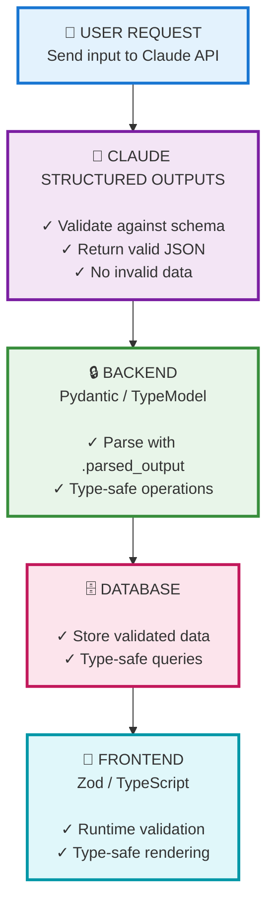

# Claude Structured Outputs: Complete Implementation Guide

## Overview

**Structured Outputs** guarantees that Claude's API responses match your exact JSON schema through constrained decoding. Released November 14, 2025 in public beta for Claude Sonnet 4.5 and Opus 4.1.

**Key Benefit:** Zero parsing errors, no retry logic, guaranteed schema compliance.

---

## Quick Start

### 1. Beta Header (Required)

All requests must include:
```python
headers = {
    "anthropic-beta": "structured-outputs-2025-11-13"
}
```

### 2. Two Modes Available

| Mode | Use Case | Parameter |
|------|----------|-----------|
| **JSON Outputs** | Data extraction, structured responses | `output_format` |
| **Strict Tool Use** | Type-safe function calls, agents | `strict: true` |

---

## Mode 1: JSON Outputs (Data Extraction)

### Basic Usage

```python
from anthropic import Anthropic

client = Anthropic()

schema = {
    "type": "object",
    "properties": {
        "name": {"type": "string"},
        "confidence": {"type": "number"},
        "category": {"type": "string", "enum": ["A", "B", "C"]}
    },
    "required": ["name", "confidence", "category"],
    "additionalProperties": False  # Required for structured outputs
}

response = client.beta.messages.create(
    model="claude-sonnet-4-5-20250929",
    max_tokens=1024,
    betas=["structured-outputs-2025-11-13"],
    messages=[{
        "role": "user",
        "content": "Extract data from this text: ..."
    }],
    output_format={
        "type": "json_schema",
        "json_schema": {
            "name": "DataExtraction",
            "schema": schema,
            "strict": True
        }
    }
)

# Response is guaranteed valid JSON matching schema
data = response.content[0].text
```

### SDK Helper: Pydantic Integration

**Recommended approach** - Let SDK handle schema transformation:

```python
from anthropic import Anthropic
from pydantic import BaseModel

class ColorToken(BaseModel):
    hex: str
    confidence: float
    category: str

client = Anthropic()

response = client.beta.messages.parse(
    model="claude-sonnet-4-5-20250929",
    max_tokens=1024,
    betas=["structured-outputs-2025-11-13"],
    messages=[{"role": "user", "content": "Extract colors from this image"}],
    response_format=ColorToken
)

# Access validated data directly
color = response.parsed_output  # Type: ColorToken
print(f"{color.hex} - {color.confidence}")
```

**SDK Benefits:**
- Automatic schema transformation (removes unsupported constraints)
- Built-in validation against original Pydantic model
- Returns typed `parsed_output` instead of raw JSON

---

## Mode 2: Strict Tool Use (Agents & Function Calls)

### Basic Usage

```python
response = client.beta.messages.create(
    model="claude-sonnet-4-5-20250929",
    max_tokens=1024,
    betas=["structured-outputs-2025-11-13"],
    tools=[{
        "name": "get_weather",
        "description": "Get weather for a location",
        "input_schema": {
            "type": "object",
            "properties": {
                "location": {"type": "string"},
                "unit": {"type": "string", "enum": ["celsius", "fahrenheit"]}
            },
            "required": ["location", "unit"],
            "additionalProperties": False
        },
        "strict": True  # Enables structured outputs for tools
    }],
    messages=[{"role": "user", "content": "What's the weather in Tokyo?"}]
)

# Tool input is guaranteed to match schema
if response.stop_reason == "tool_use":
    tool_call = response.content[0]
    # tool_call.input is type-safe and validated
```

**Use Cases:**
- Agentic workflows requiring reliable function calls
- API integrations where parameter validation is critical
- Multi-step reasoning with guaranteed tool compliance

---

## Full-Stack Pipeline



---

## TypeScript / Zod Integration

```typescript
import Anthropic from '@anthropic-ai/sdk'
import { z } from 'zod'

const ColorSchema = z.object({
  hex: z.string(),
  confidence: z.number().min(0).max(1),
  category: z.enum(['primary', 'secondary', 'accent'])
})

const client = new Anthropic()

const response = await client.beta.messages.parse({
  model: 'claude-sonnet-4-5-20250929',
  max_tokens: 1024,
  betas: ['structured-outputs-2025-11-13'],
  messages: [{ role: 'user', content: 'Extract colors' }],
  response_format: ColorSchema
})

// Typed output
const color: z.infer<typeof ColorSchema> = response.parsed_output
```

---

## Schema Requirements & Limitations

### ✅ Supported

- Basic types: `string`, `number`, `boolean`, `integer`, `null`, `array`, `object`
- Enums with string/number/boolean values
- Simple `$ref` (within same schema)
- Nested objects and arrays

### ❌ Unsupported (SDK transforms automatically)

- Numerical constraints: `minimum`, `maximum`, `multipleOf`
- String constraints: `minLength`, `maxLength`, `pattern`
- Array constraints: `minItems`, `maxItems`, `uniqueItems`
- Recursive schemas or external `$ref`
- `additionalProperties: true` (must be `false`)
- Complex enum types (e.g., object enums)

**SDK Behavior:** Unsupported constraints are removed during transformation, but validation occurs post-response using original schema.

### Required Schema Properties

```json
{
  "type": "object",
  "properties": { /* ... */ },
  "required": [ /* list required fields */ ],
  "additionalProperties": false  // Must be false
}
```

---

## Important Behaviors

### 1. Refusals Take Precedence

Safety/policy violations return `stop_reason: "refusal"` - response may not match schema:

```python
if response.stop_reason == "refusal":
    print("Claude refused due to safety policies")
    # Handle gracefully, don't assume schema compliance
```

### 2. Token Limits

If `max_tokens` reached, output may be incomplete:

```python
if response.stop_reason == "max_tokens":
    print("Increase max_tokens for complete response")
```

### 3. Grammar Caching (24 hours)

- First request with a schema: +100-200ms compilation latency
- Subsequent requests (24h): Near-zero overhead
- Compiled grammars cached per schema hash

### 4. Incompatibilities

**Cannot use with:**
- Citations (`stop_reason: "citation_error"`)
- Message prefilling
- Streaming responses (supported but no partial validation)

---

## Cost Impact

- **Input tokens:** +0-3% (schema encoding overhead)
- **Output tokens:** Standard pricing
- **Batch API:** Works with 50% discount
- **Token counting:** Use `client.beta.messages.count_tokens()`

**Savings:** No retry logic or validation failures = net cost reduction

---

## Best Practices

1. **Use SDK helpers** - `.parse()` simplifies everything
2. **Set `additionalProperties: false`** - Required for strict mode
3. **Include clear descriptions** - Helps Claude understand intent
4. **Provide examples in prompt** - "Return JSON like: {...}"
5. **Handle refusals gracefully** - Check `stop_reason`
6. **Monitor `max_tokens`** - Ensure sufficient budget for response
7. **Leverage grammar caching** - Reuse schemas for 24h performance boost

---

## Copy That Implementation

### Color Token Extraction (Real-World Example)

```python
from anthropic import Anthropic
from pydantic import BaseModel, Field

class ColorToken(BaseModel):
    hex: str = Field(pattern=r'^#[0-9A-Fa-f]{6}$')
    confidence: float = Field(ge=0, le=1)
    semantic_name: str
    is_neutral: bool
    harmony: str

# AIColorExtractor using structured outputs
def extract_colors(image_data: bytes) -> list[ColorToken]:
    client = Anthropic()

    response = client.beta.messages.parse(
        model="claude-sonnet-4-5-20250929",
        max_tokens=2048,
        betas=["structured-outputs-2025-11-13"],
        messages=[{
            "role": "user",
            "content": [
                {
                    "type": "image",
                    "source": {
                        "type": "base64",
                        "media_type": "image/png",
                        "data": base64.b64encode(image_data).decode()
                    }
                },
                {
                    "type": "text",
                    "text": "Extract dominant colors with semantic names"
                }
            ]
        }],
        response_format=ColorToken
    )

    # Guaranteed type-safe ColorToken
    return response.parsed_output
```

### Result: Zero Validation Overhead

- ✅ No manual hex validation
- ✅ No confidence bounds checking
- ✅ No field presence verification
- ✅ Direct database insertion
- ✅ Type-safe throughout stack

**Architecture:** `Image → Claude (Structured Outputs) → Pydantic → Database → Zod → UI`

---

## Comparison: Before vs After

### ❌ Without Structured Outputs (100+ lines of defensive code)

```python
def parse_claude_response(response_text: str) -> ColorToken:
    try:
        data = json.loads(response_text)
    except json.JSONDecodeError:
        raise ValidationError("Invalid JSON")

    if 'hex' not in data or not re.match(r'^#[0-9A-Fa-f]{6}$', data['hex']):
        raise ValidationError("Invalid hex")

    if 'confidence' not in data or not (0 <= data['confidence'] <= 1):
        raise ValidationError("Invalid confidence")

    # ... 50+ more lines of validation

    return ColorToken(**data)
```

### ✅ With Structured Outputs (1 line)

```python
color = response.parsed_output  # Guaranteed valid ColorToken
```

---

## Additional Resources

- **Official Docs:** [platform.claude.com/docs/en/build-with-claude/structured-outputs](https://platform.claude.com/docs/en/build-with-claude/structured-outputs)
- **Python SDK:** [github.com/anthropics/anthropic-sdk-python](https://github.com/anthropics/anthropic-sdk-python)
- **TypeScript SDK:** [github.com/anthropics/anthropic-sdk-typescript](https://github.com/anthropics/anthropic-sdk-typescript)

---

## Summary

**Structured Outputs = Zero parsing errors + Type safety + No retries**

1. Add beta header: `structured-outputs-2025-11-13`
2. Use `.parse()` with Pydantic/Zod for best experience
3. Set `additionalProperties: false` in schemas
4. Handle refusals and token limits gracefully
5. Leverage 24-hour grammar caching for performance

**Bottom Line:** Define your schema once, get guaranteed compliance across your entire stack.
