# Shadow Pipeline Visual Guide

**A visual walkthrough of shadow extraction using real test images**

---

## Overview

This guide demonstrates the shadow extraction pipeline using processed test images. Each stage is illustrated with actual outputs from the `test_images/processedImageShadows/` folder.

```mermaid
flowchart TB
    subgraph Input
        IMG[🖼️ Original Image]
    end

    subgraph "Stage 1-2: Detection"
        ILL[Illumination Map]
        CLS[Classical Candidates]
    end

    subgraph "Stage 3: ML Analysis"
        FPN[BDRAR Features]
        SAM[SAM Refinement]
        FULL[Full Shadow Mask]
    end

    subgraph "Stage 4-5: Geometry"
        DEP[Depth Map]
        SHD[Shading Layer]
    end

    subgraph Output
        TOK[📦 Shadow Tokens]
        VIZ[Comparison Grid]
    end

    IMG --> ILL --> CLS
    IMG --> FPN --> SAM --> FULL
    IMG --> DEP
    ILL --> SHD
    CLS --> TOK
    FULL --> TOK
    DEP --> TOK
    SHD --> TOK
    TOK --> VIZ
```



---

## Test Image Gallery

The pipeline has been tested on 24 images covering various shadow scenarios:

| Category | Images | Shadow Types |
|----------|--------|--------------|
| Synthetic | 2 | Hard edges, soft gradients |
| Real Photos | 22 | Outdoor, indoor, mixed lighting |

**Processed output location:** `test_images/processedImageShadows/{image_name}/`

---

## Stage-by-Stage Walkthrough

### Hard Shadow Example: `synthetic_hard_shadow`

This synthetic test image has a clear, well-defined shadow boundary.

#### Stage 1: Original Input

📁 `processedImageShadows/synthetic_hard_shadow/00_original.png`

The input image is loaded and normalized. This is your starting point.

---

#### Stage 2: Illumination-Invariant View

📁 `processedImageShadows/synthetic_hard_shadow/02_illumination.png`


**What it shows:** Brightness distribution, removing color information. Shadow regions appear darker.

**Key insight:** Shadows cause intensity drops while preserving relative chromaticity.

---

#### Stage 3: Classical Shadow Candidates

📁 `processedImageShadows/synthetic_hard_shadow/03_classical.png`

**Algorithm:**
1. Adaptive threshold (compare to local mean)
2. Morphological cleaning (erosion + closing)
3. Connected component filtering
4. Distance transform for soft edges

**Result:** Binary mask with potential shadow regions highlighted.

---

#### Stage 4: ML Shadow Detection

Multiple detection methods are compared:

| File | Method | Description |
|------|--------|-------------|
| `04a_bdrar_features.png` | BDRAR-style FPN | Multi-scale feature pyramid |
| `04b_enhanced_classical.png` | Enhanced heuristic | LAB color + edge analysis |
| `04c_full_shadow_hq.png` | SAM + BDRAR | Boundary refinement (best quality) |
| `04d_fast_shadow.png` | Fast mode | Quick detection without SAM |


**Best result:** `04c_full_shadow_hq.png` (combines all methods)

---

#### Stage 5: Intrinsic Decomposition

📁 `processedImageShadows/synthetic_hard_shadow/05a_reflectance.png`
📁 `processedImageShadows/synthetic_hard_shadow/05b_shading.png`

**Principle:** Image = Reflectance × Shading

| Output | Shows | Use |
|--------|-------|-----|
| Reflectance | Material colors (shadow-free) | Texture analysis |
| Shading | Illumination patterns | Shadow confirmation |

---

#### Stage 6: Depth Estimation

📁 `processedImageShadows/synthetic_hard_shadow/06_depth.png`

**Model:** MiDaS v3 (monocular depth estimation)

**Depth map provides:**
- Surface normals (via gradient)
- Occlusion hints
- Light direction fitting data

---

#### Comparison Grid

📁 `processedImageShadows/synthetic_hard_shadow/comparison_grid.png`

```
┌─────────────────┬─────────────────┬─────────────────┐
│    Original     │   Illumination  │    Classical    │
├─────────────────┼─────────────────┼─────────────────┤
│    Enhanced     │   Full Shadow   │     Shading     │
└─────────────────┴─────────────────┴─────────────────┘
```

This 2×3 grid provides a quick visual overview of all key outputs.

---

### Soft Shadow Example: `synthetic_soft_shadow`

Soft shadows have gradual transitions that challenge simple thresholding.

#### Key Differences from Hard Shadows

| Aspect | Hard Shadow | Soft Shadow |
|--------|-------------|-------------|
| Edge profile | Sharp step | Gradual gradient |
| Classical detection | Clean boundaries | Fuzzy detection |
| Softness token | `hard` or `very_hard` | `soft` or `very_soft` |
| CSS blur mapping | 1-2px | 8-16px |

**Processed outputs:** `processedImageShadows/synthetic_soft_shadow/`

---

### Real Image Examples

#### `IMG_8405` - Outdoor Scene

📁 `processedImageShadows/IMG_8405/`

Typical outdoor lighting with clear directional shadows.

**Expected tokens:**
- Direction: Based on sun position
- Softness: Medium (distance from objects)
- Contrast: High (bright sunlight)

---

#### `IMG_8735` - Complex Lighting

📁 `processedImageShadows/IMG_8735/`

Mixed or challenging lighting conditions.

**Pipeline behavior:**
- Classical detection may have false positives
- ML detection provides cleaner segmentation
- Fusion balances both signals

---

#### `IMG_8634` - Indoor Scene

📁 `processedImageShadows/IMG_8634/`

Indoor images often have:
- Multiple light sources
- Softer shadows
- Lower contrast

---

## Shadow Token Extraction

After pipeline processing, shadow characteristics are quantized into design tokens:


### Token Categories

| Token | Values | Description |
|-------|--------|-------------|
| `style_key_direction` | `upper_left`, `overhead`, `left`, etc. | Primary light direction |
| `style_softness` | `very_hard`, `hard`, `medium`, `soft`, `very_soft` | Edge blur level |
| `style_contrast` | `low`, `medium`, `high` | Shadow intensity difference |
| `style_density` | `sparse`, `moderate`, `dense` | Shadow area coverage |

---

## CSS Box-Shadow Generation

The `ShadowTokenIntegration` class converts geometric analysis to CSS:

```python
from copy_that.shadowlab import ShadowTokenIntegration

# Given analysis result
css = ShadowTokenIntegration.suggest_css_box_shadow(analysis)

# Returns:
{
    "subtle": "2px 2px 4px rgba(0, 0, 0, 0.21)",
    "medium": "2px 2px 4px 2px rgba(0, 0, 0, 0.21)",
    "strong": "2px 2px 4px 2px rgba(0, 0, 0, 0.21), 0 0 4px rgba(0, 0, 0, 0.21)",
    "direction": "upper_left",
    "softness": "soft"
}
```

### Direction → Offset Mapping

```mermaid
flowchart TB
    subgraph "Light Direction → Shadow Offset"
        UL["↖ upper_left"] --> OLR["-2px, -2px"]
        UR["↗ upper_right"] --> ORL["2px, -2px"]
        L["← left"] --> OR["-4px, 0px"]
        R["→ right"] --> OL["4px, 0px"]
        OH["↑ overhead"] --> OB["0px, -4px"]
        FR["↓ front"] --> OT["0px, 4px"]
    end
```



### Softness → Blur Mapping

| Token Value | CSS Blur | CSS Spread |
|-------------|----------|------------|
| `very_hard` | 1px | 0px |
| `hard` | 2px | 1px |
| `medium` | 4px | 2px |
| `soft` | 8px | 4px |
| `very_soft` | 16px | 8px |

---

## Visual Comparison: All Methods

For each test image, `comparison_grid.png` shows the key outputs side-by-side:

### Grid Interpretation

| Position | Panel | What to Look For |
|----------|-------|------------------|
| Top-left | Original | Input quality, scene content |
| Top-center | Illumination | Brightness distribution |
| Top-right | Classical | Heuristic detection (may over/under-detect) |
| Bottom-left | Enhanced | Refined classical with color cues |
| Bottom-center | Full Shadow | Best ML detection (SAM + BDRAR) |
| Bottom-right | Shading | Illumination layer (validates shadows) |

### Common Patterns

**Good detection:** Full Shadow closely matches visible shadows in Original

**Over-detection:** Classical marks non-shadow dark regions (e.g., dark objects)

**Under-detection:** Very soft shadows may be missed by classical methods

---

## Running the Pipeline

### Quick Test

```bash
# Process all test images
uv run python scripts/test_shadow_methods.py

# Process single image
uv run python scripts/process_test_images.py test_images/IMG_8405.jpeg
```

### Output Location

```
test_images/processedImageShadows/
├── synthetic_hard_shadow/
│   ├── 00_original.png
│   ├── 02_illumination.png
│   ├── 03_classical.png
│   ├── 04a_bdrar_features.png
│   ├── 04b_enhanced_classical.png
│   ├── 04c_full_shadow_hq.png
│   ├── 04d_fast_shadow.png
│   ├── 05a_reflectance.png
│   ├── 05b_shading.png
│   ├── 06_depth.png
│   └── comparison_grid.png
├── synthetic_soft_shadow/
│   └── ...
├── IMG_8405/
│   └── ...
└── ... (22 more images)
```

---

## Token Integration Workflow


---

## Summary

The shadow pipeline transforms images through 5 stages:

1. **Input & Illumination** - Load and extract brightness map
2. **Classical Detection** - Fast heuristic candidates
3. **ML Shadow Detection** - Neural network refinement (SAM + BDRAR)
4. **Depth & Lighting** - Geometry estimation and light fitting
5. **Fusion & Tokens** - Combine signals, generate design tokens

**Visual outputs** are saved for inspection in `processedImageShadows/`.

**Tokens** can be integrated into design systems via `ShadowTokenIntegration`.

---

**See also:**
- `docs/SHADOW_PIPELINE_IMPLEMENTATION.md` - Technical implementation details
- `docs/SHADOW_PIPELINE_SPEC.md` - Original specification
- `test_images/README.md` - Quick start for processing images

---

## Implementation Validation

This section validates the current implementation against the original specification.

### Shadow Information Extraction

| Feature | Specified | Implemented | Module |
|---------|-----------|-------------|--------|
| Shadow mask | Pixels in shadow vs lit | ✅ Yes | `classical.py`, `pipeline.py` |
| Shadow strength | Darkness relative to lit | ✅ Yes | `tokens.py` (`mean_shadow_intensity`) |
| Shadow type | Hard vs soft edges | ✅ Yes | `tokens.py` (`edge_softness_mean`) |
| Light direction | Rough main light direction | ✅ Yes | `pipeline.py` (`fit_directional_light`) |
| Geometry hints | Depth/normals for shadow shape | ✅ Yes | `depth_normals.py` |

### Classical CV Methods (Section 2)

| Method | Specified | Implemented | Notes |
|--------|-----------|-------------|-------|
| Illumination-invariant color space | HSV, log-chromaticity | ✅ Yes | `illumination_invariant_v()` uses HSV V-channel |
| Local adaptive thresholding | Compare to local mean | ✅ Yes | `classical_shadow_candidates()` |
| Morphological cleanup | Open/close operations | ✅ Yes | Binary erosion, closing |

### ML-Based Detection (Section 3)

| Method | Specified | Implemented | Notes |
|--------|-----------|-------------|-------|
| Supervised shadow detector | U-Net-like architecture | ✅ Yes | SegFormer + BDRAR-style FPN |
| Soft mask output | 0-1 probability | ✅ Yes | All detection methods output soft masks |
| SAM boundary refinement | — | ✅ Yes | `run_shadow_model_with_sam()` |

### Intrinsic Decomposition (Section 4)

| Method | Specified | Implemented | Notes |
|--------|-----------|-------------|-------|
| Retinex-based separation | Image = R × S | ✅ Yes | Multi-Scale Retinex in `intrinsic.py` |
| Edge sharpness analysis | Penumbra width | ✅ Yes | `edge_softness_mean` in features |
| Shading map shadows | Low values = shadows | ✅ Yes | Used in fusion and tokens |

### Depth & Normals + Lighting (Section 5)

| Method | Specified | Implemented | Notes |
|--------|-----------|-------------|-------|
| Single-image depth | MiDaS, DPT | ✅ Yes | MiDaS v3 via PyTorch Hub |
| Surface normals | From depth gradients | ✅ Yes | `depth_to_normals()` |
| Lambertian light fitting | S ≈ N · L | ✅ Yes | `fit_directional_light()` |
| Light direction export | Spherical coords | ✅ Yes | `light_dir_to_angles()` → azimuth/elevation |

### Inverse Rendering (Section 6)

| Method | Specified | Implemented | Notes |
|--------|-----------|-------------|-------|
| Full inverse rendering | Geometry + materials + lighting | ⏳ Future | Beyond current scope |
| Differentiable rendering | Optimization pipeline | ⏳ Future | Marked for Phase 6+ |

### Practical Pipelines (Section 7)

| Pipeline | Specified | Implemented | Notes |
|----------|-----------|-------------|-------|
| 7.1 Lightweight mask + strength | Basic pipeline | ✅ Yes | `run_pipeline_v2()` (5 stages) |
| 7.2 Intrinsic + depth + normals | Structured descriptor | ✅ Yes | `stages.py` (8 stages) |
| 7.3 Style-level embedding | CLIP/transformer | ⏳ Future | Planned for Phase 6 |

### Limitations Handling (Section 8)

| Issue | Specified | Implemented | Notes |
|-------|-----------|-------------|-------|
| Non-physical shadows | Coherence score | ✅ Yes | `physics_consistency` in tokens |
| Multiple light sources | Multi-light model | ⚠️ Partial | Single dominant light fitted |
| Model failures | Graceful fallback | ✅ Yes | All ML modules have fallbacks |

### Coverage Summary


**Fully Implemented (85%):**
- Classical CV shadow detection
- ML-based detection (SAM + BDRAR-style)
- Intrinsic decomposition (MSR)
- Depth & normals estimation
- Light direction fitting
- Shadow token generation
- Token system integration

**Partially Implemented (10%):**
- Multiple light source handling (single dominant only)
- Advanced intrinsic models (using MSR, not CGIntrinsics)

**Planned for Future (5%):**
- Full inverse rendering
- Style-level CLIP embeddings
- LLaVA-based shadow descriptions

---

*Last updated: 2025-12-06*
