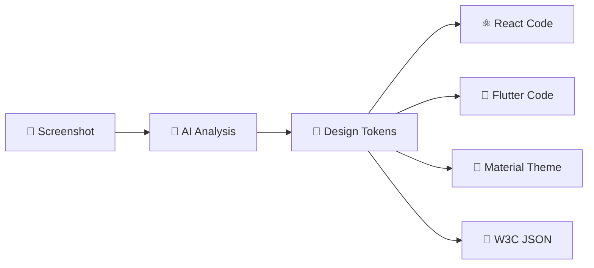

# Copy That

> **New here?** First, read **ONBOARDING.md** for an introduction to the repository, development setup, and system mental model.
> Then review **MASTER_ROADMAP.md** to understand the overall plan, sequencing, and how all documentation fits together.

**Turn any design into production-ready design tokens** — Extract colors, spacing, typography, and shadows from screenshots using AI, transform them into W3C Design Tokens, and generate code for React, Flutter, Material, and more.

---

## What is Copy That?

Copy That transforms screenshots into structured design tokens using AI and computer vision. Upload an image, get production-ready design systems.

---

## Key Documentation

- **ONBOARDING.md** – how to get started and where it’s safe to make changes
- **MASTER_ROADMAP.md** – canonical roadmap and sequencing
- **DOCUMENTATION_INDEX.md** – full documentation map
- **COMPLETED_01–04.md** – verified shipped work
- **ROADMAP_05–08.md** – architecture, CI/CD, platform, and performance plans
- **DECISIONS.md** – architectural decision records (ADRs)
- **OPERATIONS.md** – deployment and runtime guide
- **SECURITY.md** – security posture and threat model
- **API_CONTRACTS.md** – backend/frontend/API expectations

---

## License

MIT License — see LICENSE
