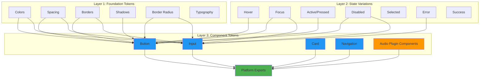

# Component Token Schema (v3.0)

**Created**: 2025-11-09
**Status**: Phase 3 Priority #5 - In Progress
**Related**: Progressive Extraction Architecture Layer 3

---

## Overview

Compositional token architecture that combines foundation tokens into component-level design tokens with full state variation support.



---

## Design Principles

### 1. **Composability**
Components are built from foundation tokens, not hard-coded values:
```typescript
button.primary.background = colors.brand.primary
button.primary.hover.background = darken(colors.brand.primary, 10%)
```

### 2. **State-First Design**
Every interactive component has explicit state variations:
- `default` - Base state
- `hover` - Mouse over
- `focus` - Keyboard/accessibility focus
- `active` - Pressed/clicked
- `disabled` - Non-interactive state

### 3. **Platform Agnostic**
Component tokens export to all platforms:
- **Web**: CSS Variables, Tailwind Config
- **React**: TypeScript components + Tailwind CSS
- **Flutter**: Material Theme 3
- **JUCE**: LookAndFeel C++ classes ⭐ **Primary Target**

### 4. **Audio Plugin Focus** ⭐
Special attention to audio plugin UI components:
- Rotary knobs (with skeuomorphic and flat styles)
- Linear sliders (vertical/horizontal)
- VU meters and peak displays
- Bypass buttons and toggle switches
- Parameter value displays

---

## Component Token Structure

### Button Component

```typescript
interface ButtonTokens {
  // Variant definitions
  variants: {
    primary: ButtonVariant
    secondary: ButtonVariant
    tertiary: ButtonVariant
    ghost: ButtonVariant
    danger: ButtonVariant
  }

  // Size scale
  sizes: {
    sm: ButtonSize
    md: ButtonSize
    lg: ButtonSize
  }
}

interface ButtonVariant {
  default: ButtonState
  hover: ButtonState
  focus: ButtonState
  active: ButtonState
  disabled: ButtonState
}

interface ButtonState {
  background: ColorToken
  foreground: ColorToken
  border: {
    width: number
    color: ColorToken
    style: 'solid' | 'dashed' | 'dotted'
  }
  shadow?: ShadowToken
  radius: number
  opacity?: number
}

interface ButtonSize {
  padding: {
    x: SpacingToken
    y: SpacingToken
  }
  fontSize: TypographyToken
  height: number
  minWidth?: number
}
```

**Example JSON Output**:
```json
{
  "button": {
    "variants": {
      "primary": {
        "default": {
          "background": "#646cff",
          "foreground": "#ffffff",
          "border": {
            "width": 2,
            "color": "transparent",
            "style": "solid"
          },
          "radius": 8,
          "shadow": "0 2px 4px rgba(0,0,0,0.1)"
        },
        "hover": {
          "background": "#7481ff",
          "foreground": "#ffffff",
          "border": {
            "width": 2,
            "color": "transparent",
            "style": "solid"
          },
          "radius": 8,
          "shadow": "0 4px 8px rgba(0,0,0,0.15)"
        },
        "focus": {
          "background": "#646cff",
          "foreground": "#ffffff",
          "border": {
            "width": 2,
            "color": "#646cff",
            "style": "solid"
          },
          "radius": 8,
          "shadow": "0 0 0 3px rgba(100, 108, 255, 0.3)"
        },
        "active": {
          "background": "#5159cc",
          "foreground": "#ffffff",
          "border": {
            "width": 2,
            "color": "transparent",
            "style": "solid"
          },
          "radius": 8,
          "shadow": "0 1px 2px rgba(0,0,0,0.2)"
        },
        "disabled": {
          "background": "#e0e0e0",
          "foreground": "#9e9e9e",
          "border": {
            "width": 2,
            "color": "transparent",
            "style": "solid"
          },
          "radius": 8,
          "opacity": 0.6
        }
      }
    },
    "sizes": {
      "sm": {
        "padding": { "x": 12, "y": 6 },
        "fontSize": 14,
        "height": 32
      },
      "md": {
        "padding": { "x": 16, "y": 8 },
        "fontSize": 16,
        "height": 40
      },
      "lg": {
        "padding": { "x": 24, "y": 12 },
        "fontSize": 18,
        "height": 48
      }
    }
  }
}
```

---

### Input Component

```typescript
interface InputTokens {
  variants: {
    text: InputVariant
    number: InputVariant
    email: InputVariant
    password: InputVariant
    search: InputVariant
  }

  states: {
    default: InputState
    hover: InputState
    focus: InputState
    disabled: InputState
    error: InputState
    success: InputState
  }

  sizes: {
    sm: InputSize
    md: InputSize
    lg: InputSize
  }
}

interface InputState {
  background: ColorToken
  foreground: ColorToken
  border: {
    width: number
    color: ColorToken
    style: 'solid' | 'dashed'
  }
  placeholder: ColorToken
  radius: number
  shadow?: ShadowToken
}

interface InputSize {
  padding: {
    x: SpacingToken
    y: SpacingToken
  }
  fontSize: TypographyToken
  height: number
}
```

---

### Card Component

```typescript
interface CardTokens {
  variants: {
    elevated: CardVariant
    outlined: CardVariant
    filled: CardVariant
  }

  states: {
    default: CardState
    hover: CardState
    selected: CardState
  }
}

interface CardState {
  background: ColorToken
  border: {
    width: number
    color: ColorToken
  }
  radius: number
  shadow?: ShadowToken
  padding: SpacingToken
}
```

---

### Navigation Component

```typescript
interface NavigationTokens {
  header: {
    background: ColorToken
    foreground: ColorToken
    border: BorderToken
    height: number
    padding: SpacingToken
    shadow?: ShadowToken
  }

  sidebar: {
    background: ColorToken
    foreground: ColorToken
    border: BorderToken
    width: number
    padding: SpacingToken
  }

  tab: {
    default: TabState
    hover: TabState
    active: TabState
    disabled: TabState
  }
}

interface TabState {
  background: ColorToken
  foreground: ColorToken
  border: {
    width: number
    color: ColorToken
    position: 'top' | 'bottom' | 'left' | 'right'
  }
  indicator: {
    color: ColorToken
    height: number
  }
}
```

---

### Audio Plugin Components ⭐

```typescript
interface AudioPluginTokens {
  // Rotary knobs (primary control type)
  knob: {
    variants: {
      skeuomorphic: KnobVariant  // 3D, realistic appearance
      flat: KnobVariant           // Modern, minimal
      vintage: KnobVariant        // Retro, analog-inspired
    }

    sizes: {
      sm: { diameter: 40 }
      md: { diameter: 60 }
      lg: { diameter: 80 }
    }
  }

  // Linear sliders
  slider: {
    variants: {
      vertical: SliderVariant
      horizontal: SliderVariant
    }

    sizes: {
      sm: { width: 20, height: 80 }
      md: { width: 30, height: 120 }
      lg: { width: 40, height: 160 }
    }
  }

  // Meters and displays
  meter: {
    vu: MeterVariant
    peak: MeterVariant
    rms: MeterVariant
  }

  // Buttons
  bypass: {
    default: ButtonState
    active: ButtonState    // Bypassed state
    hover: ButtonState
  }

  // Parameter displays
  valueDisplay: {
    background: ColorToken
    foreground: ColorToken
    font: TypographyToken
    border: BorderToken
    radius: number
  }
}

interface KnobVariant {
  default: KnobState
  hover: KnobState
  active: KnobState       // While dragging
  disabled: KnobState
}

interface KnobState {
  // Body
  body: {
    fill: ColorToken | GradientToken
    stroke: ColorToken
    strokeWidth: number
    shadow?: ShadowToken
  }

  // Indicator (shows current value)
  indicator: {
    type: 'line' | 'dot' | 'arc'
    color: ColorToken
    width: number
  }

  // Arc/track (shows value range)
  track?: {
    background: ColorToken
    foreground: ColorToken  // Active portion
    width: number
  }
}

interface SliderVariant {
  default: SliderState
  hover: SliderState
  active: SliderState
  disabled: SliderState
}

interface SliderState {
  track: {
    background: ColorToken
    foreground: ColorToken  // Filled portion
    height: number
  }

  thumb: {
    fill: ColorToken
    stroke: ColorToken
    width: number
    height: number
    radius: number
    shadow?: ShadowToken
  }
}

interface MeterVariant {
  background: ColorToken
  segments: {
    low: ColorToken       // Green zone
    mid: ColorToken       // Yellow zone
    high: ColorToken      // Red zone
  }
  peak: {
    color: ColorToken
    duration: number      // Hold time in ms
  }
  orientation: 'vertical' | 'horizontal'
}
```

---

## State Layer Integration

Component tokens automatically incorporate Material Design 3 state layers:

```typescript
// Example: Button hover state combines base color + state layer
button.primary.hover.background = mix(
  button.primary.default.background,
  state.hover,  // 8% white overlay
  'normal'      // Blend mode
)
```

**State Layer Reference** (from `state_layer_extractor.py`):
- `hover`: 0.08 (8%)
- `focus`: 0.12 (12%)
- `pressed`: 0.12 (12%)
- `disabled`: 0.38 (38%)
- `selected`: 0.12 (12%)

---

## Platform Export Formats

### 1. CSS Variables

```css
/* Button - Primary Variant */
--button-primary-bg: #646cff;
--button-primary-fg: #ffffff;
--button-primary-border-width: 2px;
--button-primary-radius: 8px;

--button-primary-hover-bg: #7481ff;
--button-primary-hover-shadow: 0 4px 8px rgba(0,0,0,0.15);

--button-primary-focus-border-color: #646cff;
--button-primary-focus-shadow: 0 0 0 3px rgba(100, 108, 255, 0.3);
```

### 2. Tailwind Config

```typescript
module.exports = {
  theme: {
    extend: {
      colors: {
        button: {
          primary: {
            DEFAULT: '#646cff',
            hover: '#7481ff',
            active: '#5159cc',
          }
        }
      },
      borderRadius: {
        button: '8px',
      }
    }
  },
  plugins: [
    // Component variants plugin
    function({ addComponents }) {
      addComponents({
        '.btn-primary': {
          '@apply bg-button-primary text-white': {},
          'border': '2px solid transparent',
          'border-radius': '8px',
          'box-shadow': '0 2px 4px rgba(0,0,0,0.1)',

          '&:hover': {
            '@apply bg-button-primary-hover': {},
            'box-shadow': '0 4px 8px rgba(0,0,0,0.15)',
          },

          '&:focus': {
            'border-color': '#646cff',
            'box-shadow': '0 0 0 3px rgba(100, 108, 255, 0.3)',
          },
        }
      })
    }
  ]
}
```

### 3. React Component Templates

```typescript
// Button.tsx
interface ButtonProps {
  variant?: 'primary' | 'secondary' | 'tertiary' | 'ghost' | 'danger'
  size?: 'sm' | 'md' | 'lg'
  disabled?: boolean
  children: React.ReactNode
}

export function Button({
  variant = 'primary',
  size = 'md',
  disabled = false,
  children
}: ButtonProps) {
  return (
    <button
      className={`btn-${variant} btn-${size}`}
      disabled={disabled}
    >
      {children}
    </button>
  )
}
```

### 4. JUCE LookAndFeel (C++) ⭐ **Primary Target**

```cpp
// CopyThisLookAndFeel.h
class CopyThisLookAndFeel : public juce::LookAndFeel_V4 {
public:
    CopyThisLookAndFeel() {
        // Button colors
        setColour(juce::TextButton::buttonColourId,
                  juce::Colour::fromRGB(100, 108, 255));
        setColour(juce::TextButton::buttonOnColourId,
                  juce::Colour::fromRGB(116, 129, 255));
        setColour(juce::TextButton::textColourOffId,
                  juce::Colours::white);
    }

    void drawRotarySlider(juce::Graphics& g,
                         int x, int y, int width, int height,
                         float sliderPos,
                         float rotaryStartAngle,
                         float rotaryEndAngle,
                         juce::Slider& slider) override {
        // Knob rendering using extracted tokens
        auto bounds = juce::Rectangle<int>(x, y, width, height)
                          .toFloat().reduced(10);

        auto radius = juce::jmin(bounds.getWidth(), bounds.getHeight()) / 2.0f;
        auto toAngle = rotaryStartAngle + sliderPos * (rotaryEndAngle - rotaryStartAngle);
        auto centre = bounds.getCentre();

        // Body
        g.setColour(juce::Colour::fromRGB(100, 108, 255));
        g.fillEllipse(bounds);

        // Indicator line
        juce::Path indicator;
        auto indicatorLength = radius * 0.7f;
        indicator.addLineSegment(
            juce::Line<float>(0.0f, -indicatorLength, 0.0f, -radius),
            2.0f
        );
        indicator.applyTransform(
            juce::AffineTransform::rotation(toAngle).translated(centre)
        );
        g.setColour(juce::Colours::white);
        g.fillPath(indicator);
    }
};
```

---

## Implementation Plan

### Phase 1: Type Definitions (Week 9, Day 1)
- [ ] Create TypeScript interfaces for all component tokens
- [ ] Add to `frontend/src/api/types.ts`
- [ ] Create Python type definitions in `backend/types/component_tokens.py`

### Phase 2: Backend Extractors (Week 9, Day 2-3)
- [ ] Create `component_token_generator.py`
- [ ] Integrate with existing extractors (state_layer, border, etc.)
- [ ] Add to progressive extraction pipeline

### Phase 3: Export Generators (Week 9, Day 4-5)
- [ ] CSS Variables generator
- [ ] Tailwind Config generator
- [ ] React component templates
- [ ] JUCE LookAndFeel generator ⭐

### Phase 4: Frontend Integration (Week 10, Day 1-2)
- [ ] Add component token display to UI
- [ ] Create component preview panel
- [ ] Export functionality integration

### Phase 5: Testing & Documentation (Week 10, Day 3)
- [ ] Unit tests for all generators
- [ ] Integration tests with extraction pipeline
- [ ] Update documentation
- [ ] Create examples and demos

---

## Success Metrics

- ✅ All 5 component types have complete token definitions
- ✅ All 4 platform exports working (CSS, Tailwind, React, JUCE)
- ✅ State variations applied consistently across all components
- ✅ Audio plugin components fully specified ⭐
- ✅ JUCE LookAndFeel C++ code generates successfully
- ✅ Tests pass with >80% coverage
- ✅ Documentation complete with examples

---

## Related Documents

- [Progressive Extraction Architecture](PROGRESSIVE_EXTRACTION_ARCHITECTURE.md)
- [State Layer Extractor](../../extractors/extractors/state_layer_extractor.py)
- [Border Extractor](../../extractors/extractors/border_extractor.py)
- [ROADMAP.md](../development/ROADMAP.md) - Phase 3 Priority #5

---

**Status**: Schema design complete ✅
**Next**: Create TypeScript type definitions
