# Schema Architecture Diagrams

**Date:** 2025-11-18
**Version:** 2.0 (Revised Architecture with Adapters)

---

## 📚 Related Documentation

- **[ROADMAP.md](../../ROADMAP.md)** - Phase 4 overview in project roadmap
- **[Phase 4 Revised Implementation Plan](../planning/PHASE_4_REVISED_IMPLEMENTATION_PLAN.md)** - Detailed week-by-week guide
- **[Original Schema Solution](../analysis/STRUCTURED_OUTPUTS_SCHEMA_SOLUTION.md)** - Original analysis

---

## 1. Complete System Architecture


---

## 2. Schema Layering & Dependencies


---

## 3. Data Flow with Adapters (Detailed)


---

## 4. Adapter Pattern Architecture


---

## 5. Before vs After Architecture

### Before (Tight Coupling)


### After (Loose Coupling)


---

## 6. Claude Structured Outputs Integration

```mermaid
graph TB
    subgraph "AI Extraction with Structured Outputs"
        IMG[UI Screenshot]

        subgraph "Claude API"
            PROMPT[Extraction Prompt<br/>'Extract design tokens']
            SCHEMA_DEF[JSON Schema Definition<br/>CoreColorToken.model_json_schema]
            SO[Claude Structured Outputs<br/>response_format]
            LLM[Claude Sonnet 4.5]
        end

        subgraph "Validation"
            VALID{Schema<br/>Valid?}
            OUTPUT[Guaranteed Valid<br/>Core Token]
        end

        IMG --> PROMPT
        SCHEMA_DEF --> SO
        PROMPT --> SO
        SO --> LLM
        LLM --> VALID
        VALID -->|✅ Always| OUTPUT

        OUTPUT --> CORE[Core Schema]
        CORE --> ADAPTER[Adapter Layer]
        ADAPTER --> API[API Schema]
    end

    style SO fill:#90EE90,stroke:#2E7D32,stroke-width:3px
    style OUTPUT fill:#90EE90,stroke:#2E7D32,stroke-width:2px
    style VALID fill:#4CAF50,stroke:#2E7D32,stroke-width:2px
```



---

## 7. Database Schema (Structured Tables)


---

## 8. API Versioning Strategy

```mermaid
graph TB
    subgraph "Client Requests"
        C1[Frontend Client<br/>Accept-Version: v2]
        C2[Legacy Client<br/>Accept-Version: v1]
        C3[Generator<br/>No header - default v1]
    end

    subgraph "API Gateway"
        GATEWAY[FastAPI Gateway<br/>Version Negotiation]

        subgraph "Version Routes"
            V1[/api/v1/extract]
            V2[/api/v2/extract]
        end

        subgraph "Adapters"
            AV1[V1 Adapter<br/>Strips metadata]
            AV2[V2 Adapter<br/>Full metadata]
        end
    end

    subgraph "Internal Services"
        EXTRACTOR[Token Extractor<br/>Always produces v2]
    end

    C1 -->|Accept-Version: v2| GATEWAY
    C2 -->|Accept-Version: v1| GATEWAY
    C3 -->|default| GATEWAY

    GATEWAY --> V1
    GATEWAY --> V2

    V1 --> AV1
    V2 --> AV2

    AV1 --> EXTRACTOR
    AV2 --> EXTRACTOR

    AV1 -.->|strip metadata| C2
    AV2 -.->|full tokens| C1
    V1 -.->|legacy format| C3

    style V2 fill:#90EE90,stroke:#2E7D32,stroke-width:2px
    style AV2 fill:#90EE90,stroke:#2E7D32
    style V1 fill:#FFE5B4,stroke:#F57C00
    style AV1 fill:#FFE5B4,stroke:#F57C00
```

---

## 9. Schema Registry & Versioning


---

## 10. Error Handling & Graceful Degradation


---

## Key Architecture Principles

### 1. Loose Coupling
- ✅ Each system has its own schema
- ✅ Adapters translate between schemas
- ✅ Systems evolve independently

### 2. Graceful Degradation
- ✅ `safeParse()` instead of `parse()`
- ✅ Partial parsing for recoverable errors
- ✅ Fallback UI for missing data

### 3. Type Safety
- ✅ Pydantic (Python backend)
- ✅ TypeScript (Frontend)
- ✅ Zod (Runtime validation)
- ✅ Claude Structured Outputs (AI)

### 4. Structured Data
- ✅ Relational tables (not JSONB)
- ✅ Foreign keys + indexes
- ✅ Queryable metadata

### 5. Schema Versioning
- ✅ Buf Schema Registry
- ✅ Semantic versioning
- ✅ Breaking change detection
- ✅ API version negotiation

---

## Legend


- 🟢 **Green (Core):** Minimal shared schema
- 🔵 **Blue (API):** Public API contract
- 🟡 **Yellow (Adapter):** Translation layer
- 🟣 **Purple (Consumer):** Final consumers
- 🔴 **Pink (Extractor):** Token extractors

---

**Document Version:** 2.0
**Last Updated:** 2025-11-18
**Related:** [Phase 4 Revised Implementation Plan](../planning/PHASE_4_REVISED_IMPLEMENTATION_PLAN.md)
