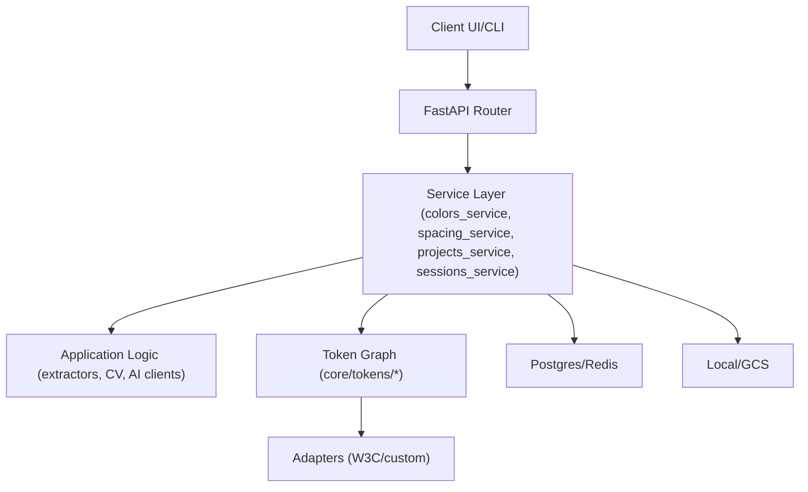
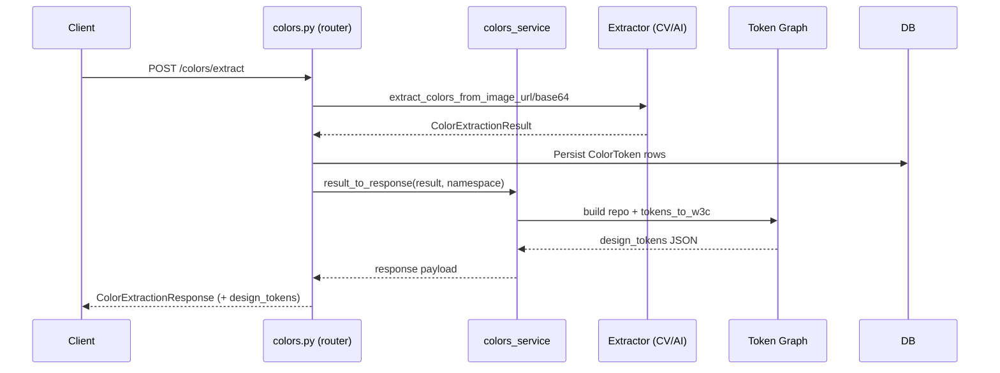

# Backend Architecture Overview

This backend follows a service-layered FastAPI stack with a shared token graph core. The goal is to keep request handling thin, push orchestration into services, and centralize token normalization/exports.

## High-level Flow (HTTP → DB/Token Graph)

## Key Modules

- **API routers (`src/copy_that/interfaces/api/`)**: HTTP endpoints; now call service helpers for token graph and DB orchestration.
- **Service layer (`src/copy_that/services/`)**: Small helpers that normalize inputs/outputs, build token repositories, serialize DB models, and wrap exports. Current services:
  - `colors_service.py`: repo builders, serialization, W3C export response for colors.
  - `spacing_service.py`: repo builders, CV/AI merge and batch aggregation for spacing.
  - `projects_service.py`: get/create project helpers for routers.
  - `sessions_service.py`: get/create session and token library helpers.
- **Token graph (`core/tokens/*`)**: `Token` model (with `TokenType`, `RelationType`, `TokenRelation`), repositories, adapters (W3C), aggregation helpers (`aggregate.py`).
- **Application extractors (`src/copy_that/application/`, `cv_pipeline/`)**: CV and AI extractors for colors/spacing; remain focused on extraction logic.
- **Infrastructure**: Postgres/Redis via docker-compose for local dev; `infrastructure/database.py` for DB sessions.

## Request Lifecycle (example: color extract)

## Current State / Decisions

- **Service layer introduced**: colors/spacing routers delegate repo building and serialization to `services/*`. This keeps handlers thinner and prepares for more endpoints.
- **Token graph as source of truth**: all exports (W3C) flow through `core/tokens` repositories/adapters; legacy `copy_that/tokens/**` removed.
- **Dockerized local stack**: api + celery + postgres + redis + observability via `docker-compose.yml`.

## Future Improvements

- Add dedicated services for projects/sessions to centralize DB access and reduce duplication across routers.
- Extend token graph adapters beyond W3C (issue #82) for custom/Figma/export formats.
- Harden e2e/test fixtures (seed DB, async client setup) to enable reliable API suite runs locally/CI.
