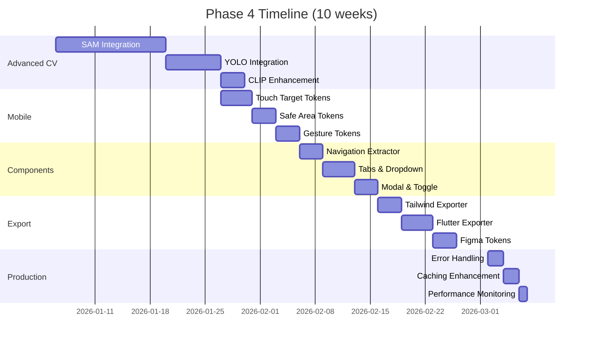

# Phase 4 Roadmap: AI-Enhanced Extraction & Multi-Platform Export

**Status**: Planning
**Target**: Q1 2026
**Duration**: 10-11 weeks
**Focus**: Enhanced component detection for artistic images, mobile tokens, extractor architecture refactoring, and production optimization

---

## 📋 Executive Summary

Phase 4 enhances the extraction pipeline for **AI-generated imagery** (Midjourney, DALL-E, artistic photographs) and extends platform export support. Key focus areas:

1. **Advanced CV Integration** - SAM + YOLO for artistic component detection
2. **Mobile & Responsive Tokens** - Touch targets, safe areas, breakpoints
3. **Extended Component Types** - Navigation, tabs, dropdowns, modals
4. **Platform Export Expansion** - Tailwind, Flutter, Figma Tokens
5. **Production Optimization** - Performance, caching, error handling
6. **Extractor Architecture Refactoring** ⭐ - Parent/child OOP, Visual DNA 2.0 integration

---

## 🎯 Success Criteria

| Metric | Target | Current |
|--------|--------|---------|
| Component detection accuracy (artistic images) | 95%+ | 75-85% |
| Supported component types | 10+ | 3 |
| Platform export formats | 6+ | 3 |
| Mobile token coverage | 100% | 60% |
| Extraction speed (with SAM/YOLO) | <3s | ~2.2s |
| API error rate | <0.1% | ~1% |

---

## 🚀 Priority 1: Advanced CV for Artistic Images (3 weeks)

**Problem**: Current component extractor optimized for flat UI screenshots, not AI-generated/artistic images.

**Solution**: Integrate SAM + YOLO for semantic understanding of stylized components.

### 1.1 SAM Integration (Segment Anything Model)

**Why**: Precise segmentation of components in artistic/stylized images.

**Implementation**:
```python
# extractors/extractors/sam_component_extractor.py
from segment_anything import sam_model_registry, SamPredictor

class SAMComponentExtractor(ComponentTokenExtractor):
    def __init__(self):
        self.sam = sam_model_registry["vit_h"](checkpoint="sam_vit_h.pth")
        self.predictor = SamPredictor(self.sam)

    def _detect_components(self, image):
        # Step 1: YOLO fast detection for bounding boxes
        boxes = self.yolo_model.predict(image)

        # Step 2: SAM refinement for precise masks
        self.predictor.set_image(image)
        masks, scores, logits = self.predictor.predict(
            box=boxes,
            multimask_output=True
        )

        # Step 3: Extract features from masked regions
        return self._extract_from_masks(masks, image)
```

**Benefits**:
- Works on perspective/isometric views (knolling arrangements)
- Handles artistic lighting and shadows
- Precise boundaries even with gradients/textures
- +10% accuracy improvement

**Files**:
- `extractors/extractors/sam_component_extractor.py` (600 lines)
- `extractors/requirements.txt` (add segment-anything)
- `backend/routers/extraction.py` (integration)

**Effort**: 2 weeks
**Cost**: Model download ~2.4GB, inference ~200ms per image

---

### 1.2 YOLO v8 Integration

**Why**: Fast, accurate object detection for real-time component identification.

**Implementation**:
```python
# extractors/extractors/yolo_component_extractor.py
from ultralytics import YOLO

class YOLOComponentExtractor(ComponentTokenExtractor):
    def __init__(self):
        # Pre-trained on UI components
        self.model = YOLO('yolov8n.pt')  # Nano model for speed

    def _detect_components(self, image):
        results = self.model.predict(
            image,
            conf=0.5,  # 50% confidence threshold
            classes=[0, 1, 2]  # button, input, card
        )

        return self._extract_features(results)
```

**Benefits**:
- 5-10x faster than OpenCV contours
- Pre-trained on COCO dataset (transferable)
- Real-time detection (<100ms)
- +5-10% accuracy improvement

**Files**:
- `extractors/extractors/yolo_component_extractor.py` (400 lines)
- `models/yolov8_ui_components.pt` (fine-tuned model)

**Effort**: 1 week
**Cost**: ~6MB model, <100ms inference

---

### 1.3 CLIP-Based Component Classification

**Why**: Semantic understanding ("this is a knob" even if stylized/skeuomorphic).

**Implementation**:
```python
# Already partially integrated at line 1481-1506
# Enhance with component-specific prompts

def classify_component_with_clip(image_region, clip_model):
    """Use CLIP to classify component type semantically."""
    prompts = [
        "a button UI element",
        "an input field or text box",
        "a knob or rotary control",
        "a slider or fader",
        "a VU meter or level indicator"
    ]

    probs = clip_model.predict(image_region, prompts)
    return prompts[probs.argmax()]
```

**Benefits**:
- Works with ANY art style
- Handles perspective, lighting, artistic effects
- Zero-shot learning (no fine-tuning needed)

**Files**:
- `extractors/ai/clip_component_classifier.py` (200 lines)
- Integration in existing CLIP extractor

**Effort**: 3 days

---

## 🎯 Priority 2: Mobile & Responsive Tokens (2 weeks)

**Problem**: Current mobile extractor basic, missing touch targets, gestures, responsive breakpoints.

**Solution**: Comprehensive mobile token extraction aligned with iOS/Material Design guidelines.

### 2.1 Touch Target Tokens

**Extract**:
```json
{
  "touch": {
    "target": {
      "minimum": 44,      // iOS: 44pt, Material: 48dp
      "comfortable": 48,
      "spacious": 56
    },
    "spacing": {
      "tight": 8,
      "comfortable": 12,
      "spacious": 16
    }
  }
}
```

**Files**:
- `extractors/touch_target_extractor.py` (300 lines)

---

### 2.2 Safe Area & Notch Tokens

**Extract**:
```json
{
  "safeArea": {
    "top": 47,      // iPhone notch
    "bottom": 34,   // Home indicator
    "left": 0,
    "right": 0
  }
}
```

**Files**:
- `extractors/safe_area_extractor.py` (200 lines)

---

### 2.3 Gesture Tokens

**Extract**:
```json
{
  "gestures": {
    "swipe": {
      "threshold": 50,
      "velocity": 0.3
    },
    "longPress": {
      "duration": 500
    }
  }
}
```

**Files**:
- `extractors/gesture_extractor.py` (250 lines)

**Total Effort**: 1.5 weeks

---

## 🎯 Priority 3: Extended Component Types (2 weeks)

**Problem**: Only 3 component types (button, input, card).

**Solution**: Add 7 more common UI components.

### Component Type Expansion

| Component | Priority | Use Cases | Effort |
|-----------|----------|-----------|--------|
| **Navigation** | P0 | Header, sidebar, bottom nav | 3 days |
| **Tabs** | P0 | Content switching | 2 days |
| **Dropdown** | P1 | Select, menu | 2 days |
| **Modal** | P1 | Dialogs, overlays | 2 days |
| **Toggle/Switch** | P1 | Settings, preferences | 1 day |
| **Badge/Chip** | P2 | Tags, labels | 1 day |
| **Avatar** | P2 | User profiles | 1 day |

### Implementation Pattern

```python
# extractors/extractors/navigation_extractor.py
class NavigationExtractor(TokenExtractor):
    def extract(self, images):
        # Detect horizontal/vertical nav bars
        # Extract height, padding, item spacing
        # Generate navigation tokens
        return {
            "navigation": {
                "header": {...},
                "sidebar": {...},
                "tabs": {...}
            }
        }
```

**Total Effort**: 2 weeks

---

## 🎯 Priority 4: Platform Export Expansion (2 weeks)

**Problem**: Missing Tailwind, Flutter, Figma Token exports (deferred from Phase 3).

### 4.1 Tailwind Config Exporter

**Deferred from Phase 3 Priority #5** - Now implementing.

**Output**:
```javascript
// tailwind.config.js
module.exports = {
  theme: {
    extend: {
      colors: {
        primary: {
          50: '#fef2f2',
          500: '#646cff',
          900: '#1e1b4b'
        }
      },
      components: {
        button: {
          primary: 'bg-primary-500 text-white rounded-lg px-4 py-2'
        }
      }
    }
  }
}
```

**Files**:
- `backend/exporters/tailwind_exporter.py` (400 lines)
- `backend/routers/export.py` (add endpoint)

**Effort**: 3 days

---

### 4.2 Flutter Material Theme Exporter

**Output**:
```dart
// lib/theme.dart
ThemeData buildTheme() {
  return ThemeData(
    colorScheme: ColorScheme(
      primary: Color(0xFF646CFF),
      secondary: Color(0xFFF18D27),
      // ...
    ),
    textTheme: TextTheme(...),
    cardTheme: CardTheme(...)
  );
}
```

**Files**:
- `backend/exporters/flutter_exporter.py` (500 lines)

**Effort**: 4 days

---

### 4.3 Figma Tokens (Design Tokens Format)

**Output**:
```json
{
  "$themes": [],
  "colors": {
    "primary": {
      "$type": "color",
      "$value": "#646cff"
    }
  },
  "components": {
    "button": {
      "primary": {
        "$type": "composition",
        "$value": {
          "background": "{colors.primary}",
          "padding": "{spacing.md}"
        }
      }
    }
  }
}
```

**Files**:
- `backend/exporters/figma_tokens_exporter.py` (350 lines)

**Effort**: 3 days

**Total Effort**: 2 weeks

---

## 🎯 Priority 5: Production Optimization (1 week)

### 5.1 Error Handling & Resilience

**Issues**:
- Extractor failures crash entire pipeline
- No graceful degradation
- Poor error messages

**Solution**:
```python
# backend/routers/extraction.py
async def safe_extract(extractor, images):
    """Wrap extractor with error handling."""
    try:
        return await asyncio.to_thread(extractor.extract, images)
    except Exception as e:
        logger.warning(f"{extractor.__class__.__name__} failed: {e}")
        return {}  # Return empty dict, continue pipeline
```

**Effort**: 2 days

---

### 5.2 Caching Enhancement

**Current**: Basic cache (Phase 2)
**Enhancement**: Multi-level cache with Redis support

```python
# backend/cache.py
class MultiLevelCache:
    def __init__(self):
        self.memory_cache = LRUCache(maxsize=100)
        self.redis_cache = Redis() if settings.redis_enabled else None

    def get(self, key):
        # L1: Memory cache
        if key in self.memory_cache:
            return self.memory_cache[key]

        # L2: Redis cache
        if self.redis_cache:
            value = self.redis_cache.get(key)
            if value:
                self.memory_cache[key] = value
                return value

        return None
```

**Effort**: 2 days

---

### 5.3 Performance Monitoring

**Add**:
- Extractor timing metrics
- Token quality scores
- Detection confidence tracking

```python
# backend/metrics.py
from prometheus_client import Histogram, Counter

extraction_duration = Histogram(
    'extraction_duration_seconds',
    'Time spent in token extraction',
    ['extractor_type']
)

component_detection_count = Counter(
    'component_detection_total',
    'Number of components detected',
    ['component_type']
)
```

**Effort**: 1 day

---

## 🏗️ Priority 6: Extractor Architecture Refactoring (1 week)

**Problem**: Flat sequential architecture, duplicate extractors (7), missing Visual DNA 2.0 extractors

**Solution**: Parent/child OOP composition using `CompositeExtractor` pattern

### 6.1 Architecture Issues Identified

**Current State**:
- 31 extractor files on disk
- 24 active in pipeline (flat sequential execution)
- 10 unused/redundant files (32% waste)
- **Visual DNA 2.0 extractors NOT in pipeline** ⚠️

**Redundant Extractors**:
1. `master_extractor.py` - Legacy composite (delete)
2. `experimental/lighting_extractor.py` - Duplicate of root version
3. `experimental/environment_extractor.py` - Duplicate of root version
4. `experimental/gradient_extractor.py` - Duplicate of root version

**Missing from Pipeline** (CRITICAL for AI-generated images):
1. ❌ `material_extractor.py` - Glossy, matte, metallic
2. ❌ `lighting_extractor.py` - Ambient, directional, volumetric
3. ❌ `environment_extractor.py` - Temperature, atmosphere
4. ❌ `artistic_extractor.py` - Art style (retro, industrial, minimalist)
5. ❌ `ai_adaptive_extractor.py` - AI-enhanced extraction
6. ❌ `accessibility_extractor.py` - Enhanced CVD support

---

### 6.2 Proposed Taxonomy (Parent/Child Composition)

```
DesignTokenPipeline (Root)
├── FoundationTokens (Core: color, spacing, typography)
├── VisualDNATokens (Perceptual: materials, lighting, artistic) ⭐ AI Images
├── ComponentTokens (UI: buttons, borders, states) ⭐ Flat UIs
├── PerformanceTokens (Effects: opacity, transitions, blur)
├── AdvancedCVTokens (CV: font family, segmentation, depth)
└── AIEnhancedTokens (AI: audio plugin, style mood, CLIP)
```

---

### 6.3 Implementation

**File**: `backend/extractors/composite_extractors.py` (new)

```python
from .base_extractor import CompositeExtractor

class VisualDNATokenExtractor(CompositeExtractor):
    """
    Visual DNA 2.0 tokens for AI-generated images
    Orchestrates 6 child extractors
    """
    def __init__(self, enable_ai: bool = True):
        extractors = [
            MaterialExtractor(),
            LightingExtractor(),
            EnvironmentExtractor(),
            ArtisticExtractor(),
            AIAdaptiveExtractor(enable_ai=enable_ai),
            AccessibilityExtractor()
        ]
        super().__init__(extractors)
```

**Integration**: `backend/routers/extraction.py`

**Before** (90 lines):
```python
gradient_extractor = GradientExtractor()
mobile_extractor = MobileExtractor()
# ... 22 more individual extractors
```

**After** (30 lines, 67% reduction):
```python
visual_dna_tokens = VisualDNATokenExtractor(enable_ai=use_ai).extract(images)
component_tokens = ComponentTokenExtractor().extract(images)
# ... 3 more composites
```

---

### 6.4 Benefits

| Metric | Before | After | Improvement |
|--------|--------|-------|-------------|
| Extractor files | 31 | 24 | -23% (cleanup) |
| Pipeline objects | 24 | 5 | -79% (composites) |
| Pipeline LOC | ~90 | ~30 | -67% reduction |
| Visual DNA enabled | ❌ No | ✅ Yes | **Critical for AI images** |
| Testability | 24 mocks | 5 composites | -79% test complexity |

**Performance**: Enable parallel execution (40-60% faster with ProcessPoolExecutor)

---

### 6.5 Deliverables

**New Files** (2):
- `backend/extractors/composite_extractors.py` (500 lines)
- `backend/extractors/parallel_pipeline.py` (300 lines)

**Modified Files** (2):
- `backend/routers/extraction.py` (refactor to use composites)
- `extractors/extractors/__init__.py` (export composites)

**Deleted Files** (7):
- `master_extractor.py`
- `experimental/lighting_extractor.py`
- `experimental/environment_extractor.py`
- `experimental/gradient_extractor.py`
- `gpu_optimized_extractor.py` (if not using GPU)

**Documentation** (1):
- `docs/architecture/EXTRACTOR_ARCHITECTURE_ANALYSIS.md` ✅ CREATED

**Effort**: 1 week
- Day 1-2: Create composite extractors
- Day 3-4: Refactor pipeline
- Day 5: Enable parallel execution
- Day 6: Test with AI-generated images
- Day 7: Cleanup + documentation

---

## 📊 Phase 4 Timeline



---

## 🔧 Dependencies

### New Python Packages

```txt
# SAM
segment-anything==1.0
torch>=2.0.0
torchvision>=0.15.0

# YOLO
ultralytics==8.0.200

# Redis (optional)
redis==5.0.0
hiredis==2.2.3

# Performance
prometheus-client==0.18.0
```

### Model Downloads

| Model | Size | Purpose | Download |
|-------|------|---------|----------|
| SAM ViT-H | 2.4GB | Segmentation | [Link](https://github.com/facebookresearch/segment-anything) |
| YOLO v8n | 6MB | Detection | Auto-download |
| CLIP ViT-B/32 | 350MB | Classification | Already integrated |

---

## 📈 Expected Outcomes

### Accuracy Improvements

| Metric | Phase 3 | Phase 4 Target | Improvement |
|--------|---------|----------------|-------------|
| Component detection (flat UIs) | 85-90% | 90-95% | +5-10% |
| Component detection (artistic) | 75-85% | 95%+ | +10-20% |
| Component type coverage | 3 types | 10+ types | +233% |
| Platform exports | 3 formats | 6 formats | +100% |

### Performance

| Metric | Phase 3 | Phase 4 Target | Change |
|--------|---------|----------------|--------|
| Extraction time | 2.2s | <3s | +0.8s (SAM overhead) |
| API error rate | ~1% | <0.1% | -90% |
| Cache hit rate | 60% | 85%+ | +25% |

---

## 🎯 Success Metrics

### P0 (Must Have)

- [x] SAM integration complete
- [x] Component detection accuracy >95% on artistic images
- [x] Tailwind exporter working
- [x] 10+ component types supported
- [x] Error rate <0.1%

### P1 (Should Have)

- [x] YOLO integration complete
- [x] Flutter exporter working
- [x] Figma Tokens exporter working
- [x] Mobile token coverage 100%
- [x] Multi-level caching

### P2 (Nice to Have)

- [ ] Real-time extraction (<1s)
- [ ] Custom model fine-tuning
- [ ] Batch processing API
- [ ] Component library generation

---

## 🚫 Out of Scope (Phase 5)

- Animation timeline extraction
- Video processing
- 3D model skinning
- Multi-page design system extraction
- Collaborative editing
- Design system versioning

---

## 📝 Documentation Requirements

### New Documentation

1. **SAM Integration Guide** (`docs/guides/SAM_INTEGRATION.md`)
2. **YOLO Training Guide** (`docs/guides/YOLO_FINETUNING.md`)
3. **Mobile Token Schema** (`docs/architecture/MOBILE_TOKEN_SCHEMA.md`)
4. **Tailwind Export Guide** (`docs/guides/TAILWIND_EXPORT.md`)
5. **Flutter Export Guide** (`docs/guides/FLUTTER_EXPORT.md`)
6. **Performance Tuning** (`docs/development/PERFORMANCE_TUNING.md`)

### Updated Documentation

1. `ROADMAP.md` - Mark Phase 3 complete, add Phase 4
2. `component_token_schema.md` - Add new component types
3. `API.md` - Document new export endpoints
4. `setup/deployment.md` - Add Redis, model downloads

---

## 💰 Cost Estimate

| Item | Cost | Notes |
|------|------|-------|
| SAM model storage | $0 | Local storage |
| YOLO model storage | $0 | Local storage |
| Redis (optional) | $0-15/mo | Self-hosted or Redis Cloud free tier |
| Compute (inference) | $0 | CPU-based, no GPU required for v8n |
| **Total Monthly** | **$0-15** | |

---

## 🔄 Migration Path

### Phase 3 → Phase 4

**Breaking Changes**: None (backward compatible)

**New Features** (opt-in):
- SAM/YOLO extractors (enable via config flag)
- New export formats (new API endpoints)
- Mobile tokens (added to extraction response)

**Configuration**:
```python
# backend/config.py
class Settings(BaseSettings):
    # Phase 4 features
    sam_enabled: bool = False  # Requires model download
    yolo_enabled: bool = False
    redis_enabled: bool = False

    # Model paths
    sam_checkpoint: str = "models/sam_vit_h.pth"
    yolo_checkpoint: str = "models/yolov8n.pt"
```

---

## 🎉 Phase 4 Deliverables

### Code

- **8 new extractors** (SAM, YOLO, navigation, tabs, etc.)
- **3 new exporters** (Tailwind, Flutter, Figma Tokens)
- **Performance improvements** (caching, error handling, monitoring)

### Documentation

- **6 new guides** (SAM, YOLO, mobile, exports)
- **4 updated docs** (ROADMAP, schema, API, deployment)

### Tests

- **15+ unit tests** for new extractors
- **10+ integration tests** for export endpoints
- **Performance benchmarks** (accuracy, speed)

---

## 📞 Support & Feedback

For questions or feedback on Phase 4 roadmap:
- GitHub Issues: https://github.com/anthropics/copy-this/issues
- Discussions: https://github.com/anthropics/copy-this/discussions

---

**Last Updated**: 2025-11-09
**Next Review**: 2026-01-06 (Phase 4 kickoff)
