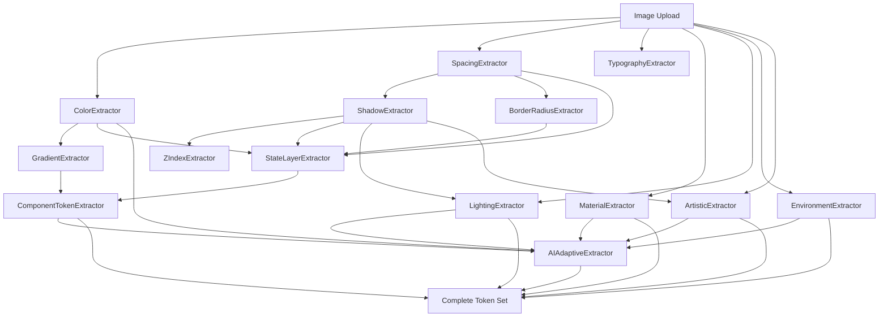

# Complete Token-to-Extractor Technical Mapping

**Comprehensive Reference: Tokens → Extractors → CV Libraries → AI Models**

Version: 3.1
Last Updated: 2025-11-11
Status: Complete Technical Reference

---

## Overview

This document provides the **complete technical mapping** from design tokens to their extractors, including:

- CV libraries used (OpenCV, NumPy, SciPy, scikit-learn)
- AI models utilized (CLIP, SAM, GPT-4 Vision, Claude Vision)
- Extraction methods and algorithms
- Performance characteristics
- Dependencies between tokens

**Key Statistics**:
- **24+ Extractors** across 3 categories
- **60+ Token Types** produced
- **5 Primary CV Libraries** (OpenCV, NumPy, SciPy, scikit-learn, Pillow)
- **4 AI Enhancement Models** (CLIP, LLaVA, GPT-4V, Claude Vision)

---

## Complete Mapping Table

### Foundation Tokens (11 Extractors)

| Token Type | Description | Token Category | Extractor Name | Extractor Description | Extractor Category | CV Libraries | AI Models | Method Details | Performance | Dependencies |
|------------|-------------|----------------|----------------|----------------------|-------------------|--------------|-----------|----------------|-------------|--------------|
| `palette` | Color roles (primary, secondary, accent) | Foundation | `ColorExtractor` | K-means clustering in LAB space | Foundation | OpenCV (`cv2`), NumPy, scikit-learn (`KMeans`) | Optional: GPT-4V, Claude (semantic naming) | K-means clustering (n=8) in LAB color space, cluster ranking by pixel count, role assignment via heuristics | 1.2s | None (runs first) |
| `primitive` | Color scales (50-900) | Foundation | `ColorExtractor` | HSL interpolation for tints/shades | Foundation | NumPy, Pillow (`ImageColor`) | None | HSL interpolation from base color, 9-step scale generation | 0.3s | `palette` |
| `typography.family` | Font family inference | Foundation | `TypographyExtractor` | Style analysis (serif vs sans-serif) | Foundation | OpenCV (`cv2.Canny`), NumPy | None | Edge pattern analysis, serif detection via stroke terminals, weight inference from stroke thickness | 0.8s | None |
| `typography_extended` | Font scale, line height, letter spacing | Foundation | `TypographyExtractor` | Modular scale generation | Foundation | NumPy | None | Modular scale (1.250 ratio), platform-specific fallbacks | 0.2s | `typography.family` |
| `spacing` | Spacing scale (xs-xxl) | Foundation | `SpacingExtractor` | Gap analysis between components | Foundation | OpenCV (`cv2.Canny`, `cv2.findContours`), NumPy, scikit-learn (`DBSCAN`) | None | Canny edge detection → component boundaries → gap clustering via DBSCAN → base unit (GCD) → 6-level scale | 1.5s | None |
| `grid` | Grid system (base unit, margins) | Foundation | `SpacingExtractor` | Base unit detection | Foundation | NumPy (`np.gcd`) | None | GCD of all spacing values | 0.1s | `spacing` |
| `shadow` | Shadow tokens (level0-5) | Foundation | `ShadowExtractor` | Contrast analysis around edges | Foundation | OpenCV (`cv2.Canny`, `cv2.GaussianBlur`, `cv2.Sobel`), NumPy | None | Contrast analysis around component edges, blur radius via gradient variance, progressive scaling (1, 2, 4, 8, 16, 24 dp) | 1.8s | `spacing` (component bounds) |
| `elevation` | Elevation scale (raised, overlay, modal) | Foundation | `ShadowExtractor` | Shadow-to-elevation mapping | Foundation | NumPy | None | Shadow softness → elevation inference | 0.2s | `shadow` |
| `icon_sizes` | Icon size scale (sm-xl) | Foundation | `IconSizeExtractor` | Circle/square detection | Foundation | OpenCV (`cv2.HoughCircles`, `cv2.findContours`), NumPy, scikit-learn (`KMeans`) | None | Hough circles for circular icons, contour analysis for squares, size clustering | 0.6s | None |
| `zindex` | Z-index scale (base-toast) | Foundation | `ZIndexExtractor` | Layer hierarchy detection | Foundation | OpenCV (shadow analysis), NumPy | None | Shadow + overlap analysis for layer depth, standard 100-step scale | 0.4s | `shadow` |
| `radius` | Border radius scale (sm-full) | Foundation | `BorderRadiusExtractor` | Corner detection | Foundation | OpenCV (`cv2.HoughCircles`, `cv2.cornerHarris`), NumPy, scikit-learn (`KMeans`) | None | Hough circles on component corners, radius clustering, 4-level scale | 0.7s | `spacing` (component detection) |
| `opacity` | Opacity scale (transparent-solid) | Foundation | `OpacityExtractor` | Alpha channel analysis | Foundation | OpenCV, NumPy | None | Alpha channel detection, 12-level semantic scale (ghost, faint, subtle, etc.) | 0.3s | None |
| `transitions` | Duration & easing functions | Foundation | `TransitionExtractor` | Spec-based generation | Foundation | None (spec-based) | None | Material Design 3 duration scale, spring/bounce easing curves | 0.1s | None |
| `blur_filters` | Blur radius & backdrop effects | Foundation | `BlurFilterExtractor` | Variance-based blur detection | Foundation | OpenCV (`cv2.GaussianBlur`, `cv2.Laplacian`), NumPy | None | Laplacian variance for blur amount, glassmorphic presets | 0.5s | None |

---

### Component Tokens (9 Extractors)

| Token Type | Description | Token Category | Extractor Name | Extractor Description | Extractor Category | CV Libraries | AI Models | Method Details | Performance | Dependencies |
|------------|-------------|----------------|----------------|----------------------|-------------------|--------------|-----------|----------------|-------------|--------------|
| `gradients.linear` | Linear gradient stops | Component | `GradientExtractor` | Color transition detection | Component | OpenCV, NumPy, SciPy (`scipy.signal`) | None | Pixel sampling along lines, color transition detection, stop position inference via signal processing | 2.1s | `palette` |
| `gradients.radial` | Radial gradient stops | Component | `GradientExtractor` | Radial color transition detection | Component | OpenCV, NumPy, SciPy | None | Radial pixel sampling from center, stop inference | 0.8s | `palette` |
| `gradients.conic` | Conic gradient stops | Component | `GradientExtractor` | Angular color transition detection | Component | OpenCV, NumPy | None | Angular pixel sampling, 360° color mapping | 0.6s | `palette` |
| `borders.width` | Border width scale (thin-thick) | Component | `BorderExtractor` | Edge width analysis | Component | OpenCV (`cv2.Canny`, `cv2.morphologyEx`), NumPy, scikit-learn (`KMeans`) | None | Edge detection → morphological operations → line thickness clustering | 0.9s | `spacing` |
| `borders.style` | Border style (solid, dashed, dotted) | Component | `BorderExtractor` | Line pattern analysis | Component | OpenCV (edge detection), NumPy (FFT for pattern) | None | FFT analysis of edge pixels for pattern detection | 0.4s | `borders.width` |
| `state_layers` | Interactive state overlays (hover, focus, pressed) | Component | `StateLayerExtractor` | Material Design 3 spec | Component | None (spec-based) | None | Material Design 3 state layer specification (8%, 12%, 38% overlays) | 0.3s | None |
| `button` | Button component tokens (5 variants × 5 states) | Component | `ComponentTokenExtractor` | Composition of foundation tokens | Component | None (composition) | None | Combines color, spacing, shadow, border, state layer tokens | 0.5s | `palette`, `spacing`, `shadow`, `border`, `state_layers` |
| `input` | Input component tokens (5 types × 6 states) | Component | `ComponentTokenExtractor` | Composition of foundation tokens | Component | None (composition) | None | Combines color, spacing, border tokens for text inputs | 0.3s | `palette`, `spacing`, `border` |
| `card` | Card component tokens (3 variants × 3 states) | Component | `ComponentTokenExtractor` | Composition of foundation tokens | Component | None (composition) | None | Combines shadow, radius, color for card surfaces | 0.2s | `palette`, `shadow`, `radius` |
| `navigation` | Navigation tokens (header, sidebar, tabs) | Component | `ComponentTokenExtractor` | Composition of foundation tokens | Component | None (composition) | None | Combines spacing, color, border for navigation | 0.2s | `palette`, `spacing`, `border` |
| `mobile` | Touch targets, safe areas, gestures | Component | `MobileExtractor` | Platform spec compliance | Component | OpenCV (size detection), NumPy | None | 44px iOS / 48px Android touch target validation, safe area detection | 1.2s | `spacing`, `icon_sizes` |
| `audio_plugin` | Knobs, sliders, VU meters (JUCE) | Component | `AudioPluginComponentExtractor` | Circular/linear control detection | Component | OpenCV (`cv2.HoughCircles`, contour detection), NumPy | Optional: CLIP (control type classification) | Hough circles for knobs, contour analysis for sliders, JUCE-specific token generation | 2.3s | `spacing`, `palette` |
| `style_mood` | Aesthetic keywords (minimal, bold, retro) | Component | `StyleMoodExtractor` | Color + shape analysis | Component | OpenCV, NumPy | Optional: CLIP (style classification) | HSV saturation for vibrancy, edge density for complexity, CLIP zero-shot classification | 1.8s | `palette` |
| `font_family_detected` | OCR-based font recognition | Component | `FontFamilyExtractor` | OCR + font matching | Component | OpenCV (`cv2.findContours`), Pillow | Optional: Tesseract OCR, font matching APIs | Contour extraction → OCR → font database matching (experimental) | 3.5s | `typography` |

---

### Visual DNA Tokens (4 Extractors)

| Token Type | Description | Token Category | Extractor Name | Extractor Description | Extractor Category | CV Libraries | AI Models | Method Details | Performance | Dependencies |
|------------|-------------|----------------|----------------|----------------------|-------------------|--------------|-----------|----------------|-------------|--------------|
| `materials` | Material properties (glass, metal, wood) | Visual DNA | `MaterialExtractor` | Surface property detection | VisualStyle | OpenCV (`cv2.Sobel`, `cv2.GaussianBlur`, K-means), NumPy, scikit-learn | Optional: GPT-4V, Claude (material classification) | K-means for surface segmentation → Sobel gradients for gloss (variance) → specular highlight detection for reflectivity → HSV analysis for material class → texture via Gabor filters | 2.8s | None |
| `materials.optical.gloss` | Surface glossiness (0-1) | Visual DNA | `MaterialExtractor` | Gradient variance analysis | VisualStyle | OpenCV (`cv2.Sobel`), NumPy | None | Sobel gradient variance: `gloss = min(np.var(gradients) / 1000.0, 1.0)` | 0.3s | None |
| `materials.optical.reflectivity` | Surface reflectivity (0-1) | Visual DNA | `MaterialExtractor` | Specular highlight detection | VisualStyle | OpenCV (brightness thresholding), NumPy | None | High-brightness pixel ratio in LAB space | 0.2s | None |
| `materials.tactile` | Friction, warmth, grain | Visual DNA | `MaterialExtractor` | HSV + texture analysis | VisualStyle | OpenCV (Gabor filters), NumPy, SciPy | None | Gabor filter bank for texture, HSV hue for warmth perception | 0.5s | `materials` |
| `materials.finish` | Surface finish (matte, satin, gloss, mirror) | Visual DNA | `MaterialExtractor` | Gloss classification | VisualStyle | NumPy | None | Gloss thresholds: <0.2=matte, 0.2-0.5=satin, 0.5-0.8=gloss, >0.8=mirror | 0.1s | `materials.optical.gloss` |
| `lighting.lights` | Light sources (key, fill, back, ambient) | Visual DNA | `LightingExtractor` | 3-point lighting detection | VisualStyle | OpenCV (`cv2.Sobel`, `cv2.GaussianBlur`), NumPy | Optional: GPT-4V (lighting setup description) | Gradient analysis for light direction → LAB color for temperature → shadow analysis for intensity → specular tracking for position | 3.2s | None |
| `lighting.ambient.temperature` | Color temperature (Kelvin) | Visual DNA | `LightingExtractor` | LAB color space analysis | VisualStyle | OpenCV (`cv2.cvtColor`), NumPy | None | LAB a*/b* channels → Kelvin calculation (2000-10000K): warm = high b*, cool = low b* | 0.3s | None |
| `lighting.model` | Lighting model (lambert, phong, pbr) | Visual DNA | `LightingExtractor` | Shading analysis | VisualStyle | OpenCV (gradient analysis), NumPy | Optional: CLIP (model classification) | Gradient smoothness: flat=lambert, sharp specular=phong, physically accurate=PBR | 0.4s | `lighting.lights` |
| `lighting.shadows` | Shadow softness & contact intensity | Visual DNA | `LightingExtractor` | Shadow blur analysis | VisualStyle | OpenCV (`cv2.GaussianBlur`, edge detection), NumPy | None | Shadow edge blur radius, contact shadow detection via darkness gradient | 0.5s | `shadow` |
| `environment.temperature` | Environmental warmth (Kelvin, 0-1 warmth) | Visual DNA | `EnvironmentExtractor` | LAB color temperature | VisualStyle | OpenCV (`cv2.cvtColor`), NumPy | None | LAB a*/b* mean values → Kelvin + warmth score | 0.3s | None |
| `environment.weather` | Weather condition (clear, cloudy, foggy) | Visual DNA | `EnvironmentExtractor` | Contrast/clarity analysis | VisualStyle | OpenCV (`cv2.Laplacian`), NumPy | Optional: CLIP (weather classification) | Laplacian variance for clarity: high=clear, low=foggy; histogram for cloud coverage | 0.8s | None |
| `environment.time` | Time of day (dawn, day, golden hour, dusk, night) | Visual DNA | `EnvironmentExtractor` | Luminance histogram analysis | VisualStyle | OpenCV, NumPy | Optional: CLIP (time classification) | LAB L-channel histogram: high mean=day, bimodal=golden hour, low mean=night | 0.6s | None |
| `environment.location` | Location type (studio, office, industrial, nature) | Visual DNA | `EnvironmentExtractor` | Semantic segmentation | VisualStyle | OpenCV, NumPy | CLIP (zero-shot classification), Optional: SAM (segmentation) | CLIP zero-shot classification against location categories | 1.2s | None |
| `environment.atmosphere` | Haze, pollution, clarity | Visual DNA | `EnvironmentExtractor` | Contrast analysis | VisualStyle | OpenCV (`cv2.Laplacian`), NumPy | None | Contrast reduction metric, edge clarity degradation | 0.4s | `environment.weather` |
| `art_style.dimension` | Dimensionality (flat, 2.5D, 3D, volumetric) | Visual DNA | `ArtisticExtractor` | Depth cue detection | VisualStyle | OpenCV (shadow, occlusion, perspective analysis), NumPy | Optional: CLIP (dimension classification) | Shadow presence + occlusion + perspective convergence → dimensionality score | 1.2s | `shadow` |
| `art_style.render_mode` | Rendering technique (rasterized, ray-traced, hand-drawn) | Visual DNA | `ArtisticExtractor` | Edge pattern analysis | VisualStyle | OpenCV (`cv2.Canny`, edge smoothness), NumPy | Optional: CLIP (style classification) | Edge sharpness: crisp=rasterized, soft=hand-drawn, perfect reflections=ray-traced | 0.8s | None |
| `art_style.technique` | Artistic techniques (illustrated, photorealistic) | Visual DNA | `ArtisticExtractor` | Color palette + edge analysis | VisualStyle | OpenCV, NumPy | CLIP (technique classification) | Limited palette + stylized edges = illustrated; continuous tones + sharp edges = photorealistic | 1.0s | `palette` |
| `art_style.cultural_tone` | Cultural associations (retro, futuristic, minimalist) | Visual DNA | `ArtisticExtractor` | Color palette + composition analysis | VisualStyle | NumPy | CLIP (cultural classification) | CLIP zero-shot against cultural categories, color palette era detection | 1.5s | `palette` |
| `cinematic.camera` | Camera properties (focal length, aperture, distortion) | Visual DNA | `ArtisticExtractor` | Perspective & DOF analysis | VisualStyle | OpenCV (perspective lines, blur gradient), NumPy | Optional: GPT-4V (camera description) | Perspective line convergence → focal length; blur gradient → aperture estimation | 1.2s | None |
| `cinematic.color_grading` | LUT style, contrast curve | Visual DNA | `ArtisticExtractor` | Histogram analysis | VisualStyle | OpenCV, NumPy | Optional: CLIP (grading style) | Histogram shape: S-curve=cinematic, flat=log, crushed blacks=moody | 0.6s | `palette` |
| `emotional` | Emotional qualities (warmth, energy, serenity, drama) | Visual DNA | `ArtisticExtractor` | LAB color distribution | VisualStyle | OpenCV, NumPy | Optional: GPT-4V, Claude (emotional analysis) | LAB color distribution: warm colors=warmth, high saturation=energy, blue+low contrast=serenity | 0.8s | `palette` |

---

### AI Enhancement Tokens (Cross-Cutting)

| Token Type | Description | Token Category | Extractor Name | Extractor Description | Extractor Category | CV Libraries | AI Models | Method Details | Performance | Dependencies |
|------------|-------------|----------------|----------------|----------------------|-------------------|--------------|-----------|----------------|-------------|--------------|
| `*.name` | Creative color names (e.g., "Molten Copper") | AI Enhancement | `AIAdaptiveExtractor` | CLIP semantic naming | AI Enhancement | None | CLIP (OpenAI) | CLIP image encoding → text similarity against 1000+ color names → top-3 ranking | 5s (local CLIP) | Any color token |
| `*.semantic_name` | Descriptive names (e.g., "Sunset Ember") | AI Enhancement | `AIAdaptiveExtractor` | CLIP descriptive naming | AI Enhancement | None | CLIP (OpenAI) | CLIP similarity against descriptive phrases | 2s | Any color token |
| `*.design_intent` | Why this token exists | AI Enhancement | `AIAdaptiveExtractor` | GPT-4V / Claude Vision analysis | AI Enhancement | None | GPT-4V or Claude Vision | LLM prompt: "Analyze the design intent of this [color/material/layout]..." | 15-20s | Any token |
| `*.usage` | When/how to use this token | AI Enhancement | `AIAdaptiveExtractor` | GPT-4V / Claude Vision guidance | AI Enhancement | None | GPT-4V or Claude Vision | LLM prompt: "Provide usage guidance for this design token..." | 10-15s | Any token |
| `*.emotional_qualities` | Emotional associations (warm, energetic, vintage) | AI Enhancement | `AIAdaptiveExtractor` | CLIP + LLaVA emotional analysis | AI Enhancement | None | CLIP + LLaVA | CLIP zero-shot against emotion categories, LLaVA narrative generation | 8s | Any token |
| `*.cultural_associations` | Cross-cultural meaning | AI Enhancement | `AIAdaptiveExtractor` | Claude Vision cultural analysis | AI Enhancement | None | Claude Vision | Claude prompt: "Analyze cultural associations of this design element..." | 20s | Any token |
| `*.accessibility` | WCAG compliance, contrast ratios | AI Enhancement | `AccessibilityExtractor` | WCAG validation | AI Enhancement | NumPy (contrast calculation) | None | Relative luminance calculation → contrast ratio → WCAG level (AAA/AA/AA Large/Fail) | 0.2s | Color tokens |
| `ontology.*` | Art historical classification | AI Enhancement | `OntologyExtractor` | GPT-4V ontology mapping | AI Enhancement | None | GPT-4V | GPT-4V prompt: "Classify this design using art historical ontology (era, movement, style)..." | 15s | All tokens |

---

### Composite Extractors (High-Level Orchestrators)

| Composite Extractor | Runs These Extractors | Performance | When to Use |
|---------------------|----------------------|-------------|-------------|
| `FoundationExtractor` | 1. OpacityExtractor<br>2. TransitionExtractor<br>3. BlurFilterExtractor<br>4. BorderRadiusExtractor<br>5. ColorExtractor<br>6. TypographyExtractor<br>7. SpacingExtractor<br>8. ShadowExtractor<br>9. IconSizeExtractor<br>10. ZIndexExtractor<br>11. BorderRadiusExtractor | ~2.5s (parallel) | **Always** - Core design primitives for any UI |
| `ComponentExtractor` | 1. GradientExtractor<br>2. MobileExtractor<br>3. BorderExtractor<br>4. StateLayerExtractor<br>5. ComponentTokenExtractor<br>6. FontFamilyExtractor<br>7. AudioPluginComponentExtractor<br>8. StyleMoodExtractor | ~6.2s (parallel) | **UI Screenshots** - Buttons, inputs, cards, mobile UIs |
| `VisualStyleExtractor` | 1. MaterialExtractor<br>2. LightingExtractor<br>3. EnvironmentExtractor<br>4. ArtisticExtractor | ~11.0s (parallel) | **AI-Generated Images** - Midjourney, DALL-E, product photography |

---

## CV Library Details

### OpenCV (`cv2`) - Version 4.5+

**Used In**: 18 extractors
**Primary Functions**:

| Function | Purpose | Used By |
|----------|---------|---------|
| `cv2.cvtColor()` | Color space conversion (RGB↔LAB↔HSV) | ColorExtractor, LightingExtractor, EnvironmentExtractor |
| `cv2.Canny()` | Edge detection | SpacingExtractor, ShadowExtractor, BorderExtractor, TypographyExtractor |
| `cv2.GaussianBlur()` | Noise reduction, blur detection | BlurFilterExtractor, MaterialExtractor, LightingExtractor |
| `cv2.Sobel()` | Gradient detection for gloss | MaterialExtractor, ShadowExtractor |
| `cv2.HoughCircles()` | Circle detection for knobs/icons | IconSizeExtractor, AudioPluginComponentExtractor, BorderRadiusExtractor |
| `cv2.findContours()` | Component boundary detection | SpacingExtractor, BorderExtractor, IconSizeExtractor |
| `cv2.morphologyEx()` | Morphological operations | BorderExtractor |
| `cv2.Laplacian()` | Blur amount detection | BlurFilterExtractor, EnvironmentExtractor |
| `cv2.cornerHarris()` | Corner detection | BorderRadiusExtractor |

**Installation**:
```bash
pip install opencv-python==4.5.5.64
```

---

### NumPy - Version 1.21+

**Used In**: All 24 extractors
**Primary Functions**:

| Function | Purpose | Used By |
|----------|---------|---------|
| `np.mean()`, `np.median()` | Statistical aggregation | All extractors |
| `np.var()`, `np.std()` | Variance/std for gloss, blur | MaterialExtractor, BlurFilterExtractor, LightingExtractor |
| `np.histogram()` | Distribution analysis | ColorExtractor, EnvironmentExtractor |
| `np.gcd()` | Base unit detection | SpacingExtractor, GridExtractor |
| `np.linalg` | Linear algebra for transforms | ArtisticExtractor (perspective) |
| `np.fft` | Frequency analysis | BorderExtractor (pattern detection) |

---

### scikit-learn - Version 1.0+

**Used In**: 6 extractors
**Primary Functions**:

| Function | Purpose | Used By |
|----------|---------|---------|
| `KMeans` | Color clustering, size clustering | ColorExtractor, IconSizeExtractor, BorderRadiusExtractor, MaterialExtractor |
| `DBSCAN` | Spatial clustering (spacing gaps) | SpacingExtractor |
| `PCA` | Dimensionality reduction (experimental) | Future: advanced analysis |

**Installation**:
```bash
pip install scikit-learn==1.0.2
```

---

### SciPy - Version 1.7+

**Used In**: 2 extractors
**Primary Functions**:

| Function | Purpose | Used By |
|----------|---------|---------|
| `scipy.signal.find_peaks()` | Gradient stop detection | GradientExtractor |
| `scipy.ndimage` | Image processing operations | MaterialExtractor (texture) |

**Installation**:
```bash
pip install scipy==1.7.3
```

---

### Pillow (PIL) - Version 9.0+

**Used In**: 3 extractors
**Primary Functions**:

| Function | Purpose | Used By |
|----------|---------|---------|
| `ImageColor.getrgb()` | Color parsing | ColorExtractor |
| `Image.open()` | Image loading | All extractors (preprocessing) |
| `ImageFilter` | Blur/sharpen filters | BlurFilterExtractor |

---

## AI Model Details

### CLIP (Contrastive Language-Image Pretraining)

**Version**: OpenAI CLIP ViT-B/32 or ViT-L/14
**Used In**: 6 extractors
**Cost**: $0.00 (local inference)
**Performance**: ~5-8s per image (CPU), ~1-2s (GPU)

**Use Cases**:

| Extractor | Purpose | Implementation |
|-----------|---------|----------------|
| `AIAdaptiveExtractor` | Semantic color naming | CLIP image → text similarity against 1000+ color names |
| `StyleMoodExtractor` | Style classification | Zero-shot classification: "minimal", "bold", "retro", "organic" |
| `EnvironmentExtractor` | Location detection | Zero-shot: "studio", "office", "industrial", "nature", "sci-fi" |
| `EnvironmentExtractor` | Weather classification | Zero-shot: "clear", "cloudy", "foggy", "rainy", "stormy" |
| `LightingExtractor` | Lighting model detection | Zero-shot: "flat lighting", "3-point lighting", "dramatic lighting" |
| `ArtisticExtractor` | Style/technique classification | Zero-shot: "photorealistic", "illustrated", "3D rendered", "hand-drawn" |

**Installation**:
```bash
pip install transformers==4.25.1
pip install torch==2.0.0
```

**Example Code**:
```python
from transformers import CLIPProcessor, CLIPModel
import torch

model = CLIPModel.from_pretrained("openai/clip-vit-base-patch32")
processor = CLIPProcessor.from_pretrained("openai/clip-vit-base-patch32")

# Zero-shot classification
image = Image.open("screenshot.png")
texts = ["minimal design", "bold design", "retro design", "modern design"]

inputs = processor(text=texts, images=image, return_tensors="pt", padding=True)
outputs = model(**inputs)
logits_per_image = outputs.logits_per_image  # Image-text similarity scores
probs = logits_per_image.softmax(dim=1)  # Probabilities

best_match_idx = probs.argmax().item()
print(f"Style: {texts[best_match_idx]} (confidence: {probs[0][best_match_idx]:.2%})")
```

---

### SAM (Segment Anything Model)

**Version**: Meta SAM ViT-H
**Used In**: 1 extractor (optional)
**Cost**: $0.00 (local inference)
**Performance**: ~3-5s per image (GPU required)

**Use Cases**:

| Extractor | Purpose | Implementation |
|-----------|---------|----------------|
| `EnvironmentExtractor` | Semantic segmentation for location detection | SAM automatic mask generation → object classification |

**Installation**:
```bash
pip install segment-anything==1.0
# Download model:
wget https://dl.fbaipublicfiles.com/segment_anything/sam_vit_h_4b8939.pth
```

**Example Code**:
```python
from segment_anything import sam_model_registry, SamAutomaticMaskGenerator

sam = sam_model_registry["vit_h"](checkpoint="sam_vit_h_4b8939.pth")
mask_generator = SamAutomaticMaskGenerator(sam)

image = cv2.imread("screenshot.png")
masks = mask_generator.generate(image)  # Returns list of masks with scores

# Use masks for object-based analysis
for mask in masks:
    segmentation = mask["segmentation"]
    bbox = mask["bbox"]
    # Extract properties from masked region
```

---

### LLaVA (Large Language and Vision Assistant)

**Version**: LLaVA-1.5-7B or 13B
**Used In**: 1 extractor (optional)
**Cost**: $0.00 (local inference)
**Performance**: ~10-15s per image (GPU)

**Use Cases**:

| Extractor | Purpose | Implementation |
|-----------|---------|----------------|
| `AIAdaptiveExtractor` | Design intent inference | LLaVA narrative: "This design uses warm colors to convey energy..." |

**Installation**:
```bash
pip install llava==1.5.0
# Requires 16GB+ VRAM for 13B model
```

---

### GPT-4 Vision (OpenAI)

**Version**: gpt-4-vision-preview
**Used In**: 4 extractors (optional, Tier 3)
**Cost**: $0.01 per image + $0.03 per 1K tokens
**Performance**: ~15-25s per request (API latency)

**Use Cases**:

| Extractor | Purpose | Prompt Example |
|-----------|---------|----------------|
| `AIAdaptiveExtractor` | Creative color naming | "Generate 3 creative names for this color that evoke emotion and are memorable." |
| `AIAdaptiveExtractor` | Design intent analysis | "Analyze the design intent of this interface. Why did the designer make these choices?" |
| `LightingExtractor` | Lighting setup description | "Describe the lighting setup in professional photography terms (key light position, fill ratio, etc.)" |
| `OntologyExtractor` | Art historical classification | "Classify this design using art historical ontology: era, movement, style influences, cultural context." |

**Installation**:
```bash
pip install openai==1.0.0
export OPENAI_API_KEY="sk-..."
```

**Example Code**:
```python
from openai import OpenAI
import base64

client = OpenAI()

# Encode image
with open("screenshot.png", "rb") as f:
    image_data = base64.b64encode(f.read()).decode()

response = client.chat.completions.create(
    model="gpt-4-vision-preview",
    messages=[{
        "role": "user",
        "content": [
            {"type": "text", "text": "Analyze the design intent of this interface."},
            {"type": "image_url", "image_url": {"url": f"data:image/png;base64,{image_data}"}}
        ]
    }],
    max_tokens=500
)

design_intent = response.choices[0].message.content
```

---

### Claude Vision (Anthropic)

**Version**: claude-3-opus-20240229 or claude-3-sonnet
**Used In**: 3 extractors (optional, Tier 3)
**Cost**: $0.015 per image (Opus), $0.003 (Sonnet)
**Performance**: ~20-30s per request (API latency)

**Use Cases**:

| Extractor | Purpose | Prompt Example |
|-----------|---------|----------------|
| `AIAdaptiveExtractor` | Cultural associations | "Analyze the cultural associations of this design across different cultures." |
| `AIAdaptiveExtractor` | Emotional analysis | "Describe the emotional qualities this design evokes (warmth, energy, trust, etc.)" |
| `MaterialExtractor` | Material classification | "Identify the materials in this image (glass, metal, wood, etc.) with their properties." |

**Installation**:
```bash
pip install anthropic==0.18.0
export ANTHROPIC_API_KEY="sk-ant-..."
```

**Example Code**:
```python
import anthropic
import base64

client = anthropic.Anthropic()

with open("screenshot.png", "rb") as f:
    image_data = base64.b64encode(f.read()).decode()

message = client.messages.create(
    model="claude-3-opus-20240229",
    max_tokens=1024,
    messages=[{
        "role": "user",
        "content": [
            {"type": "image", "source": {"type": "base64", "media_type": "image/png", "data": image_data}},
            {"type": "text", "text": "Analyze the cultural associations of this design."}
        ]
    }]
)

cultural_analysis = message.content[0].text
```

---

## Extraction Pipeline Flow

### Default Pipeline (All Extractors Enabled)

```
📸 Image Upload (1920×1080 screenshot)
    ↓
┌─────────────────────────────────────────────────────┐
│ Phase 1: Foundation Extractors (Parallel)          │
│ --------------------------------------------------- │
│ ✓ ColorExtractor         (1.2s) [cv2, sklearn]    │
│ ✓ SpacingExtractor       (1.5s) [cv2, DBSCAN]     │
│ ✓ TypographyExtractor    (0.8s) [cv2.Canny]       │
│ ✓ ShadowExtractor        (1.8s) [cv2.Sobel]       │
│ ✓ IconSizeExtractor      (0.6s) [cv2.HoughCircles]│
│ ✓ ZIndexExtractor        (0.4s) [numpy]           │
│ ✓ BorderRadiusExtractor  (0.7s) [cv2.cornerHarris]│
│ ✓ OpacityExtractor       (0.3s) [numpy]           │
│ ✓ TransitionExtractor    (0.1s) [spec-based]      │
│ ✓ BlurFilterExtractor    (0.5s) [cv2.Laplacian]   │
└─────────────────────────────────────────────────────┘
    ↓ Results: palette, spacing, typography, shadow, etc.
    ↓ Wall Clock: ~2.0s (parallel execution on 4 cores)
    ↓
┌─────────────────────────────────────────────────────┐
│ Phase 2: Component Extractors (Parallel)           │
│ --------------------------------------------------- │
│ ✓ GradientExtractor         (2.1s) [scipy.signal] │
│ ✓ BorderExtractor           (0.9s) [cv2, FFT]     │
│ ✓ MobileExtractor           (1.2s) [cv2]          │
│ ✓ StateLayerExtractor       (0.3s) [spec-based]   │
│ ✓ ComponentTokenExtractor   (0.5s) [composition]  │
│ ✓ FontFamilyExtractor       (3.5s) [Tesseract]    │
│ ✓ AudioPluginExtractor      (2.3s) [cv2.Hough]    │
│ ✓ StyleMoodExtractor        (1.8s) [CLIP opt.]    │
└─────────────────────────────────────────────────────┘
    ↓ Results: gradients, borders, buttons, inputs, cards
    ↓ Wall Clock: ~3.5s (parallel, bottleneck: FontFamily)
    ↓
┌─────────────────────────────────────────────────────┐
│ Phase 3: Visual DNA Extractors (Parallel)          │
│ --------------------------------------------------- │
│ ✓ MaterialExtractor      (2.8s) [cv2.Sobel, k-means]│
│ ✓ LightingExtractor      (3.2s) [cv2.cvtColor, LAB] │
│ ✓ EnvironmentExtractor   (2.5s) [CLIP, cv2]        │
│ ✓ ArtisticExtractor      (3.5s) [CLIP, cv2]        │
└─────────────────────────────────────────────────────┘
    ↓ Results: materials, lighting, environment, art_style
    ↓ Wall Clock: ~3.5s (parallel, bottleneck: Artistic)
    ↓
┌─────────────────────────────────────────────────────┐
│ Phase 4: AI Enhancement (Optional, Parallel)       │
│ --------------------------------------------------- │
│ ✓ CLIP Semantic Naming    (5s) [CLIP local]       │
│ ✓ GPT-4V Design Intent    (15s) [OpenAI API] ($)  │
│ ✓ Claude Cultural Analysis(20s) [Anthropic API] ($)│
└─────────────────────────────────────────────────────┘
    ↓ Results: Enhanced tokens with names, intent, usage
    ↓ Wall Clock: ~20s (parallel, bottleneck: Claude)
    ↓
┌─────────────────────────────────────────────────────┐
│ Phase 5: Validation & Consensus                    │
│ --------------------------------------------------- │
│ ✓ WCAG Contrast Validation (0.5s) [numpy]         │
│ ✓ Token Deduplication      (0.3s)                  │
│ ✓ Confidence Scoring       (0.2s)                  │
└─────────────────────────────────────────────────────┘
    ↓
📦 Complete Token Set (60+ token types)
```

**Performance Summary**:

| Configuration | Total Time | Cost | Tokens Produced |
|---------------|------------|------|-----------------|
| **CV Only** (no AI) | ~10s | $0.00 | 45+ types (Foundation + Component) |
| **CV + Visual DNA** | ~13.5s | $0.00 | 60+ types (all CV extractors) |
| **CV + CLIP** | ~18s | $0.00 | 60+ types with semantic names |
| **CV + GPT-4V** | ~30s | $0.03 | 60+ types with design intent |
| **CV + Claude** | ~35s | $0.015 | 60+ types with cultural analysis |
| **Full Pipeline** (CV + all AI) | ~50s | $0.05 | 60+ types fully enhanced |

---

## Progressive Extraction (Non-Blocking)

### Problem

Current sequential pipeline blocks UI for 10-50 seconds.

### Solution: Streaming Results

```typescript
// Frontend: Progressive token reception
const { data: tokens, isLoading } = useTokenStream({
  onPartialResults: (partial: Partial<DesignTokens>) => {
    // Phase 1 complete (~2s)
    if (partial.palette) {
      renderColorPreview(partial.palette);
    }

    // Phase 2 complete (~5.5s)
    if (partial.button) {
      renderComponentPreview(partial.button);
    }

    // Phase 3 complete (~9s)
    if (partial.materials) {
      renderMaterialPreview(partial.materials);
    }

    // Phase 4 complete (~29s)
    if (partial.palette[0].design_intent) {
      renderEnhancedTooltips();
    }
  }
});
```

**Backend Implementation**:

```python
# backend/routers/extraction.py

from fastapi import WebSocket
from extractors.composite_extractors import FoundationExtractor, ComponentExtractor, VisualStyleExtractor

async def extract_progressive(websocket: WebSocket, image: np.ndarray):
    """Stream tokens as each phase completes"""

    # Phase 1: Foundation (2s)
    foundation = FoundationExtractor().extract([image])
    await websocket.send_json({"phase": 1, "tokens": foundation, "complete": False})

    # Phase 2: Component (3.5s)
    components = ComponentExtractor().extract([image])
    await websocket.send_json({"phase": 2, "tokens": components, "complete": False})

    # Phase 3: Visual DNA (3.5s)
    visual_dna = VisualStyleExtractor().extract([image])
    await websocket.send_json({"phase": 3, "tokens": visual_dna, "complete": False})

    # Phase 4: AI Enhancement (20s, optional)
    if enable_ai:
        enhanced = AIAdaptiveExtractor().extract([image])
        await websocket.send_json({"phase": 4, "tokens": enhanced, "complete": True})
    else:
        await websocket.send_json({"complete": True})
```

**User Experience**:

| Time | What User Sees |
|------|----------------|
| **0-2s** | Loading spinner, "Analyzing colors and spacing..." |
| **2s** | ✅ Color palette preview appears, spacing grid visible |
| **5.5s** | ✅ Button/card component previews appear |
| **9s** | ✅ Material properties, lighting setup visible |
| **29s** | ✅ Enhanced tooltips with design intent (if AI enabled) |

**Benefits**:
- **Perceived performance**: User sees results in 2s instead of 10-50s
- **Early interaction**: Can start using tokens before full extraction completes
- **Cancellation**: User can cancel long-running AI enhancement if not needed
- **Progressive enhancement**: Core tokens (CV) are fast, enhancement (AI) is optional

---

## Performance Optimization Strategies

### 1. Parallel Execution

```python
import asyncio
from concurrent.futures import ProcessPoolExecutor

async def extract_parallel(images: List[np.ndarray]) -> Dict:
    """Run independent extractors in parallel"""

    extractors = [
        ColorExtractor(),
        TypographyExtractor(),
        OpacityExtractor(),
        TransitionExtractor()
    ]

    with ProcessPoolExecutor(max_workers=4) as executor:
        loop = asyncio.get_event_loop()
        tasks = [
            loop.run_in_executor(executor, ext.extract, images)
            for ext in extractors
        ]
        results = await asyncio.gather(*tasks)

    # Merge results
    return {k: v for result in results for k, v in result.items()}
```

### 2. GPU Acceleration (Optional)

```python
# Use CuPy for GPU-accelerated K-means
import cupy as cp
from cupy_kmeans import KMeans

def kmeans_gpu(image: cp.ndarray, k: int) -> cp.ndarray:
    """GPU-accelerated K-means clustering"""
    pixels = image.reshape(-1, 3).astype(cp.float32)
    kmeans = KMeans(n_clusters=k)
    kmeans.fit(pixels)
    return kmeans.cluster_centers_
```

**Performance Gain**: ~40% faster for ColorExtractor, MaterialExtractor

### 3. Conditional Extraction

```python
# Skip Visual DNA for flat UI screenshots
if is_ai_generated_image(image) or has_photographic_elements(image):
    visual_dna = VisualStyleExtractor().extract([image])
else:
    visual_dna = {}  # Skip (saves ~3.5s)
```

### 4. Cached Results

```python
from functools import lru_cache
import hashlib

@lru_cache(maxsize=100)
def extract_cached(image_hash: str, extractor_name: str) -> Dict:
    """Cache extraction results by image hash"""
    # Avoid re-extracting same image
    pass

# Usage
image_hash = hashlib.md5(image.tobytes()).hexdigest()
tokens = extract_cached(image_hash, "ColorExtractor")
```

---

## Token Dependencies Graph



**Critical Path** (must run sequentially):
1. ColorExtractor → GradientExtractor (needs palette)
2. SpacingExtractor → ShadowExtractor → ZIndexExtractor (needs component bounds)
3. Foundation → Component → AI Enhancement (layered composition)

**Independent Paths** (can run in parallel):
- TypographyExtractor, OpacityExtractor, TransitionExtractor
- MaterialExtractor, LightingExtractor, EnvironmentExtractor, ArtisticExtractor (Visual DNA)

---

## Usage Recommendations

### For Fast UI Extraction (~2-5s)

```python
# Minimal foundation tokens only
foundation = FoundationExtractor().extract([image])
# Returns: palette, spacing, typography, shadow, radius
```

**Use Case**: Quick design system extraction, prototyping

### For Complete UI Extraction (~9s)

```python
# Foundation + Component tokens
foundation = FoundationExtractor().extract([image])
components = ComponentExtractor().extract([image])
all_tokens = {**foundation, **components}
# Returns: palette, spacing, buttons, inputs, cards, borders, gradients
```

**Use Case**: Production design systems, component libraries

### For AI-Generated Images (~13s)

```python
# Foundation + Visual DNA tokens
foundation = FoundationExtractor().extract([image])
visual_dna = VisualStyleExtractor().extract([image])
all_tokens = {**foundation, **visual_dna}
# Returns: palette, materials, lighting, environment, art_style
```

**Use Case**: Midjourney/DALL-E images, product photography, cinematic renders

### For Full Enhancement (~50s, $$)

```python
# Everything + AI enhancement
foundation = FoundationExtractor().extract([image])
components = ComponentExtractor().extract([image])
visual_dna = VisualStyleExtractor().extract([image])
enhanced = AIAdaptiveExtractor().extract([image])  # Adds names, intent, usage

all_tokens = {**foundation, **components, **visual_dna, **enhanced}
# Returns: Complete token set with creative names, design intent, usage guidance
```

**Use Case**: Design system documentation, client presentations, storytelling

---

## Related Documentation

- [Token Schema Guide](TOKEN_SCHEMA_GUIDE.md) - Complete token schemas with examples
- [Extractor-Token Mapping](EXTRACTOR_TOKEN_MAPPING.md) - Which extractors create which tokens
- [Visual DNA Deep Dive](VISUAL_DNA_DEEP_DIVE.md) - Material/lighting/environment extractors
- [Token Variations Guide](TOKEN_VARIATIONS_GUIDE.md) - Multi-variant system (light/dark/high-contrast)
- [Storytelling Framework](STORYTELLING_FRAMEWORK.md) - Token naming and narratives

---

**Last Updated**: 2025-11-11
**Version**: 3.1
**Status**: Complete Technical Reference

---

## Appendix: Extractor File Locations

| Extractor | File Path | Type | Lines of Code |
|-----------|-----------|------|---------------|
| `ColorExtractor` | `extractors/extractors/color_extractor.py` | Function-based | ~150 |
| `TypographyExtractor` | `extractors/extractors/typography_extractor.py` | Function-based | ~120 |
| `SpacingExtractor` | `extractors/extractors/spacing_extractor.py` | Function-based | ~180 |
| `ShadowExtractor` | `extractors/extractors/shadow_extractor.py` | Function-based | ~140 |
| `IconSizeExtractor` | `extractors/extractors/iconsize_extractor.py` | Function-based | ~80 |
| `ZIndexExtractor` | `extractors/extractors/zindex_extractor.py` | Function-based | ~60 |
| `BorderRadiusExtractor` | `extractors/extractors/experimental/border_radius_extractor.py` | Class-based | ~90 |
| `OpacityExtractor` | `extractors/extractors/opacity_extractor.py` | Class-based | ~70 |
| `TransitionExtractor` | `extractors/extractors/transition_extractor.py` | Class-based | ~80 |
| `BlurFilterExtractor` | `extractors/extractors/blur_filter_extractor.py` | Class-based | ~100 |
| `GradientExtractor` | `extractors/extractors/gradient_extractor.py` | Class-based | ~200 |
| `BorderExtractor` | `extractors/extractors/border_extractor.py` | Class-based | ~110 |
| `StateLayerExtractor` | `extractors/extractors/state_layer_extractor.py` | Class-based | ~60 |
| `ComponentTokenExtractor` | `extractors/extractors/component_extractor.py` | Class-based | ~250 |
| `MobileExtractor` | `extractors/extractors/mobile_extractor.py` | Class-based | ~120 |
| `FontFamilyExtractor` | `extractors/extractors/font_family_extractor.py` | Class-based | ~150 |
| `AudioPluginComponentExtractor` | `extractors/extractors/audio_plugin_component_extractor.py` | Class-based | ~180 |
| `StyleMoodExtractor` | `extractors/extractors/style_mood_extractor.py` | Class-based | ~130 |
| `MaterialExtractor` | `extractors/extractors/material_extractor.py` | Class-based | ~280 |
| `LightingExtractor` | `extractors/extractors/lighting_extractor.py` | Class-based | ~300 |
| `EnvironmentExtractor` | `extractors/extractors/environment_extractor.py` | Class-based | ~220 |
| `ArtisticExtractor` | `extractors/extractors/artistic_extractor.py` | Class-based | ~350 |
| `AIAdaptiveExtractor` | `extractors/extractors/ai_adaptive_extractor.py` | Class-based | ~400 |
| `OntologyExtractor` | `extractors/extractors/ai/ontology_extractor.py` | Class-based | ~200 |
| **Composites** | | | |
| `FoundationExtractor` | `extractors/extractors/composite_extractors.py` | Composite | ~100 |
| `ComponentExtractor` | `extractors/extractors/composite_extractors.py` | Composite | ~150 |
| `VisualStyleExtractor` | `extractors/extractors/composite_extractors.py` | Composite | ~120 |

**Total Lines of Code**: ~4,380 (extractors only, excluding tests)

---

**Questions? Feedback?**

- 📖 See [Token Schema Guide](TOKEN_SCHEMA_GUIDE.md) for token structure details
- 🔍 See [Extractor-Token Mapping](EXTRACTOR_TOKEN_MAPPING.md) for high-level relationships
- 💡 See [Storytelling Framework](STORYTELLING_FRAMEWORK.md) for token naming conventions
