# Claude Structured Outputs: Guaranteed Type Safety & Schema Compliance

## Overview

**Structured Outputs** is Claude's powerful feature that enforces JSON schema compliance on AI responses. Rather than hoping Claude returns well-formed JSON, Structured Outputs **guarantees** that Claude's response matches your exact JSON schema. This eliminates validation overhead and enables robust applications that trust AI output.

---

## Architecture

### 1. **JSON Schema Definition** (Source of Truth)

Structured Outputs begins with a **JSON Schema** that defines your expected response format. This schema is the single source of truth for what Claude can and cannot output.

**Example: Structured Data Extraction Schema**

```json
{
  "$schema": "http://json-schema.org/draft-07/schema#",
  "title": "DataItem",
  "type": "object",
  "properties": {
    "id": { "type": "string" },
    "name": { "type": "string" },
    "score": { "type": "number", "minimum": 0, "maximum": 100 },
    "category": { "type": "string", "enum": ["A", "B", "C"] },
    "tags": { "type": "array", "items": { "type": "string" } }
  },
  "required": ["id", "name", "score", "category"]
}
```

**Benefits:**
- ✅ Single source of truth for response structure
- ✅ Enforces enum constraints (Claude can only output listed values)
- ✅ Validates data types and ranges
- ✅ Required fields are guaranteed to be present

---

### 2. **Type Safety: Generate Backend Models from Schema**

Once you have a JSON Schema, generate corresponding backend models (Pydantic, Dataclasses, etc.). This keeps type definitions in sync with the schema.

```python
from pydantic import BaseModel, Field
from typing import Optional

class DataItem(BaseModel):
    id: str
    name: str
    score: float = Field(..., ge=0, le=100)
    category: str = Field(..., enum=["A", "B", "C"])
    tags: list[str]
```

**Process:**
1. Define JSON Schema (single source of truth)
2. Auto-generate or manually create backend model
3. Runtime validation enforces all constraints
4. Type hints enable IDE autocomplete and static analysis

---

### 3. **Frontend Type Safety: TypeScript/Zod Validation**

Use Zod or similar libraries to mirror your schema on the frontend. This enables runtime validation before rendering.

```typescript
import { z } from 'zod'

export const DataItemSchema = z.object({
  id: z.string(),
  name: z.string(),
  score: z.number().min(0).max(100),
  category: z.enum(['A', 'B', 'C']),
  tags: z.array(z.string())
})

export type DataItem = z.infer<typeof DataItemSchema>
```

**Benefits:**
- ✅ Runtime validation with `safeParse()` for graceful error handling
- ✅ Type inference for IDE autocomplete
- ✅ Catches malformed responses before rendering
- ✅ Mirror of schema ensures consistency across stack

---

## Full Pipeline

```mermaid
graph TD
    %% User Input
    User["👤 USER REQUEST<br/>Send input to Claude API"]

    %% Claude Processing
    Claude["🤖 CLAUDE STRUCTURED OUTPUTS<br/><br/>✓ Analyze input<br/>✓ Extract structured data<br/>✓ Validate against schema<br/>✓ Return valid JSON<br/>✓ No invalid data"]

    %% Backend Validation
    Backend["🔒 BACKEND VALIDATION<br/>Pydantic / TypeModel<br/><br/>✓ Parse JSON response<br/>✓ Runtime type enforcement<br/>✓ Fast validation<br/>✓ Schema compliant"]

    %% Database Storage
    Database["🗄️ DATABASE STORAGE<br/><br/>✓ Store validated data<br/>✓ Pre-validated fields<br/>✓ Type-safe operations"]

    %% API Response
    API["⚡ API RESPONSE<br/><br/>✓ Serialize to JSON<br/>✓ Include metadata<br/>✓ Guaranteed valid"]

    %% Frontend Validation
    Frontend["🎨 FRONTEND VALIDATION<br/>Zod / TypeScript<br/><br/>✓ Parse API response<br/>✓ safeParse validation<br/>✓ Graceful errors<br/>✓ Type-safe props"]

    %% UI Rendering
    UI["🖥️ UI RENDERING<br/><br/>✓ Display validated data<br/>✓ Type-safe rendering<br/>✓ IDE support"]

    %% Flow
    User --> Claude
    Claude --> Backend
    Backend --> Database
    Database --> API
    API --> Frontend
    Frontend --> UI

    %% Styling
    classDef userStyle fill:#e3f2fd,stroke:#1976d2,stroke-width:3px,color:#000
    classDef claudeStyle fill:#f3e5f5,stroke:#7b1fa2,stroke-width:3px,color:#000
    classDef backendStyle fill:#e8f5e9,stroke:#388e3c,stroke-width:3px,color:#000
    classDef dbStyle fill:#fce4ec,stroke:#c2185b,stroke-width:3px,color:#000
    classDef apiStyle fill:#fff3e0,stroke:#f57c00,stroke-width:3px,color:#000
    classDef frontendStyle fill:#e0f7fa,stroke:#0097a7,stroke-width:3px,color:#000
    classDef uiStyle fill:#f1f8e9,stroke:#689f38,stroke-width:3px,color:#000

    class User userStyle
    class Claude claudeStyle
    class Backend backendStyle
    class Database dbStyle
    class API apiStyle
    class Frontend frontendStyle
    class UI uiStyle
```



---

## Key Benefits

### 1. **Guaranteed Type Compliance**
- Claude's response is **schema-validated before return**
- No hallucinations, no invalid data types
- Schema constraints enforced at the source
- Zero parsing errors or unexpected formats

### 2. **Elimination of Defensive Code**
Without Structured Outputs, you need extensive validation:
```python
# Without Structured Outputs: Defensive code everywhere
if 'field' not in response:
  return error
if not validate_format(response['field']):
  return error
# ... 20+ more checks
```

With Structured Outputs, Claude guarantees compliance:
```python
# With Structured Outputs: Direct parsing
data = MySchema(**response)  # Always succeeds
```

### 3. **Type Safety Across Full Stack**
```
JSON Schema → Backend Models → API Response → Frontend Types → UI Components
```
Every layer has type information. IDE autocomplete end-to-end.

### 4. **Frontend Resilience with Zod**
Even though Claude guarantees valid output, handle edge cases gracefully:
```typescript
const result = DataItemSchema.safeParse(apiResponse)
if (!result.success) {
  console.error('Unexpected format:', result.error)
  // Handle gracefully
} else {
  // result.data is 100% type-safe
  setData(result.data)
}
```

### 5. **Single Source of Truth**
One JSON Schema drives:
- Backend validation models
- Frontend type definitions
- API documentation
- Type checking everywhere

Change schema once → all layers stay in sync.

---

## Structured Output in Action

### Using Structured Outputs with Claude API

```python
from anthropic import Anthropic

client = Anthropic()

schema = {
    "$schema": "http://json-schema.org/draft-07/schema#",
    "title": "DataItem",
    "type": "object",
    "properties": {
        "id": {"type": "string"},
        "name": {"type": "string"},
        "score": {"type": "number", "minimum": 0, "maximum": 100},
        "category": {"type": "string", "enum": ["A", "B", "C"]},
        "tags": {"type": "array", "items": {"type": "string"}}
    },
    "required": ["id", "name", "score", "category"]
}

response = client.messages.create(
    model="claude-sonnet-4-5",
    max_tokens=1024,
    messages=[{
        "role": "user",
        "content": "Extract data from this text: ..."
    }],
    response_format={
        "type": "json_schema",
        "json_schema": {
            "name": "DataExtraction",
            "schema": schema,
            "strict": True
        }
    }
)

# Claude guarantees response matches schema
data = json.loads(response.content[0].text)
validated_item = DataItem(**data)  # Guaranteed to succeed
```

**Claude's Guarantee:** The response will always match your schema. No unexpected formats.

---

## Comparison: With vs Without Structured Outputs

### ❌ Without Structured Outputs
```python
# Unpredictable: Claude might return anything
response = client.messages.create(
    model="claude-sonnet-4-5",
    messages=[{"role": "user", "content": "Extract data: ..."}]
)

# Manual parsing with tons of error handling
try:
    data = json.loads(response.content[0].text)

    # Defensive checks everywhere
    if 'items' not in data:
        raise ValueError("Missing items field")

    for item in data['items']:
        if 'id' not in item or 'name' not in item:
            continue
        if 'score' not in item or not (0 <= item['score'] <= 100):
            continue
        if item.get('category') not in ['A', 'B', 'C']:
            continue
        # ... more validation code

except json.JSONDecodeError:
    print("Claude returned invalid JSON")
except ValueError as e:
    print(f"Validation error: {e}")
except Exception as e:
    print(f"Unexpected error: {e}")
```

### ✅ With Structured Outputs
```python
# Schema-enforced: Claude MUST return valid JSON
response = client.messages.create(
    model="claude-sonnet-4-5",
    messages=[{"role": "user", "content": "Extract data: ..."}],
    response_format={
        "type": "json_schema",
        "json_schema": {
            "name": "DataExtraction",
            "schema": my_schema,  # Enforced by Claude
            "strict": True
        }
    }
)

# Direct parsing - Claude guarantees validity
data = json.loads(response.content[0].text)
items = [DataItem(**item) for item in data['items']]

# All items are 100% valid and type-safe
for item in items:
    print(f"{item.name} (Category: {item.category}) - Score: {item.score}")
```

---

## Cost Impact

**Structured Outputs: +0-3% input tokens**
- Schema is encoded in prompt
- Claude's reasoning slightly more efficient
- Output always valid (no retries needed)

**Total savings from validation → higher productivity**

---

## Use Cases for Structured Outputs

Structured Outputs work exceptionally well for:

1. **Data Extraction** - Extract fields from documents, articles, or images
2. **Classification & Tagging** - Categorize content into predefined categories
3. **Structured Summarization** - Generate summaries with consistent structure
4. **API Response Generation** - Ensure Claude generates valid API responses
5. **Code Generation** - Generate structured code with guaranteed format
6. **Entity Recognition** - Extract and structure information from text
7. **Hierarchical Data** - Parse nested structures consistently

---

## Common Patterns

### Pattern 1: Single Item Extraction
```json
{
  "type": "object",
  "properties": {
    "field1": {"type": "string"},
    "field2": {"type": "number"}
  },
  "required": ["field1", "field2"]
}
```

### Pattern 2: Array of Items
```json
{
  "type": "object",
  "properties": {
    "items": {
      "type": "array",
      "items": {
        "type": "object",
        "properties": {
          "id": {"type": "string"},
          "value": {"type": "string"}
        }
      }
    }
  }
}
```

### Pattern 3: Enum-Based Classification
```json
{
  "type": "object",
  "properties": {
    "category": {
      "type": "string",
      "enum": ["A", "B", "C"]
    },
    "confidence": {
      "type": "number",
      "minimum": 0,
      "maximum": 1
    }
  }
}
```

---

## Best Practices

1. **Keep schemas simple** - Complex schemas can reduce accuracy
2. **Use required fields strategically** - Required fields are always present
3. **Provide examples** - In your prompt, show example outputs matching the schema
4. **Use enums for categories** - Restrict outputs to valid values
5. **Test edge cases** - Verify Claude handles unusual inputs correctly
6. **Version your schemas** - Update schema names when they change
7. **Combine with validation** - Use Pydantic/Zod even though Claude guarantees compliance

---

## Conclusion

Claude Structured Outputs guarantee that AI responses match your exact schema, eliminating the need for extensive validation code. By establishing a single source of truth (JSON Schema), you get type safety across your entire stack—from API responses to frontend components.

**Key Takeaway:** Stop worrying about parsing errors and invalid data. Define your schema once, and let Claude guarantee compliance.
