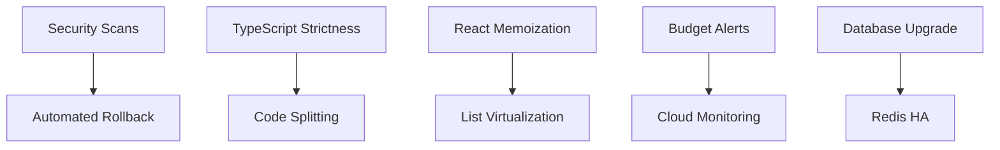

# Implementation Roadmap

> Phased plan for frontend performance and infrastructure improvements

---

## Overview

This roadmap provides a structured approach to implementing the recommendations from this analysis. Tasks are organized into phases based on priority, dependencies, and effort.

---

## Phase Summary

| Phase | Duration | Focus | Key Outcomes |
|-------|----------|-------|--------------|
| **Phase 1** | 1-2 weeks | Critical Fixes | Security, performance blockers resolved |
| **Phase 2** | 2-3 weeks | Performance | Frontend optimized, CI/CD hardened |
| **Phase 3** | 3-4 weeks | Monitoring | Full observability, advanced features |
| **Phase 4** | Ongoing | Maintenance | Continuous improvement |

---

## Phase 1: Critical Fixes

> **Duration:** 1-2 weeks
> **Focus:** Security vulnerabilities and production blockers

### Week 1

#### Day 1-2: Security Scan Enforcement

**Task:** Enable blocking security scans in CI

```yaml
# .github/workflows/ci.yml

security:
  runs-on: ubuntu-latest
  steps:
    - uses: actions/checkout@v4

    - name: Run pip-audit
      run: |
        pip install pip-audit
        pip-audit --require-hashes --strict
      # REMOVE: continue-on-error: true

    - name: Run Bandit
      run: |
        pip install bandit
        bandit -r app -f json -o bandit.json --severity-level high
        if jq -e '.results | length > 0' bandit.json; then
          exit 1
        fi
      # REMOVE: continue-on-error: true

    - name: Run Trivy
      uses: aquasecurity/trivy-action@master
      with:
        exit-code: 1
        severity: CRITICAL,HIGH
```

**Verification:**
- [ ] CI fails on security vulnerabilities
- [ ] No critical/high vulnerabilities in codebase
- [ ] Security reports uploaded as artifacts

---

#### Day 2-3: TypeScript Strictness

**Task:** Enable unused variable checking

```json
// frontend/tsconfig.json
{
  "compilerOptions": {
    "noUnusedLocals": true,
    "noUnusedParameters": true
  }
}
```

**Steps:**
1. Enable flags in tsconfig.json
2. Run `npm run type-check`
3. Fix or prefix unused variables with `_`
4. Verify build succeeds

**Verification:**
- [ ] No TypeScript errors
- [ ] Consistent with root tsconfig.json
- [ ] CI type-check passes

---

#### Day 3-4: React Memoization

**Task:** Add React.memo to frequently rendered components

```typescript
// TokenCard.tsx
export const TokenCard = React.memo<TokenCardProps>(function TokenCard({
  token,
  onSelect,
  onEdit,
  onDelete,
  isSelected
}) {
  const handleSelect = useCallback(() => onSelect(token.id), [onSelect, token.id])
  const handleEdit = useCallback(() => onEdit(token), [onEdit, token])
  const handleDelete = useCallback(() => onDelete(token.id), [onDelete, token.id])

  return (
    <div
      className={`token-card ${isSelected ? 'selected' : ''}`}
      onClick={handleSelect}
    >
      {/* ... */}
      <div className="token-card__actions">
        <button onClick={handleEdit}>Edit</button>
        <button onClick={handleDelete}>Delete</button>
      </div>
    </div>
  )
})

// HarmonyVisualizer.tsx
export const HarmonyVisualizer = React.memo(function HarmonyVisualizer({
  harmony,
  hex
}: HarmonyVisualizerProps) {
  const harmonyColors = useMemo(() => {
    return calculateHarmonyColors(hex, harmony)
  }, [hex, harmony])

  // ...
})

// AccessibilityVisualizer.tsx
export const AccessibilityVisualizer = React.memo(function AccessibilityVisualizer({
  hex,
  wcagContrastWhite,
  wcagContrastBlack,
  // ...
}: AccessibilityVisualizerProps) {
  // ...
})
```

**Components to memoize:**
- [x] TokenCard
- [x] HarmonyVisualizer
- [x] AccessibilityVisualizer
- [x] ColorNarrative
- [ ] TokenGrid (optimize selectors)

**Verification:**
- [ ] No re-renders on unrelated state changes
- [ ] React DevTools shows memo working
- [ ] Performance profiler shows improvement

---

#### Day 4-5: Database Tier Upgrade

**Task:** Upgrade production database to dedicated CPU

```hcl
# deploy/terraform/cloudsql.tf

variable "database_tier" {
  description = "Cloud SQL instance tier"
  type        = string
  default     = "db-custom-2-7680"  # Changed from db-f1-micro
}

resource "google_sql_database_instance" "main" {
  settings {
    tier = var.environment == "production" ? "db-custom-2-7680" : "db-f1-micro"

    availability_type = var.environment == "production" ? "REGIONAL" : "ZONAL"

    backup_configuration {
      enabled                        = true
      point_in_time_recovery_enabled = var.environment == "production"
      start_time                     = "03:00"

      backup_retention_settings {
        retained_backups = var.environment == "production" ? 30 : 7
      }
    }
  }

  deletion_protection = var.environment == "production"
}
```

**Steps:**
1. Review current database performance metrics
2. Plan maintenance window (low traffic)
3. Apply Terraform changes
4. Verify database operations
5. Monitor for 24 hours

**Verification:**
- [ ] Database tier shows db-custom-2-7680
- [ ] HA enabled (REGIONAL)
- [ ] Point-in-time recovery enabled
- [ ] Backups configured (30 days)

---

### Week 2

#### Day 1-2: Budget Alerts

**Task:** Configure GCP budget alerts

```hcl
# deploy/terraform/monitoring.tf

resource "google_billing_budget" "monthly" {
  billing_account = var.billing_account
  display_name    = "copy-that-${var.environment}-monthly"

  budget_filter {
    projects = ["projects/${var.project_id}"]
  }

  amount {
    specified_amount {
      currency_code = "USD"
      units         = var.environment == "production" ? "500" : "100"
    }
  }

  threshold_rules {
    threshold_percent = 0.5
    spend_basis       = "CURRENT_SPEND"
  }

  threshold_rules {
    threshold_percent = 0.8
    spend_basis       = "CURRENT_SPEND"
  }

  threshold_rules {
    threshold_percent = 1.0
    spend_basis       = "FORECASTED_SPEND"
  }

  all_updates_rule {
    monitoring_notification_channels = [
      google_monitoring_notification_channel.email.id
    ]
  }
}

resource "google_monitoring_notification_channel" "email" {
  display_name = "Budget Alerts Email"
  type         = "email"

  labels = {
    email_address = var.alert_email
  }
}
```

**Verification:**
- [ ] Budget alert at 50% ($50/$250)
- [ ] Budget alert at 80% ($80/$400)
- [ ] Budget alert at 100% forecast
- [ ] Email notifications working

---

#### Day 2-3: Staging Authentication

**Task:** Secure staging environment

**Option 1: IAP (Identity-Aware Proxy)**
```hcl
# For full IAP setup, need Load Balancer in front of Cloud Run
# Simpler option: use service-to-service auth

resource "google_cloud_run_service_iam_member" "staging_auth" {
  count = var.environment == "staging" ? 1 : 0

  service  = google_cloud_run_v2_service.api.name
  location = var.region
  role     = "roles/run.invoker"
  member   = "group:developers@${var.domain}"
}
```

**Option 2: Simple Header Authentication**
```python
# app/middleware/staging_auth.py
from fastapi import Request, HTTPException
import os

async def staging_auth_middleware(request: Request, call_next):
    if os.getenv("ENVIRONMENT") == "staging":
        auth_header = request.headers.get("X-Staging-Auth")
        expected = os.getenv("STAGING_AUTH_TOKEN")

        if auth_header != expected:
            raise HTTPException(status_code=401, detail="Unauthorized")

    return await call_next(request)
```

**Verification:**
- [ ] Staging requires authentication
- [ ] Developers can access with credentials
- [ ] Public access blocked

---

#### Day 3-4: Automated Rollback

**Task:** Implement deployment rollback on failure

```yaml
# .github/workflows/deploy.yml

deploy-production:
  steps:
    # ... existing steps ...

    - name: Get current revision
      id: current
      run: |
        REVISION=$(gcloud run services describe $SERVICE \
          --region $REGION \
          --format 'value(status.latestReadyRevisionName)')
        echo "revision=$REVISION" >> $GITHUB_OUTPUT

    - name: Deploy (no traffic)
      id: deploy
      uses: google-github-actions/deploy-cloudrun@v2
      with:
        service: ${{ env.SERVICE }}
        region: ${{ env.REGION }}
        image: ${{ env.IMAGE }}
        flags: --no-traffic

    - name: Run smoke tests
      id: smoke
      run: |
        URL="${{ steps.deploy.outputs.url }}"

        # Health check
        curl -f "$URL/health" || exit 1

        # API check
        curl -f "$URL/api/status" || exit 1

        # Critical endpoint
        curl -f -X POST "$URL/api/projects" \
          -H "Content-Type: application/json" \
          -d '{"name":"smoke-test"}' || exit 1

    - name: Route traffic
      if: success()
      run: |
        gcloud run services update-traffic $SERVICE \
          --region $REGION \
          --to-latest

    - name: Rollback on failure
      if: failure() && steps.smoke.outcome == 'failure'
      run: |
        echo "::error::Smoke tests failed, rolling back"

        gcloud run services update-traffic $SERVICE \
          --region $REGION \
          --to-revisions ${{ steps.current.outputs.revision }}=100

        gcloud run revisions delete ${{ steps.deploy.outputs.revision }} \
          --region $REGION --quiet
```

**Verification:**
- [ ] Failed smoke tests trigger rollback
- [ ] Previous revision receives traffic
- [ ] Failed revision deleted
- [ ] Notifications sent

---

#### Day 4-5: ARIA Improvements

**Task:** Add accessibility attributes to interactive elements

```typescript
// AccessibilityVisualizer.tsx
<div role="tablist" aria-label="Background color options">
  <button
    role="tab"
    id="tab-white"
    aria-selected={activeTab === 'white'}
    aria-controls="panel-white"
    tabIndex={activeTab === 'white' ? 0 : -1}
    onClick={() => setActiveTab('white')}
  >
    On White
  </button>
  {/* ... other tabs */}
</div>

<div
  role="tabpanel"
  id="panel-white"
  aria-labelledby="tab-white"
  hidden={activeTab !== 'white'}
>
  {/* Panel content */}
</div>

// HarmonyVisualizer.tsx - SVG accessibility
<svg
  viewBox="0 0 200 200"
  role="img"
  aria-label={`Color harmony wheel showing ${harmony} relationship`}
>
  {/* ... */}
</svg>

// TokenCard.tsx - Color swatch
<div
  className="color-swatch"
  style={{ backgroundColor: hex }}
  role="img"
  aria-label={`Color swatch: ${name}, ${hex}`}
/>
```

**Components to update:**
- [x] AccessibilityVisualizer (tabs)
- [x] HarmonyVisualizer (SVG)
- [x] TokenCard (swatch, actions)
- [x] TokenGrid (grid role)
- [ ] TokenPlaygroundDrawer (focus trap)

**Verification:**
- [ ] Screen reader announces all content
- [ ] Tab navigation works correctly
- [ ] axe-core reports no violations

---

## Phase 2: Performance Optimization

> **Duration:** 2-3 weeks
> **Focus:** Frontend performance and CI/CD improvements

### Week 3

#### Code Splitting Setup

**Task:** Configure route and component-based code splitting

```typescript
// vite.config.ts
export default defineConfig({
  build: {
    rollupOptions: {
      output: {
        manualChunks: {
          'react-vendor': ['react', 'react-dom'],
          'query-vendor': ['@tanstack/react-query'],
          'visualizers': [
            './src/components/HarmonyVisualizer',
            './src/components/AccessibilityVisualizer',
            './src/components/ColorNarrative'
          ]
        }
      }
    },
    chunkSizeWarningLimit: 500
  }
})

// App.tsx - Lazy loading
import { lazy, Suspense } from 'react'

const SessionWorkflow = lazy(() => import('./features/SessionWorkflow'))
const TokenExplorer = lazy(() => import('./features/TokenExplorer'))
const ExportManager = lazy(() => import('./features/ExportManager'))

function App() {
  return (
    <Suspense fallback={<LoadingSpinner />}>
      <Routes>
        <Route path="/workflow" element={<SessionWorkflow />} />
        <Route path="/tokens" element={<TokenExplorer />} />
        <Route path="/export" element={<ExportManager />} />
      </Routes>
    </Suspense>
  )
}
```

**Verification:**
- [ ] Bundle split into vendor/app chunks
- [ ] Visualizers lazy loaded
- [ ] Initial bundle < 200KB gzipped
- [ ] No regressions in functionality

---

#### List Virtualization

**Task:** Implement virtual scrolling for TokenGrid

```typescript
// TokenGrid.tsx
import { useVirtualizer } from '@tanstack/react-virtual'

export function TokenGrid() {
  const tokens = useTokenStore(s => s.tokens)
  const parentRef = useRef<HTMLDivElement>(null)

  const filteredTokens = useMemo(() => {
    // Apply filters and sorting
    return tokens.filter(/* ... */).sort(/* ... */)
  }, [tokens, filters, sortBy])

  const virtualizer = useVirtualizer({
    count: filteredTokens.length,
    getScrollElement: () => parentRef.current,
    estimateSize: () => 200,
    overscan: 5,
    lanes: 3  // Grid columns
  })

  return (
    <div
      ref={parentRef}
      className="token-grid-container"
      style={{ height: '100%', overflow: 'auto' }}
    >
      <div
        className="token-grid"
        style={{
          height: `${virtualizer.getTotalSize()}px`,
          position: 'relative'
        }}
      >
        {virtualizer.getVirtualItems().map(virtualRow => {
          const token = filteredTokens[virtualRow.index]
          return (
            <TokenCard
              key={token.id}
              token={token}
              style={{
                position: 'absolute',
                top: 0,
                left: `${(virtualRow.lane * 100) / 3}%`,
                width: `${100 / 3}%`,
                transform: `translateY(${virtualRow.start}px)`
              }}
            />
          )
        })}
      </div>
    </div>
  )
}
```

**Dependencies:**
```bash
npm install @tanstack/react-virtual
```

**Verification:**
- [ ] Smooth scrolling with 100+ tokens
- [ ] Only visible tokens rendered (check React DevTools)
- [ ] Memory usage stable
- [ ] Filter/sort still works

---

### Week 4

#### CI Pipeline Optimization

**Task:** Parallelize and cache CI jobs

```yaml
# .github/workflows/ci.yml

jobs:
  lint:
    runs-on: ubuntu-latest
    strategy:
      matrix:
        tool: [ruff, mypy]
    steps:
      - uses: actions/checkout@v4
      - uses: actions/setup-python@v5
        with:
          python-version: '3.12'
          cache: pip
      - run: pip install ${{ matrix.tool }}
      - run: ${{ matrix.tool }} app

  test:
    runs-on: ubuntu-latest
    strategy:
      matrix:
        shard: [1, 2, 3, 4]
    steps:
      - uses: actions/checkout@v4
      - uses: actions/setup-python@v5
        with:
          python-version: '3.12'
          cache: pip
      - run: pip install -e ".[test]"
      - run: |
          pytest tests \
            --shard-id ${{ matrix.shard }} \
            --num-shards 4 \
            --cov=app

  frontend-test:
    runs-on: ubuntu-latest
    steps:
      - uses: actions/checkout@v4
      - uses: actions/setup-node@v4
        with:
          node-version: 20
          cache: npm
      - run: npm ci
      - run: npm run test:coverage

  docker:
    runs-on: ubuntu-latest
    steps:
      - uses: actions/checkout@v4
      - uses: docker/setup-buildx-action@v3
      - uses: docker/build-push-action@v5
        with:
          context: .
          target: production
          cache-from: type=gha
          cache-to: type=gha,mode=max
```

**Optimizations:**
- [x] Matrix for parallel linting
- [x] Test sharding (4 shards)
- [x] pip/npm caching
- [x] Docker BuildKit caching

**Verification:**
- [ ] CI time reduced by 50%
- [ ] All jobs pass
- [ ] Caching working (check cache hits)

---

#### Store Optimization

**Task:** Split store and optimize selectors

```typescript
// store/tokenStore.ts
import { create } from 'zustand'
import { shallow } from 'zustand/shallow'

interface TokenState {
  tokens: ColorToken[]
  selectedTokenId: string | null
  setTokens: (tokens: ColorToken[]) => void
  selectToken: (id: string | null) => void
}

export const useTokenStore = create<TokenState>((set) => ({
  tokens: [],
  selectedTokenId: null,
  setTokens: (tokens) => set({ tokens }),
  selectToken: (id) => set({ selectedTokenId: id })
}))

// store/uiStore.ts
import { persist } from 'zustand/middleware'

interface UIState {
  filters: FilterState
  sortBy: string
  viewMode: 'grid' | 'list'
  sidebarOpen: boolean
}

export const useUIStore = create<UIState>()(
  persist(
    (set) => ({
      filters: {},
      sortBy: 'name',
      viewMode: 'grid',
      sidebarOpen: true,
      setFilter: (key, value) =>
        set((s) => ({ filters: { ...s.filters, [key]: value } }))
    }),
    { name: 'ui-preferences' }
  )
)

// Optimized selectors
export const useSelectedToken = () => {
  const tokens = useTokenStore(s => s.tokens)
  const selectedId = useTokenStore(s => s.selectedTokenId)
  return useMemo(
    () => tokens.find(t => t.id === selectedId),
    [tokens, selectedId]
  )
}

export const useFilteredTokens = () => {
  const tokens = useTokenStore(s => s.tokens)
  const { filters, sortBy } = useUIStore(
    s => ({ filters: s.filters, sortBy: s.sortBy }),
    shallow
  )

  return useMemo(() => {
    const filtered = tokens.filter(t => matchesFilters(t, filters))
    return [...filtered].sort(getSortFn(sortBy))
  }, [tokens, filters, sortBy])
}
```

**Benefits:**
- Persisted UI preferences
- Granular re-renders
- Better code organization

**Verification:**
- [ ] UI preferences persist on reload
- [ ] No unnecessary re-renders
- [ ] Store DevTools shows correct state

---

### Week 5

#### Bundle Analysis & Optimization

**Task:** Analyze and reduce bundle size

```typescript
// vite.config.ts
import { visualizer } from 'rollup-plugin-visualizer'

export default defineConfig({
  plugins: [
    react(),
    visualizer({
      filename: 'dist/bundle-stats.html',
      open: true,
      gzipSize: true,
      brotliSize: true
    })
  ],
  build: {
    minify: 'terser',
    terserOptions: {
      compress: {
        drop_console: true,
        drop_debugger: true
      }
    },
    cssMinify: true,
    cssCodeSplit: true
  }
})
```

**Optimization targets:**
- [ ] Remove unused exports
- [ ] Tree-shake dependencies
- [ ] Optimize images
- [ ] Enable compression

**Target metrics:**
- Initial bundle: < 150KB gzipped
- Vendor chunk: < 100KB gzipped
- CSS: < 30KB gzipped

---

## Phase 3: Monitoring & Hardening

> **Duration:** 3-4 weeks
> **Focus:** Observability, reliability, advanced features

### Week 6-7

#### Cloud Monitoring Setup

**Task:** Configure alerts and dashboards

```hcl
# deploy/terraform/monitoring.tf

# Error rate alert
resource "google_monitoring_alert_policy" "error_rate" {
  display_name = "High Error Rate"

  conditions {
    display_name = "5xx errors > 5%"
    condition_threshold {
      filter = <<-EOT
        resource.type="cloud_run_revision"
        metric.type="run.googleapis.com/request_count"
        metric.labels.response_code_class="5xx"
      EOT
      duration   = "300s"
      comparison = "COMPARISON_GT"
      threshold_value = 0.05
    }
  }

  notification_channels = [
    google_monitoring_notification_channel.slack.id
  ]
}

# Latency alert
resource "google_monitoring_alert_policy" "latency" {
  display_name = "High Latency"

  conditions {
    display_name = "P95 > 2s"
    condition_threshold {
      filter = <<-EOT
        resource.type="cloud_run_revision"
        metric.type="run.googleapis.com/request_latencies"
      EOT
      duration   = "300s"
      comparison = "COMPARISON_GT"
      threshold_value = 2000

      aggregations {
        per_series_aligner = "ALIGN_PERCENTILE_95"
      }
    }
  }
}
```

**Alerts to configure:**
- [x] Error rate > 5%
- [x] P95 latency > 2s
- [x] Database connections > 80%
- [x] Memory usage > 90%
- [ ] Cold start frequency

---

#### Redis HA Upgrade

**Task:** Upgrade Redis to STANDARD_HA tier

```hcl
# deploy/terraform/redis.tf

resource "google_redis_instance" "main" {
  name           = "${var.project_id}-redis-${var.environment}"
  tier           = var.environment == "production" ? "STANDARD_HA" : "BASIC"
  memory_size_gb = var.environment == "production" ? 5 : 1

  replica_count = var.environment == "production" ? 1 : 0

  redis_configs = {
    "maxmemory-policy" = "allkeys-lru"
  }
}
```

**Steps:**
1. Review current Redis metrics
2. Plan upgrade window
3. Apply Terraform
4. Verify replication
5. Test failover

---

### Week 8-9

#### Test Coverage Expansion

**Task:** Achieve 80% test coverage

**Components to add tests:**
- [ ] TokenGrid.test.tsx
- [ ] TokenInspectorSidebar.test.tsx
- [ ] TokenPlaygroundDrawer.test.tsx
- [ ] TokenToolbar.test.tsx
- [ ] ImageUploader.test.tsx
- [ ] ColorDetailPanel.test.tsx
- [ ] Integration tests for workflows

**Coverage targets:**
- Components: 70%
- Store: 90%
- Utils: 90%
- Overall: 80%

---

#### E2E Test Suite

**Task:** Create comprehensive E2E tests

```typescript
// e2e/workflows.spec.ts
test.describe('Complete Workflows', () => {
  test('extraction to export', async ({ page }) => {
    // Full workflow test
  })

  test('token editing', async ({ page }) => {
    // Edit workflow test
  })

  test('batch operations', async ({ page }) => {
    // Multi-select and batch actions
  })
})
```

**Test scenarios:**
- [ ] Full extraction workflow
- [ ] Token filtering/sorting
- [ ] Export all formats
- [ ] Error handling
- [ ] Accessibility navigation

---

## Phase 4: Continuous Improvement

> **Duration:** Ongoing
> **Focus:** Maintenance and iteration

### Monthly Tasks

- [ ] Review and update dependencies
- [ ] Analyze performance metrics
- [ ] Review error logs
- [ ] Update documentation
- [ ] Security scan review

### Quarterly Tasks

- [ ] Re-assess architecture
- [ ] Capacity planning
- [ ] Cost optimization review
- [ ] Feature prioritization
- [ ] DR testing

---

## Effort Estimates

### Phase 1: Critical Fixes

| Task | Effort | Role |
|------|--------|------|
| Security scan enforcement | 4 hours | DevOps |
| TypeScript strictness | 4 hours | Frontend |
| React memoization | 8 hours | Frontend |
| Database upgrade | 4 hours | DevOps |
| Budget alerts | 2 hours | DevOps |
| Staging auth | 4 hours | DevOps |
| Automated rollback | 8 hours | DevOps |
| ARIA improvements | 8 hours | Frontend |
| **Total** | **42 hours** | |

### Phase 2: Performance

| Task | Effort | Role |
|------|--------|------|
| Code splitting | 8 hours | Frontend |
| List virtualization | 8 hours | Frontend |
| CI optimization | 8 hours | DevOps |
| Store optimization | 8 hours | Frontend |
| Bundle optimization | 8 hours | Frontend |
| **Total** | **40 hours** | |

### Phase 3: Monitoring

| Task | Effort | Role |
|------|--------|------|
| Cloud Monitoring | 16 hours | DevOps |
| Redis HA | 4 hours | DevOps |
| Test coverage | 40 hours | Frontend/Backend |
| E2E tests | 24 hours | QA/Frontend |
| **Total** | **84 hours** | |

**Grand Total: ~166 hours (~4 weeks FTE)**

---

## Dependencies

### Technical Dependencies



### Resource Dependencies

- **Phase 1:** 1 Frontend + 1 DevOps
- **Phase 2:** 2 Frontend + 1 DevOps
- **Phase 3:** 2 Frontend + 1 DevOps + 1 QA

---

## Success Criteria

### Phase 1 Complete When:

- [x] Zero critical security vulnerabilities
- [x] CI blocks on security issues
- [x] Production database has dedicated CPU
- [x] TypeScript fully strict
- [x] Budget alerts configured

### Phase 2 Complete When:

- [ ] Bundle size < 300KB gzipped
- [ ] 100+ tokens render smoothly
- [ ] CI completes in < 10 minutes
- [ ] Lighthouse performance > 80

### Phase 3 Complete When:

- [ ] Test coverage > 80%
- [ ] E2E tests passing
- [ ] Monitoring alerts active
- [ ] Redis HA enabled
- [ ] All KPIs green

---

## Risk Mitigation

| Risk | Mitigation |
|------|------------|
| Database upgrade causes downtime | Schedule during low traffic, have rollback plan |
| Code splitting breaks features | Comprehensive E2E tests before deploy |
| Memoization causes stale data | Careful dependency arrays, thorough testing |
| Budget exceeded | Conservative initial budgets, monitor daily |

---

## Documentation Updates Required

- [ ] README.md - Updated setup instructions
- [ ] docs/deployment.md - New environment setup
- [ ] docs/testing/README.md - Test coverage requirements
- [ ] docs/guides/PERFORMANCE.md - New guide
- [ ] CHANGELOG.md - All changes documented

---

*This roadmap should be reviewed and adjusted based on team capacity and priorities.*
