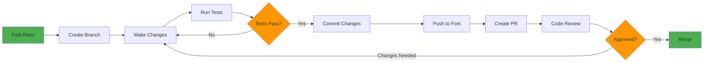

# Contributing to Copy This

Thank you for your interest in contributing! This document provides guidelines and best practices for contributing to the project.

---

## 📋 Table of Contents

- [Code of Conduct](#code-of-conduct)
- [Getting Started](#getting-started)
- [Development Workflow](#development-workflow)
- [Code Standards](#code-standards)
- [Testing Requirements](#testing-requirements)
- [Pull Request Process](#pull-request-process)
- [Documentation Standards](#documentation-standards)

---

## Code of Conduct

This project follows the [Contributor Covenant Code of Conduct](https://www.contributor-covenant.org/version/2/1/code_of_conduct/). By participating, you are expected to uphold this code.

---

## Contribution Workflow



---

## Getting Started

### Prerequisites

- Python 3.12+
- Node.js 18+
- pnpm (install via `npm install -g pnpm`)
- Git

### Development Setup

```bash
# Fork and clone the repository
git clone https://github.com/yourusername/copy_this.git
cd copy_this

# Install dependencies
python3 -m venv .venv
source .venv/bin/activate
pip install -e "ingest[dev]"

cd generators
pnpm install
cd ..

# Verify setup
make all
```

---

## Development Workflow

### Daily Checklist

Follow [checklist.md](checklist.md) for daily development:

1. **Start of day**: Pull latest, create feature branch
2. **Pick 2 tasks**: Focus on one area (ingest **or** generators)
3. **End with `make all`**: Ensure green build before committing
4. **Run `make demo`**: Verify visual changes

### Guardrails

- ✅ Work in one area at a time (ingest **or** generators)
- ✅ End every session with `make all` passing
- ✅ No new tools/dependencies without discussion
- ✅ If blocked > 20 min, switch areas or ask for help

### Branch Naming

```bash
git checkout -b feat/YYYYMMDD-description    # New features
git checkout -b fix/YYYYMMDD-description     # Bug fixes
git checkout -b docs/YYYYMMDD-description    # Documentation
git checkout -b refactor/YYYYMMDD-description # Code refactoring
```

Example: `feat/20251103-color-language-doc`

---

## Code Standards

### Python (Ingest Pipeline)

**Style Guide:** PEP 8

```bash
# Linting
ruff check extractors/

# Formatting
ruff format extractors/

# Type checking
mypy extractors/
```

**Key Rules:**
- Use type hints for all function signatures
- Maximum line length: 100 characters
- Use descriptive variable names (no single letters except loop counters)
- Document all public functions with docstrings

**Example:**

```python
def extract_palette(image_path: str, k: int = 12) -> list[tuple[int, int, int]]:
    """
    Extract color palette from image using k-means clustering.

    Args:
        image_path: Absolute path to input image
        k: Number of clusters (default: 12)

    Returns:
        List of RGB tuples representing cluster centers

    Raises:
        FileNotFoundError: If image_path does not exist
    """
    # Implementation
```

### TypeScript (Generators)

**Style Guide:** Airbnb TypeScript

```bash
# Linting
cd generators && pnpm lint

# Type checking
cd generators && pnpm type-check
```

**Key Rules:**
- Use strict TypeScript mode
- Use Zod for runtime validation
- Prefer functional programming (pure functions, immutability)
- Use meaningful names (no abbreviations unless standard)

**Example:**

```typescript
import { z } from 'zod';

const ColorToken = z.object({
  hex: z.string().regex(/^#[0-9A-F]{6}$/i),
  name: z.string(),
  description: z.string().optional(),
});

export function normalizeTokens(raw: unknown): ColorToken[] {
  return z.array(ColorToken).parse(raw);
}
```

### React Components

**Style Guide:** Functional components with hooks

```tsx
import React, { useState } from 'react';

interface ColorSwatchProps {
  name: string;
  color: string;
}

export function ColorSwatch({ name, color }: ColorSwatchProps) {
  const [copied, setCopied] = useState(false);

  const handleClick = () => {
    navigator.clipboard.writeText(color);
    setCopied(true);
    setTimeout(() => setCopied(false), 1500);
  };

  return (
    <div onClick={handleClick} style={{ cursor: 'pointer' }}>
      <div style={{ background: color, width: 48, height: 48 }} />
      <span>{copied ? 'Copied!' : name}</span>
    </div>
  );
}
```

### JUCE C++ (Scaffold Generation)

**Style Guide:** JUCE conventions

```cpp
#pragma once
#include <juce_gui_basics/juce_gui_basics.h>

namespace Theme {
    const juce::Colour primary { juce::Colour::fromString("#F15925") };
    const juce::Colour secondary { juce::Colour::fromString("#F18D27") };
}
```

---

## Testing Requirements

### Python Tests

```bash
cd ingest
pytest                    # Run all tests
pytest -v                 # Verbose output
pytest -k test_palette    # Run specific test
pytest --cov              # Coverage report
```

**Minimum Coverage:** 80%

### TypeScript Tests

```bash
cd generators
pnpm test                 # Run all tests
pnpm test:watch           # Watch mode
pnpm test:coverage        # Coverage report
```

**Minimum Coverage:** 75%

### Integration Tests

Before submitting:

```bash
make all                  # Full pipeline must pass
make demo                 # Visual verification
```

---

## Pull Request Process

### 1. Before Submitting

- [ ] All tests pass (`make all`)
- [ ] Code follows style guidelines
- [ ] Documentation updated (README, CHANGELOG, inline comments)
- [ ] No linting errors
- [ ] Commits follow conventional commits format
- [ ] Branch is up to date with main

### 2. Commit Message Format

Follow [Conventional Commits](https://www.conventionalcommits.org/):

```
<type>(<scope>): <description>

[optional body]

[optional footer]
```

**Types:**
- `feat`: New feature
- `fix`: Bug fix
- `docs`: Documentation only
- `style`: Code style (formatting, no logic change)
- `refactor`: Code refactoring
- `test`: Adding tests
- `chore`: Maintenance

**Examples:**

```
feat(palette): add LAB deduplication with ΔE < 15 threshold

Prevents duplicate colors in extracted palette by computing
color difference in LAB space and merging similar colors.

Closes #42
```

```
fix(react): correct RGB/BGR channel swap in palette extraction

Previously converted RGB → BGR before colormath, causing warm
colors to appear as cool. Now keeps RGB format throughout.

BREAKING CHANGE: Regenerated palettes will differ from v0.x
```

### 3. PR Description Template

```markdown
## Description
Brief summary of changes

## Type of Change
- [ ] Bug fix
- [ ] New feature
- [ ] Breaking change
- [ ] Documentation update

## Checklist
- [ ] Tests added/updated
- [ ] Documentation updated
- [ ] `make all` passes
- [ ] CHANGELOG.md updated
- [ ] No breaking changes (or documented)

## Screenshots (if applicable)
Before/after images of visual changes

## Related Issues
Closes #123
```

### 4. Review Process

- At least 1 approving review required
- All CI checks must pass
- No unresolved comments
- Branch must be up to date with main

---

## Documentation Standards

### Markdown Guidelines

Follow [Markdown Lint](https://github.com/markdownlint/markdownlint):

- Use ATX-style headers (`#` not underlines)
- Blank lines around fenced code blocks
- Consistent list markers (`-` for unordered, `1.` for ordered)
- No trailing spaces
- One blank line at end of file

### Code Documentation

**Python:**
```python
def function(arg: str) -> int:
    """
    Brief one-line description.

    Longer description if needed, explaining behavior,
    edge cases, and design decisions.

    Args:
        arg: Description of argument

    Returns:
        Description of return value

    Raises:
        ValueError: When arg is invalid
    """
```

**TypeScript:**
```typescript
/**
 * Brief one-line description
 *
 * Longer description if needed
 *
 * @param arg - Description of parameter
 * @returns Description of return value
 * @throws {Error} When validation fails
 */
export function doSomething(arg: string): number {
  // Implementation
}
```

### Inline Comments

Use comments for:
- **Why**, not **what** (code should be self-documenting)
- Complex algorithms or non-obvious logic
- TODO/FIXME with issue numbers
- Performance optimizations
- Workarounds for bugs

**Good:**
```python
# Boost warm colors 2x to prioritize oranges/reds in k-means
# See: https://github.com/user/repo/issues/15
adjusted_count = count * 2.0 if is_warm else count
```

**Bad:**
```python
# Multiply count by 2
adjusted_count = count * 2.0
```

---

## Questions?

- Open a [GitHub Discussion](https://github.com/yourusername/copy_this/discussions)
- File an [Issue](https://github.com/yourusername/copy_this/issues)
- Check existing [documentation](https://github.com/yourusername/copy_this/wiki)

---

**Thank you for contributing to Copy This!** 🎉
