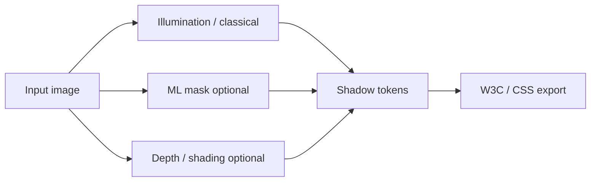

# Shadow Pipeline Visual Guide

**Last Updated:** 2026-09-21

Operator overview. Pipeline stage PNGs are **not** kept in-repo (were ~14MB under `docs/images/`). Regenerate locally; optional archived figures live at `~/Documents/copy-that-archive/docs-images/`.

---

## Flow (conceptual)



Deep models optional; classical path always works. See [SPEC.md](./SPEC.md) for stage→code mapping and [GETTING_STARTED.md](./GETTING_STARTED.md) for API/UI.

---

## Regenerate processed outputs

`test_images/processedImageShadows*` are **gitignored**. From repo root:

```bash
# Method comparison → test_images/processedImageShadows/{image}/
uv run python scripts/test_shadow_methods.py

# Full pipeline / tokens (see script help for paths)
uv run python scripts/process_test_images.py
# or single file:
# uv run python scripts/process_test_images.py test_images/IMG_8634.jpeg
```

Also useful: `scripts/process_shadows_v2.py` when present. Fixture JPEGs stay under `test_images/` (e.g. `IMG_8634.jpeg`).

---

## Inspect results

1. Open folders under `test_images/processedImageShadows/` (or script output dir).
2. Compare stage grids locally; do not commit large PNG trees.
3. UI: upload fixture at http://localhost:5173 · API: `POST /api/v1/shadows/extract`.

Historical committed example grids (if needed for slides):  
`~/Documents/copy-that-archive/docs-images/shadow_pipeline_example/` and `…/shadow_pipeline/`.

---

## Related

- [GETTING_STARTED.md](./GETTING_STARTED.md)  
- [SPEC.md](./SPEC.md)  
- [test_images/README.md](../../test_images/README.md)
