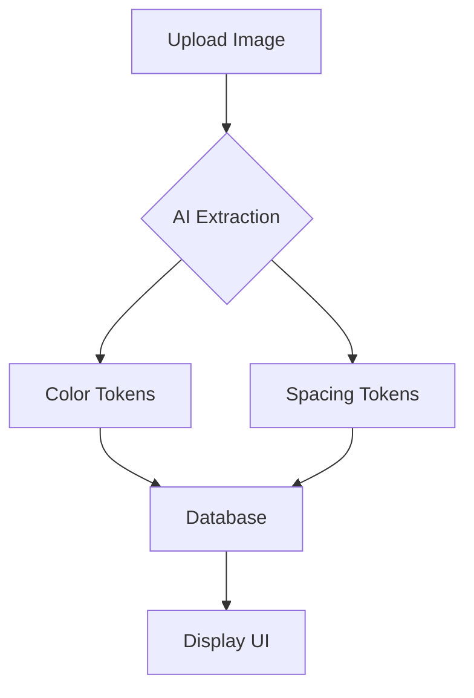
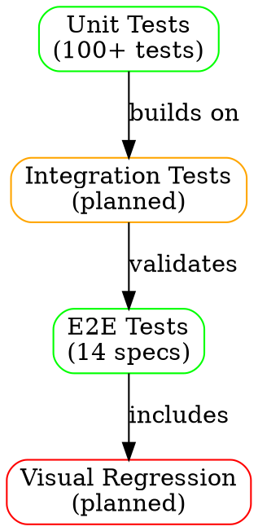
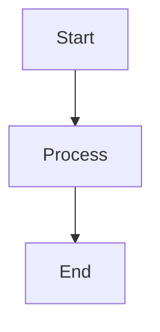
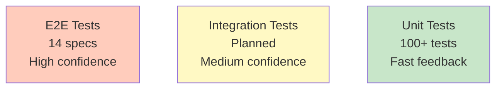
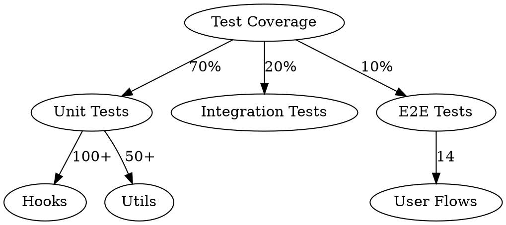

# Visualization Tools Guide

## 📊 Available Tools

### 1. **Mermaid** - Diagrams from Markdown
**Best for:** Flowcharts, sequence diagrams, Gantt charts, class diagrams
**Command:** `mmdc` (mermaid-cli) or `pnpm mermaid`

**Features:**
- Native GitHub/GitLab rendering
- Wide variety of diagram types
- Simple text-based syntax
- Great for documentation

**Example Syntax:**


**Usage:**
```bash
# Create diagram from .mmd file
pnpm mermaid input.mmd -o output.svg

# Or use mmdc directly
mmdc -i flowchart.mmd -o flowchart.png
```

---

### 2. **D2** - Modern Diagram Language
**Best for:** Architecture diagrams, system flows, elegant layouts
**Command:** `d2`

**Features:**
- Beautiful default styling
- Auto-layout with multiple engines
- Connections and relationships
- Themes and customization
- SVG, PNG, PDF output

**Example Syntax:**
```d2
direction: right

upload: Image Upload {
  shape: circle
}

extraction: AI Extractor {
  claude: Claude Sonnet 4.5
  structured: Structured Outputs
}

adapter: Token Adapter {
  transform: Core → API
}

db: Database {
  shape: cylinder
}

upload -> extraction: sends image
extraction -> adapter: raw tokens
adapter -> db: validated schema
```

**Usage:**
```bash
# Create diagram with default layout
d2 diagram.d2 output.svg

# With specific layout engine
d2 --layout elk diagram.d2 output.svg

# With theme
d2 --theme=200 diagram.d2 output.png
```

**Available Themes:**
- `0` - Neutral (default)
- `1` - Neutral Grey
- `100` - Cool Classics
- `200` - Dark Flagship
- `300` - Vanilla Nitro
- `400` - Orange Creamsicle

---

### 3. **Graphviz (DOT)** - Classic Graph Visualization
**Best for:** Complex graphs, hierarchies, data flow
**Command:** `dot`, `neato`, `fdp`, `sfdp`, `circo`, `twopi`

**Features:**
- Powerful layout algorithms
- Fine-grained control
- Multiple output formats
- Industry standard

**Example Syntax:**


**Usage:**
```bash
# Hierarchical layout
dot -Tsvg graph.dot -o graph.svg

# Spring layout
neato -Tpng graph.dot -o graph.png

# Force-directed
fdp -Tpdf graph.dot -o graph.pdf
```

---

### 4. **ImageMagick** - Image Processing
**Best for:** Combining images, adding annotations, format conversion
**Command:** `convert`, `magick`

**Features:**
- Image composition
- Annotations and overlays
- Format conversion
- Batch processing

**Usage:**
```bash
# Combine images horizontally
convert image1.png image2.png +append combined.png

# Add text annotation
convert diagram.png -pointsize 24 -fill black \
  -annotate +10+30 "Test Architecture v1.0" \
  annotated.png

# Convert and resize
convert diagram.svg -resize 800x600 diagram.png
```

---

### 5. **SVGO** - SVG Optimization
**Best for:** Reducing SVG file sizes, cleaning up generated SVGs
**Command:** `svgo`

**Features:**
- Reduces file size 30-50%
- Removes unnecessary data
- Preserves visual appearance
- Batch processing

**Usage:**
```bash
# Optimize single file
svgo diagram.svg -o diagram-optimized.svg

# Optimize folder
svgo -f ./diagrams -o ./diagrams-optimized

# With specific plugins
svgo --enable=cleanupIds,removeComments diagram.svg
```

---

## 🚀 NPM Scripts

Add these to your workflow:

```bash
# Generate diagrams
pnpm diagram:mermaid <input.mmd>    # Mermaid diagram → SVG
pnpm diagram:d2 <input.d2>          # D2 diagram → SVG
pnpm diagram:dot <input.dot>        # Graphviz → SVG

# Optimize output
pnpm optimize:svg <input.svg>       # Optimize SVG files

# Build all docs diagrams
pnpm docs:diagrams                  # Generate all diagrams
```

---

## 📋 Quick Reference

### Flowchart (Mermaid)
```bash
cat > flowchart.mmd << 'EOF'
graph LR
    A[Test] --> B{Pass?}
    B -->|Yes| C[Deploy]
    B -->|No| D[Fix]
    D --> A
EOF
mmdc -i flowchart.mmd -o flowchart.svg
```

### Architecture Diagram (D2)
```bash
cat > arch.d2 << 'EOF'
frontend: Frontend {
  shape: rectangle
  style.fill: "#e3f2fd"
}
backend: Backend {
  shape: rectangle
  style.fill: "#fff3e0"
}
db: Database {
  shape: cylinder
  style.fill: "#f3e5f5"
}
frontend -> backend: API calls
backend -> db: queries
EOF
d2 --layout elk --theme=100 arch.d2 arch.svg
```

### Data Flow (Graphviz)
```bash
cat > dataflow.dot << 'EOF'
digraph {
  rankdir=LR;
  node [shape=box];
  Image -> Extractor -> Tokens -> Database;
}
EOF
dot -Tsvg dataflow.dot -o dataflow.svg
```

---

## 🎨 Best Practices for Testing Docs

### 1. **Test Flow Diagrams** (Mermaid)
- Show test execution order
- Visualize test dependencies
- Document test data flow

### 2. **Architecture Diagrams** (D2)
- Component relationships
- Integration test boundaries
- System architecture overview

### 3. **Coverage Maps** (Graphviz)
- Module coverage relationships
- Test coverage hierarchy
- Dependency graphs

### 4. **Comparison Images** (ImageMagick)
- Before/after refactoring
- Visual regression baselines
- Screenshot comparisons

---

## 🔧 Integration with Documentation

### GitHub/GitLab Auto-Rendering
Mermaid diagrams render automatically in markdown:

~~~markdown

~~~

### Generating Images for Offline Docs
```bash
# Generate all diagrams for PDF/offline use
find docs -name "*.mmd" -exec mmdc -i {} -o {}.svg \;
find docs -name "*.d2" -exec d2 {} {}.svg \;
```

### Automating Diagram Generation
Add to pre-commit hook:
```bash
#!/bin/bash
# .git/hooks/pre-commit
pnpm docs:diagrams
git add docs/**/*.svg
```

---

## 📚 Example Use Cases for Testing Documentation

### 1. Test Pyramid Visualization


### 2. Test Data Flow
```d2
image: Test Image {
  shape: document
}

fixture: Test Fixtures {
  mockData: Mock Data
  stubs: API Stubs
}

test: Test Suite {
  arrange: Arrange
  act: Act
  assert: Assert
}

results: Test Results {
  shape: page
}

image -> fixture: loads
fixture -> test: provides
test -> results: outputs
```

### 3. Coverage Hierarchy


---

## 🎯 Next Steps

1. **Create initial diagrams** for testing documentation
2. **Add npm scripts** to package.json for easy diagram generation
3. **Document architecture** with D2 diagrams
4. **Visualize test flows** with Mermaid
5. **Optimize SVGs** with SVGO before committing

---

## 📖 Additional Resources

- **Mermaid:** https://mermaid.js.org/
- **D2:** https://d2lang.com/
- **Graphviz:** https://graphviz.org/
- **ImageMagick:** https://imagemagick.org/
- **SVGO:** https://github.com/svg/svgo

---

**Last Updated:** 2025-12-05
**Tools Version:** Mermaid CLI 11.12.0, D2 0.7.1, Graphviz (latest), ImageMagick (latest), SVGO 4.0.0
